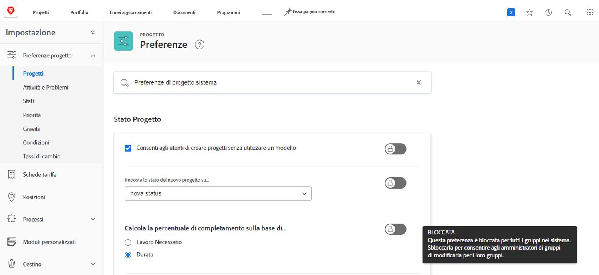
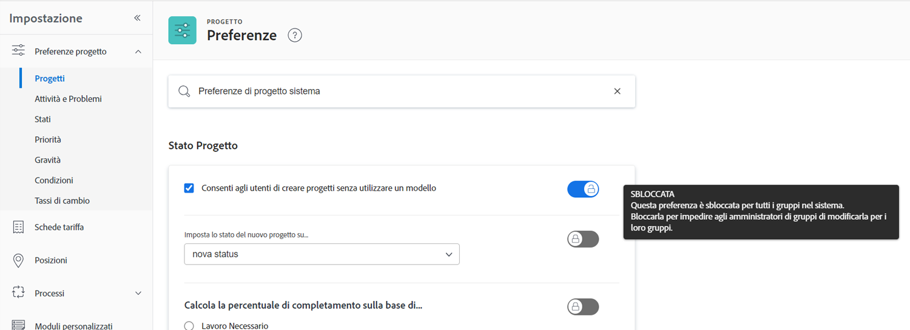
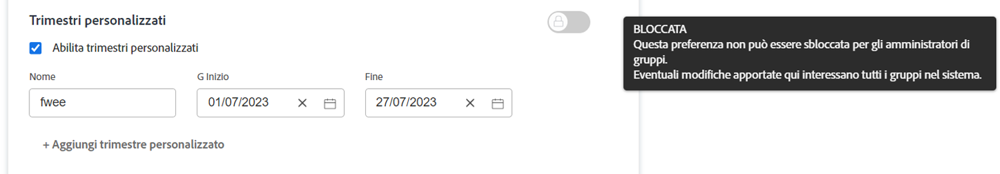

# Configurare le impostazioni globali predefinite del progetto

<!---
21.4 updates have been made
--->

In questo video scoprirai come:

* Modificare uno stato personalizzato
* Impostare le preferenze globali del progetto
* Creare e utilizzare pianificazioni

>[!VIDEO](https://video.tv.adobe.com/v/335065/?quality=12&learn=on&enablevpops)

## Impostazioni globali e di gruppo per progetti, attività e problemi

Quando apri le impostazioni [!UICONTROL Progetti] in [!DNL Workfront], noterai la dicitura “[!UICONTROL Preferenze di progetto del sistema]” nella barra di ricerca nella parte superiore della finestra. Questo consente di sapere che queste impostazioni interessano tutti gli utenti nel sistema di [!DNL Workfront]: è una configurazione globale.

Pagina ![[!UICONTROL Preferenze di progetto] in [!UICONTROL Configurazione]](assets/admin-fund-system-project-preferences-1.png)

Quando apri le impostazioni [!UICONTROL Attività e problemi] potrai vedere qualcosa di simile.

![[!UICONTROL Preferenze attività e problemi] in [!UICONTROL Configurazione]](assets/admin-fund-task-issue-preferences-2.png)

Tuttavia, è possibile che non tutti i gruppi in [!DNL Workfront] necessitino delle stesse preferenze di progetto, attività e problema. Ad esempio, il gruppo marketing desidera che lo stato di un nuovo progetto sia Pianificazione, mentre il gruppo di project manager preferisce lo stato Richiesta.

[!DNL Workfront] consente agli amministratori di gruppi di regolare alcune preferenze di progetti, attività e problemi per i loro gruppi. L’amministratore di sistema di [!DNL Workfront], mediante le opzioni di blocco/sblocco, determina quali preferenze possono essere modificate.

Per iniziare, accedi all’area [!UICONTROL Configurazione]:

1. Seleziona **[!UICONTROL Configurazione]** nel **[!UICONTROL Menu principale]**.
1. Espandi **[!UICONTROL Preferenze progetto]** nel menu a sinistra.
1. Seleziona **[!UICONTROL Progetti]** o **[!UICONTROL Attività e problemi]**, a seconda delle impostazioni da modificare.

Blocca una preferenza per impedire agli amministratori di gruppo di modificare tale impostazione per il proprio gruppo.

Sblocca la preferenza per renderla disponibile agli amministratori di gruppi per la personalizzazione.

Alcune impostazioni non possono essere sbloccate e rimangono impostazioni di sistema globali.

### Impostare le preferenze di gruppo e sottogruppo

Per qualsiasi impostazione sbloccata dall’amministratore di sistema, gli amministratori di gruppo possono apportare modifiche ai gruppi da loro gestiti ed ai sottogruppi nidificati in tali gruppi. Inoltre, gli amministratori di gruppo possono controllare le impostazioni che i loro amministratori dei sottogruppi possono modificare.

1. Seleziona **[!UICONTROL Configurazione]** nel **[!UICONTROL Menu principale]**.
1. Fai clic su **[!DNL Groups]** nel menu a sinistra.
1. Fai clic sul nome del gruppo o del sottogruppo per aprirlo.
1. Seleziona **[!UICONTROL Preferenze progetto]** o **[!UICONTROL Preferenze attività e problemi]** nel menu a sinistra.
1. Apporta le modifiche necessarie per ciascuna delle preferenze sbloccate.
1. Seleziona **[!UICONTROL Salva]**.

Sezione ![[!UICONTROL Stato progetto] nella pagina [!UICONTROL Gruppo]](assets/admin-fund-group-preferences.png)

Se l’organizzazione non utilizza gli amministratori di gruppo, l’amministratore di sistema può gestire le impostazioni delle preferenze per i diversi gruppi.

<!---
learn more URLs and guides
Create or edit a group status 
Group administrators 
Configure system-wide project preferences 
Configure project preferences for a group 
Configure task and issue preferences for a group 
Create and modify a group’s schedule 
--->
