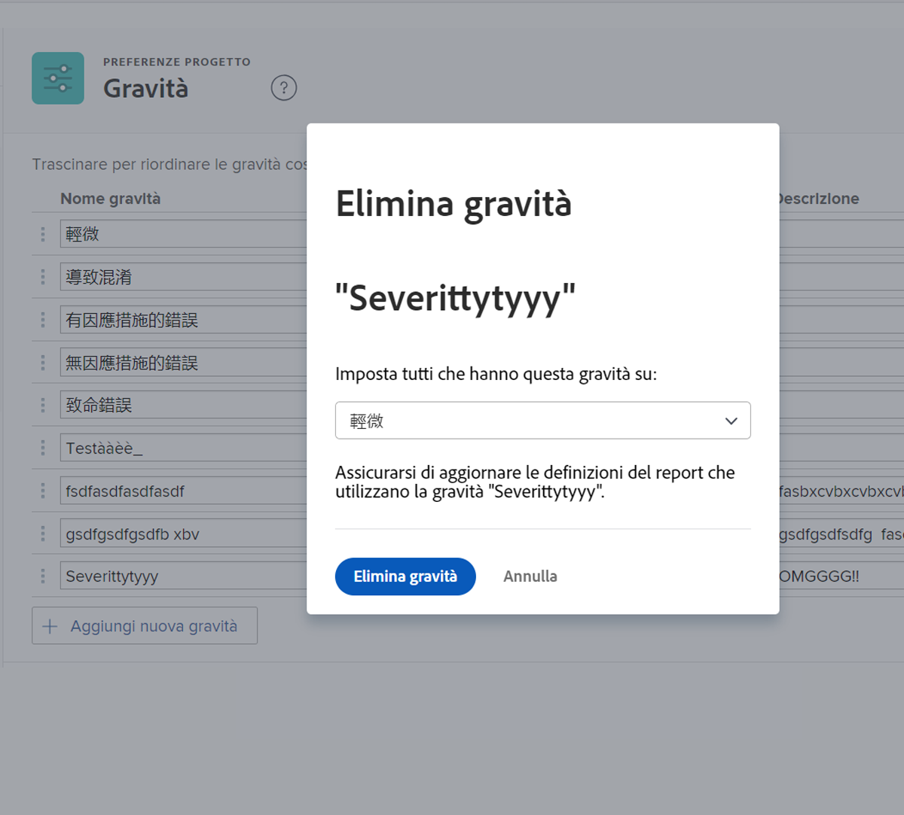

# Creare e gestire le gravità dei problemi

## Introduzione alle gravità dei problemi

È possibile utilizzare una gravità per indicare la gravità del problema o il suo impatto sul lavoro svolto.

![[!UICONTROL Gravità] nel menu [!UICONTROL Dettagli del problema] finestra](assets/admin-fund-severity-issue-details.png)

La [!UICONTROL Gravità] è accessibile nel [!UICONTROL Dettagli del problema]. Può essere incluso anche nelle viste a colonne negli elenchi e nei rapporti personalizzati.

[!DNL Workfront] ha cinque severità predefinite:

* [!UICONTROL Cosmetico]
* [!UICONTROL Causa Confusione]
* [!UICONTROL Bug con workaround]
* [!UICONTROL Bug senza workaround]
* [!UICONTROL Errore Fatale]

Gli amministratori di sistema possono rinominare queste severità predefinite o crearne di nuove, se necessario.

I livelli di gravità sono disponibili solo per i problemi in [!DNL Workfront].

## Creare e gestire le gravità dei problemi

In qualità di amministratore di sistema, puoi creare nuove severità, se necessario, per completare il flusso di lavoro del problema.

![[!UICONTROL Gravità] in [!UICONTROL Configurazione]](assets/admin-fund-severity-section.png)

1. Fai clic su **[!UICONTROL Configurazione]** in **[!UICONTROL Menu principale]**.
1. Espandi la **[!UICONTROL Preferenze del progetto]** nel pannello del menu a sinistra.
1. Seleziona **[!UICONTROL Gravità]**.
1. Fai clic su **[!UICONTROL Aggiungere una nuova gravità]**.
1. Assegna alla gravità un nome che corrisponda all’uso previsto.
1. La **[!UICONTROL Importanza]** Il numero corrisponde alla gravità del problema. Il numero più alto corrisponde alla gravità più elevata. La [!UICONTROL Importanza] Il numero deve essere univoco.
1. Seleziona un colore per la tua priorità. Viene utilizzato nei rapporti sui grafici e in altre posizioni in [!DNL Workfront].
1. Designa una delle opzioni di gravità come **[!UICONTROL Gravità predefinita]**. Questo viene applicato automaticamente a tutti i nuovi problemi in Workfront.
1. Includi una descrizione della gravità, ad esempio come verrà utilizzata.
1. Fai clic all’esterno dei campi da salvare.

![[!UICONTROL Gravità] elenco](assets/admin-fund-severity-new.png)

### Modifica delle gravità

Se una gravità non diventa più rilevante per i flussi di lavoro dei problemi, può essere rinominata, nascosta o eliminata.

Se una gravità non è più necessaria, [!DNL Workfront] consiglia di nascondere la gravità (fai clic sul pulsante [!UICONTROL Nascondi] accanto a esso nell&#39;area di configurazione). Questo rimuove l’opzione di gravità dal menu a discesa sul problema, ma mantiene la gravità dei dati storici in modo che sia ancora disponibile a scopo di reporting.

![[!UICONTROL Nascondi] colonna evidenziata [!UICONTROL Gravità] in [!UICONTROL Configurazione]](assets/admin-fund-severity-hide.png)

[!DNL Workfront] consiglia di **non** elimina una gravità utilizzata per i problemi passati. Quando elimini una gravità, ti chiede di sostituire un’altra gravità. Questo può modificare i dati storici e influenzare il reporting.

<!---
learn more URLs
Create and customize issue severities
Update issue severity
--->
