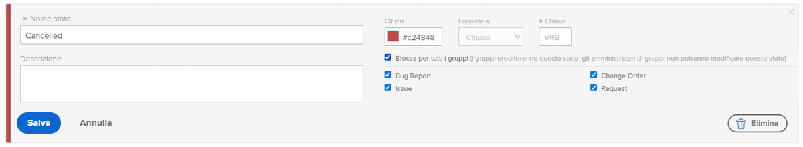
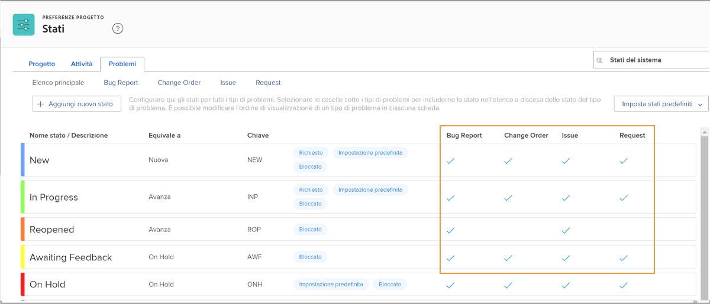

# Personalizzare gli stati a livello di sistema

[!DNL Workfront] fornisce una serie di statue predefinite per adattarsi ai flussi di lavoro di gestione dei problemi della tua organizzazione. Questi stati possono essere rinominati in base alla terminologia della tua organizzazione. E gli stati possono essere assegnati a tipi di problemi specifici.

Se necessario, puoi creare altri stati. Solo gli amministratori di sistema possono creare stati a livello di sistema. Inoltre, gli amministratori di sistema controllano quali stati possono essere modificati dagli amministratori di gruppo.

![[!UICONTROL Problemi] scheda su [!UICONTROL Statue] in [!UICONTROL Configurazione]](assets/admin-fund-all-issue-statuses.png)

## Modificare gli stati esistenti

[!DNL Workfront] consiglia un numero minimo di stati. Questo semplifica la scelta dello stato corretto per gli utenti e genera un elenco più breve di stati da mantenere.

È possibile modificare uno stato esistente per modificare il nome, i tipi di problema a cui è assegnato, il colore correlato, ecc.

![Elenco dello stato del problema con [!UICONTROL Modifica] opzione evidenziata](assets/admin-fund-edit-issue-status.png)

1. Fai clic su **[!UICONTROL Configurazione]** in **[!UICONTROL Menu principale]**.
1. Espandi la **[!UICONTROL Preferenze del progetto]** nel pannello del menu a sinistra.
1. Seleziona **[!UICONTROL Stati]**.
1. Seleziona la **[!UICONTROL Problemi]** e assicurati [!UICONTROL Stati del sistema] nell&#39;angolo in alto a destra.
1. Seleziona **[!UICONTROL Elenco principale]** per visualizzare gli stati di tutti i tipi di problemi. In questo punto puoi creare o modificare lo stato di un problema.
1. Passa il puntatore del mouse sul lato destro dello stato da rinominare e fai clic su **[!UICONTROL Modifica]**.
1. Assegna allo stato un nuovo nome o modifica una qualsiasi delle altre informazioni, come desiderato.
1. Blocca lo stato se queste impostazioni devono essere applicate a tutti gli utenti nel tuo [!DNL Workfront] istanza.
1. Sblocca lo stato per consentire agli amministratori di gruppo di modificare lo stato solo per i loro gruppi.
1. Seleziona le caselle relative al tipo di problema a cui deve essere applicato lo stato.
1. Fai clic su **[!UICONTROL Salva]**.

### Assegnazioni di stato

Non tutti gli stati possono essere assegnati a tutti i tipi di problemi. La [!UICONTROL Stati] in una pagina sono presenti colonne che mostrano per quale tipo di problema è possibile utilizzare ogni stato.

Per visualizzare solo gli stati assegnati a un tipo di problema specifico, fai clic sul nome del tipo di problema nella parte superiore della finestra.

![[!UICONTROL Problema] scheda di [!UICONTROL Stato] pagina con colonne evidenziate](assets/admin-fund-statuses-issue-type.png)

Da qui, puoi trascinare e rilasciare i problemi nell’ordine in cui desideri che vengano visualizzati nella [!UICONTROL Stato] menu a discesa.

Per modificare gli stati, devi tornare alla sezione [!UICONTROL Elenco principale].
