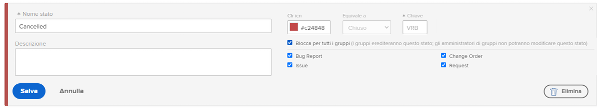
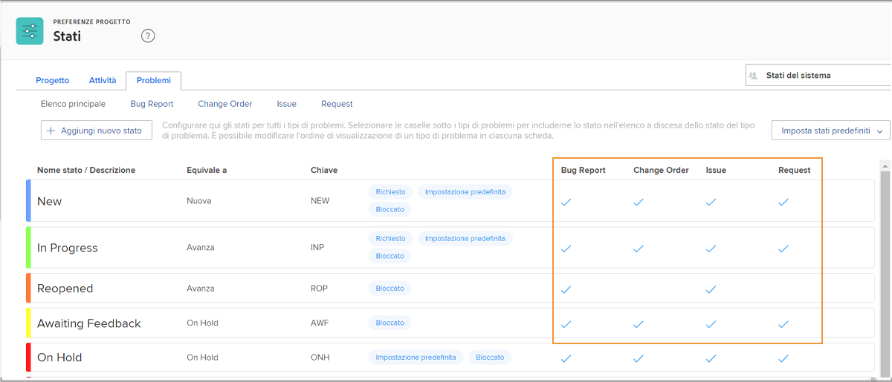

# Personalizzare gli stati a livello di sistema

[!DNL Workfront] fornisce una varietà di stati predefiniti per soddisfare i flussi di lavoro di gestione dei problemi della tua organizzazione. Questi stati possono essere rinominati per corrispondere alla terminologia della tua organizzazione. Inoltre, gli stati possono essere assegnati a tipi di problemi specifici.

Se necessario, è possibile creare stati aggiuntivi. Solo gli amministratori di sistema possono creare stati a livello di sistema. Inoltre, gli amministratori di sistema controllano quali stati possono essere modificati dagli amministratori di gruppi.

Scheda ![[!UICONTROL Problemi] nella pagina [!UICONTROL Stati] in [!UICONTROL Configurazione]](assets/admin-fund-all-issue-statuses.png)

## Modificare gli stati esistenti

[!DNL Workfront] consiglia un numero minimo di stati. In questo modo la scelta dello stato corretto è più semplice per gli utenti e si ottiene un elenco di stati più breve da mantenere.

È possibile modificare uno stato esistente per cambiare il nome, i tipi di problema a cui è assegnato, il colore correlato e così via.

![L’elenco degli stati dei problemi con l’opzione [!UICONTROL Modifica] evidenziata](assets/admin-fund-edit-issue-status.png)

1. Fai clic su **[!UICONTROL Configurazione]** nel **[!UICONTROL Menu principale]**.
1. Espandi la sezione **[!UICONTROL Preferenze progetto]** nel pannello del menu a sinistra.
1. Seleziona **[!UICONTROL Stati]**.
1. Seleziona la scheda **[!UICONTROL Problemi]** e assicurati che [!UICONTROL Stati del sistema] venga visualizzato nell’angolo superiore destro.
1. Seleziona **[!UICONTROL Elenco principale]** per visualizzare gli stati di tutti i tipi di problema. In questa fase è possibile creare o modificare lo stato di un problema.
1. Passa il puntatore sul lato destro dello stato che desideri rinominare e fai clic su **[!UICONTROL Modifica]**.
1. Assegna un nuovo nome allo stato o modifica eventuali altre informazioni, a seconda delle esigenze.
1. Blocca lo stato se queste impostazioni devono essere applicate a tutti gli utenti nella tua istanza di [!DNL Workfront].
1. Sblocca lo stato per consentire agli amministratori di gruppo di modificare lo stato solo per i loro gruppi.
1. Seleziona le caselle per il tipo di problema a cui si applica lo stato.
1. Fai clic su **[!UICONTROL Salva]**.

### Assegnazioni di stato

Non tutti gli stati possono essere assegnati a tutti i tipi di problema. La pagina [!UICONTROL Stati] include colonne che mostrano per quale tipo di problema è possibile utilizzare ogni stato.

Per visualizzare solo gli stati assegnati a un tipo di problema specifico, fai clic sul nome del tipo di problema nella parte superiore della finestra.

Scheda ![[!UICONTROL Problema] nella pagina [!UICONTROL Stato] con le colonne evidenziate](assets/admin-fund-statuses-issue-type.png)

Da qui, puoi trascinare i problemi nell’ordine in cui desideri che vengano visualizzati nel menu a discesa [!UICONTROL Stato].

Per modificare gli stati, torna all’[!UICONTROL Elenco principale].
