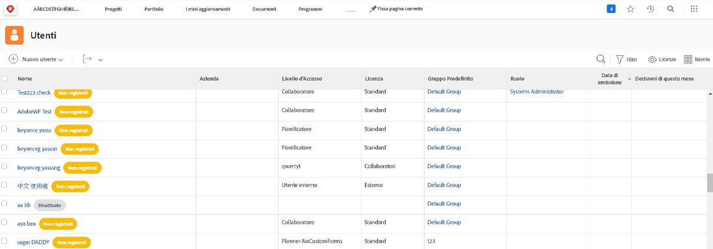

# Aggiungi utenti in blocco

L&#39;aggiunta di utenti uno alla volta può richiedere molto tempo e può essere molto oneroso. [!DNL Workfront] consente a un amministratore di sistema di aggiungere più utenti contemporaneamente utilizzando la funzione di importazione.

![[!UICONTROL Importa persone] opzione menu](assets/admin-fund-adding-users-5.png)

1. Seleziona **[!UICONTROL Utenti]** dal [!UICONTROL Menu principale].
1. Seleziona la freccia sulla **[!UICONTROL Nuova persona]** e seleziona **[!UICONTROL Importa persone]**.
1. La finestra visualizzata illustra la creazione di un foglio di calcolo degli utenti da importare.
1. Scarica il file di esempio, che è un [!DNL Excel] foglio di calcolo.
1. Aggiorna il foglio di calcolo con le informazioni utente (nome, cognome, indirizzo e-mail, livello di accesso) seguendo le istruzioni contenute nel file stesso.
1. Seleziona la **[!UICONTROL Scegli file]** una volta salvato l&#39;elenco utenti.
1. Passa al file del foglio di calcolo utente e selezionalo.

Gli utenti importati vengono visualizzati nella [!UICONTROL Utenti] elenco. Se necessario, modifica le informazioni relative a singoli o più utenti.

## Importa utenti: Utilizzo degli avvii

[!DNL Workfront] fornisce un modello di avvio per importare i dati nel sistema. Può essere utilizzato anche per l’importazione di utenti. Prima di usare il calcio d&#39;inizio, [!DNL Workfront] consiglia di utilizzare [!DNL Workfront] consulente, poiché ci sono considerazioni di cui dovresti essere a conoscenza.

<!---
paragraph below needs URL to article
--->

Per informazioni dettagliate, consulta Importazione di dati in Workfront tramite Kick-Starts .

![[!UICONTROL Importare dati] ([!UICONTROL Avvio]) in [!UICONTROL Configurazione] area](assets/admin-fund-adding-users-8.png)

<!--
Learn more URLs
Import users
Import data into Workfront via Kick-Starts
-->
