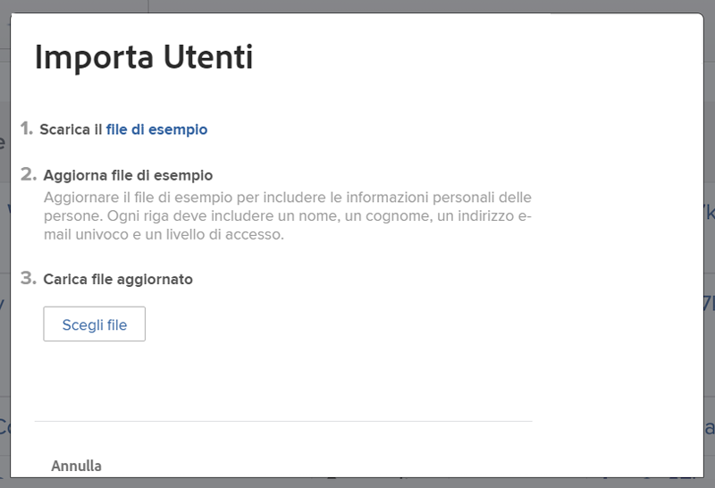

# Aggiungere utenti in blocco

L’aggiunta di un utente alla volta può risultare laborioso. [!DNL Workfront] consente a un amministratore di sistema di aggiungere più utenti contemporaneamente utilizzando la funzione di importazione.

![[!UICONTROL Opzione di menu Importa persone]](assets/admin-fund-adding-users-5.png)

1. Seleziona **[!UICONTROL Utenti]** dal [!UICONTROL Menu principale].
1. Seleziona la freccia sul pulsante **[!UICONTROL Nuova persona]** e scegli **[!UICONTROL Importa persone]**.
1. La finestra visualizzata illustra come creare un foglio di calcolo con gli utenti da importare.
1. Scarica il file di esempio, che è un foglio di calcolo [!DNL Excel].
1. Aggiorna il foglio di calcolo con le informazioni relative all’utente (nome, cognome, indirizzo e-mail, livello di accesso) seguendo le istruzioni contenute nel file stesso.
1. Seleziona il pulsante **[!UICONTROL Scegli file]** dopo aver salvato l’elenco utenti.
1. Passa al file del foglio di calcolo degli utenti e selezionalo.

Gli utenti importati vengono visualizzati nell’elenco[!UICONTROL  Utenti]. Se necessario, modifica le informazioni per uno o più utenti.

## Importare gli utenti: utilizzo di modelli kick-start

[!DNL Workfront] fornisce un modello kick-start per importare i dati nel sistema. Può essere utilizzato anche per l’importazione di utenti. Prima di usare il modello kick-start in [!DNL Workfront], è consigliabile collaborare con un consulente [!DNL Workfront], in quanto ci sono considerazioni di cui dovresti essere a conoscenza.

<!---
paragraph below needs URL to article
--->

Per informazioni dettagliate, consulta Importare dati in Workfront tramite modelli kick-start.

![[!UICONTROL Finestra Importa dati] ([!UICONTROL Kick-Start]) nell’area [!UICONTROL Configurazione]](assets/admin-fund-adding-users-8.png)

<!--
Learn more URLs
Import users
Import data into Workfront via Kick-Starts
-->
