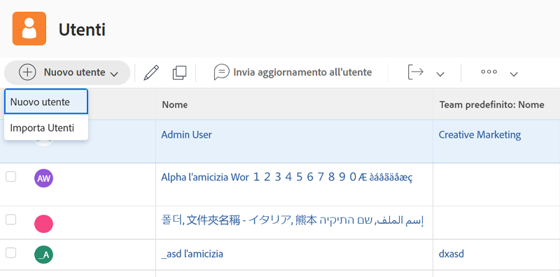

# Creare un singolo profilo utente

Quando viene assunto un nuovo dipendente o qualcuno cambia reparto utilizzando [!DNL Workfront], l’amministratore di sistema deve creare un singolo utente. Questa operazione può essere eseguita in modo rapido e semplice dall’area [!UICONTROL Utenti] in [!DNL Workfront].

1. Seleziona **[!UICONTROL Utenti]** dal **[!UICONTROL Menu principale]**.
1. Fai clic sul pulsante **[!UICONTROL Nuova persona]**.
1. Inserisci il nome e il cognome dell’utente nella finestra [!UICONTROL Nuova persona].
1. Inserisci l’indirizzo e-mail dell’utente. Questo verrà usato per accedere a [!DNL Workfront] e deve essere univoco all’interno dell’istanza di [!DNL Workfront].
1. Se desideri che l’utente riceva un’e-mail relativa ai suoi nuovi dati di accesso, seleziona la casella Invia invito.
1. Assegna alla persona un livello di accesso. Questo consente di concedere le autorizzazioni principali in [!DNL Workfront].
1. Assegna l’utente a un gruppo Home (o gruppo predefinito) per assicurarti che abbia accesso ai lavori corretti.
1. Seleziona **[!DNL Add this Person]** per completare la creazione dell’utente.

![[!UICONTROL Finestra Nuova persona]](assets/admin-fund-adding-users-1.png)

Il collegamento [!UICONTROL Mostra opzioni avanzate] apre la finestra dei dettagli completi dell’utente. Questa consente all’amministratore di sistema di impostare ulteriori informazioni sull’organizzazione e la pianificazione delle risorse, ad esempio team e mansioni, e di immettere informazioni personali sull’utente (numero di telefono, qualifica, ecc.).

![[!UICONTROL Finestra Nuova persona] dopo aver fatto clic su [!UICONTROL Mostra opzioni avanzate]](assets/admin-fund-adding-users-2.png)

Alcune di queste informazioni possono essere modificate dall’utente, altre no (dipende dalle autorizzazioni del livello di accesso dell’utente).

## Copiare un utente esistente per crearne uno nuovo

Puoi utilizzare un utente esistente nel sistema come base per creare un nuovo accesso. Alcune delle informazioni dell’utente esistente verranno copiate, altre devono essere compilate da zero.

1. Seleziona **[!UICONTROL Utenti]** dal **[!UICONTROL Menu principale]**.
1. Seleziona l’utente che desideri copiare selezionando la casella accanto al nome.
1. Seleziona la freccia sul pulsante **[!UICONTROL Nuova persona]** e scegli **[!UICONTROL Nuovo da persona selezionata]**.
1. Compila la sezione **[!UICONTROL Informazioni personali]** con le informazioni del nuovo utente.
1. Alcuni campi vengono copiati dall’utente originale. Modifica le informazioni in base alle esigenze.
1. Seleziona **[!UICONTROL Aggiungi questa persona]**.

![[!UICONTROL Finestra Nuova persona]](assets/admin-fund-adding-users-4.png)

<!--
Learn more URLs
Add users
-->
