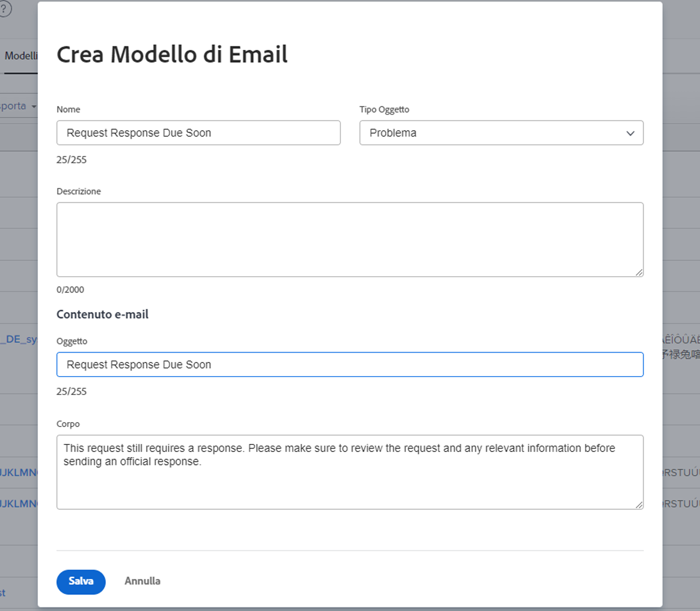

<!---
this has the same content as the system administrator notification setup and mangement section of the email and inapp notificiations learning path
--->

# Impostare le notifiche di promemoria

Le notifiche di promemoria vengono create dagli amministratori di sistema nell’area [!UICONTROL Configurazione]. Possono quindi essere collegate e utilizzate dai proprietari di progetti, attività e problemi come promemoria per quando il lavoro è in scadenza o in ritardo.

I promemoria sono specifici dell’oggetto e devono essere collegati manualmente all’elemento di lavoro corrispondente in modo che la notifica possa essere inviata.

**Creare una notifica di promemoria**

1. Fai clic su **[!UICONTROL Configurazione]** nel **[!UICONTROL Menu principale]**.
1. Fai clic sulla sezione **[!UICONTROL E-mail]**.
1. Fai clic sulla sezione **[!UICONTROL Notifiche]**.
1. Fao clic sulla scheda **[!UICONTROL Nuovo promemoria]**.
1. Fai clic sul pulsante **[!UICONTROL Nuova notifica di promemoria]**.
1. Seleziona l’oggetto desiderato dal menu a discesa.
1. Compila le informazioni richieste.
1. Fai clic su **[!UICONTROL Salva]**.

Finestra ![[!UICONTROL Nuova notifica di promemoria]](assets/admin-fund-reminder-notification-1.png)

Quando si imposta il promemoria, è necessario considerare alcuni aspetti:

* **[!UICONTROL Nome della notifica di promemoria]:** questo è il nome che verrà visualizzato dai project manager quando collegano un promemoria a un oggetto. Assicurati che il nome sia sintetico ma descrittivo.
* **[!UICONTROL Periodo idoneo]:** il numero di ore, giorni, settimane o mesi prima/dopo la data selezionata nella sezione Tempistica.
* **[!UICONTROL Tempistica]:** seleziona se inviare il promemoria prima o dopo le date di inizio/completamento pianificate, previste o effettive. Le opzioni per le schede orario sono correlate alla data di inizio, alla data di fine o alla data dell’ultimo aggiornamento.
* **[!UICONTROL Criteri]:** specifica i criteri per consentire l’invio del promemoria. Le opzioni variano a seconda del promemoria specifico dell’oggetto.
* **[!UICONTROL Destinatari]:** seleziona a chi inviare il promemoria. Le opzioni degli stakeholder variano a seconda del tipo di oggetto selezionato per il promemoria.

Una volta stabilite e salvate le impostazioni del promemoria, la notifica del promemoria è disponibile per l’utilizzo da parte dei proprietari dell’oggetto di [!DNL Workfront].

## Personalizzazione e-mail

Le notifiche di promemoria utilizzano un formato e-mail e un messaggio predefiniti. Se desideri personalizzare l’e-mail, puoi creare un modello.

<!---
paragraph above needs a hyperlink to an article
--->

<!---
learn more URLs
--->
