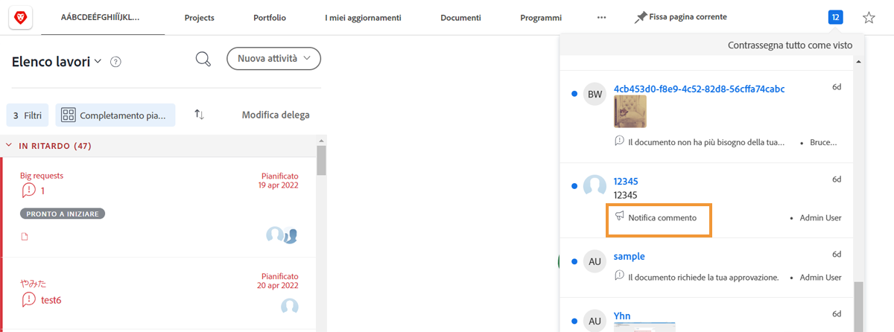
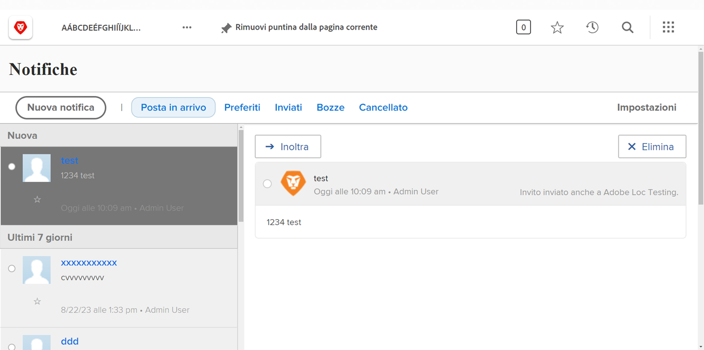

<!--
this has the same content as the system administrator notification setup and mangement section of the email and inapp notificiations learning path
-->

# Inviare messaggi tramite il [!UICONTROL Centro annunci]

Il [!UICONTROL Centro annunci] è un’area centralizzata da cui gli amministratori di sistema ricevono comunicazioni da [!DNL Workfront] o inviano annunci agli utenti di [!DNL Workfront] della propria organizzazione.

[!DNL Workfront] invia annunci agli amministratori di sistema sul rilascio di versioni del software, sui prossimi webinar, sulla manutenzione del sistema e altro ancora. Il [!UICONTROL Centro annunci] raccoglie tutte queste informazioni importanti in un’unica area, in modo da non perderle tra gli altri messaggi che arrivano nella propria casella e-mail.

L’icona di notifica mostra eventuali notifiche e annunci non letti inviati tramite [!DNL Workfront]. Gli annunci nell’elenco sono etichettati e sono cliccabili per consentire di aprirli.

Anche gli amministratori di sistema possono utilizzare il [!UICONTROL Centro annunci] per inviare messaggi [!DNL Workfront] a livello generale agli utenti. Puoi inviare promemoria su chi contattare per il supporto, offrire un &quot;suggerimento del giorno&quot; e altro ancora.

![[!UICONTROL Link a Tutti gli annunci]](assets/admin-fund-announcements-2.png)

**Per inviare un annuncio**

1. Fai clic sull’**icona di notifica**.
1. Fai clic su **[!UICONTROL Tutti gli annunci]**.
1. Fai clic sul pulsante **[!UICONTROL Nuovo annuncio]**. Per impostazione predefinita, la riga [!UICONTROL Invia a] viene compilata con[!UICONTROL Tutti] per mandare un messaggio a tutti gli utenti di [!DNL Workfront]. Puoi eliminare questa impostazione e immettere i nomi di utenti, mansioni, team, gruppi o aziende.
1. Immetti un oggetto.
1. Quindi digita il testo dell’annuncio, utilizzando gli strumenti di modifica desiderati.
1. Allega i file da condividere facendo clic sul pulsante **[!UICONTROL Aggiungi allegato]**, se applicabile.
1. Fai clic su **[!UICONTROL Invia]**.

![Scrivere un annuncio sulla pagina [!UICONTROL Annunci]](assets/admin-fund-announcements-3.png)

L&#39;area degli annunci assomiglia a una casella di posta in entrata, con i messaggi ricevuti elencati nel pannello a sinistra. Fai clic su un messaggio per leggerlo.

