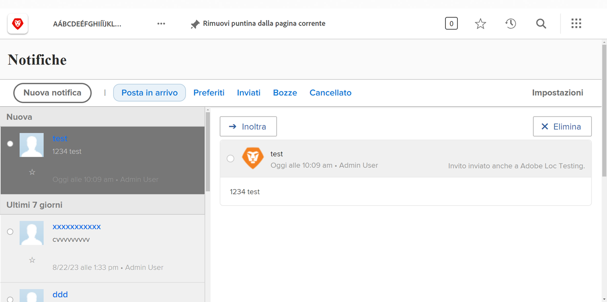

<!---
this has the same content as the system administrator notification setup and mangement section of the email and inapp notificiations learning path
--->

# Invia [!UICONTROL Centro notifiche] messaggi

Il [!UICONTROL centro annunci] è una posizione centralizzata da cui gli amministratori di sistema possono ricevere comunicazioni [!DNL Workfront] o invia annunci al team di [!DNL Workfront] utenti.

[!DNL Workfront] invia annunci agli amministratori di sistema sulle versioni del software, i prossimi webinar, la manutenzione del sistema e altro ancora. Il [!UICONTROL centro annunci] inserisce tutte queste informazioni importanti in un’unica posizione, in modo da non perderle tra gli altri messaggi nella tua casella e-mail in entrata.

L’icona di notifica mostra tutte le notifiche e gli annunci non letti inviati tramite [!DNL Workfront]. Gli annunci nell’elenco sono etichettati e sono cliccabili se desideri aprirli.

Gli amministratori di sistema possono inoltre utilizzare [!UICONTROL centro annunci] da inviare [!DNL Workfront]messaggi a livello di utente. Puoi inviare promemoria su chi contattare per il supporto, offrire un &quot;suggerimento del giorno&quot; e altro ancora.

![[!UICONTROL Tutti gli annunci] link](assets/admin-fund-announcements-2.png)

**Per inviare una notifica**

1. Fai clic su **icona di notifica**.
1. Clic **[!UICONTROL Tutti gli annunci]**.
1. Fai clic su **[!UICONTROL Nuova notifica]** pulsante. Per impostazione predefinita, il [!UICONTROL Invia a] riga riempita con [!UICONTROL Tutti] per inviare un messaggio a tutti [!DNL Workfront] utenti. Puoi eliminare questa voce e immettere i nomi di utenti, mansioni, team, gruppi o aziende.
1. Immettere un oggetto.
1. Quindi digita il testo dell’annuncio, utilizzando gli strumenti di modifica desiderati.
1. Allegare i file da condividere facendo clic sul pulsante **[!UICONTROL Aggiungi allegato]** , se applicabile.
1. Clic **[!UICONTROL Invia]**.

![Scrittura di un annuncio su [!UICONTROL Annunci] pagina](assets/admin-fund-announcements-3.png)

L’area annunci è simile a una casella in entrata e i messaggi ricevuti sono visualizzati nel pannello a sinistra. Fai clic su un messaggio per leggerlo.

