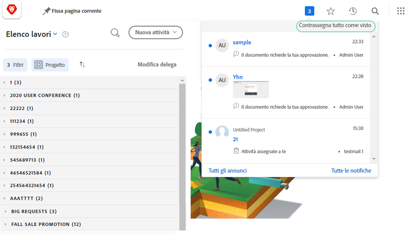
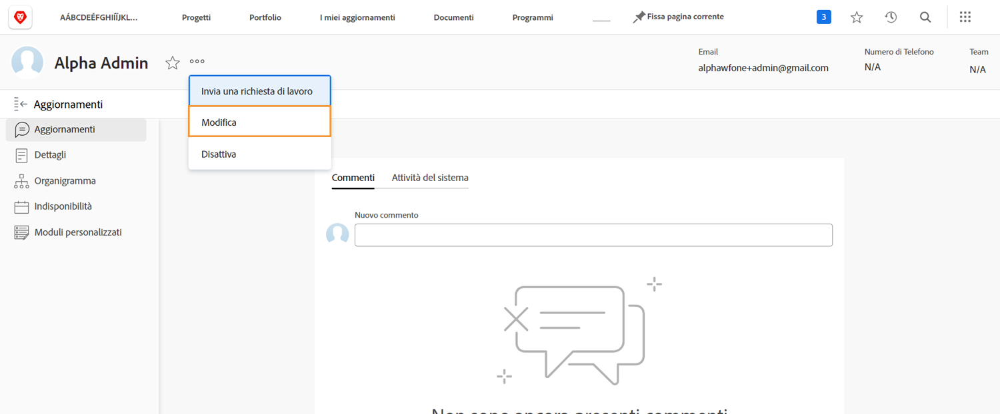

# Gestire le notifiche in-app ed e-mail degli eventi

Le e-mail fanno parte della vita lavorativa quotidiana e, in alcuni giorni, la quantità di e-mail che ricevi è enorme. Tuttavia, [!DNL Workfront], gli amministratori di sistema possono assicurarsi che tutti ricevano e-mail pertinenti e utili sul lavoro a cui sono coinvolti.

Esistono diversi tipi di notifiche che Workfront può inviare agli utenti. Alcune di queste notifiche sono controllate a livello di sistema e interessano tutti gli utenti. Alcune notifiche possono essere impostate in modo da generare istantaneamente e-mail, in un riepilogo giornaliero. Oppure disattiva le e-mail per generare solo notifiche all’interno di Workfront.

## Avvisi di Evento

Un evento è simile a una modifica dello stato, a un commento pubblicato o a un’assegnazione effettuata e può attivare una notifica in-app in [!DNL Workfront].

Tuttavia, puoi determinare per quali eventi desideri ricevere le notifiche e-mail selezionando o deselezionando le opzioni nelle preferenze.

Per apportare tali modifiche, fare clic sul proprio nome dal [!UICONTROL Menu principale].

![Nome utente in [!UICONTROL Menu principale]](assets/admin-fund-user-notifications-02.png)

Clic [!UICONTROL Modifica] dal [!UICONTROL Altro] menu.

Clic [!UICONTROL Notifiche] nel [!UICONTROL Modifica persona] finestra popup.

![[!UICONTROL Modifica persona] finestra](assets/admin-fund-user-notifications-04.png)

Da qui puoi decidere quali notifiche desideri ricevere immediatamente, quotidianamente o non ricevere affatto. Tutte le modifiche apportate qui sono specifiche e non influiscono su alcun altro utente in Workfront.

**[!UICONTROL Giornaliera]**

Per impostazione predefinita, le e-mail sono configurate per essere inviate all’istante. Tuttavia, puoi cambiare la frequenza delle notifiche e-mail da [!UICONTROL Istantanea] a [!UICONTROL Giornaliero], assicurandoti di ottenere le informazioni necessarie quando lo desideri.

![[!UICONTROL Notifica] sezione di [!UICONTROL Modifica persona] finestra](assets/admin-fund-user-notifications-05.png)

L’opzione Daily (Giornaliero) invia un riepilogo degli eventi del giorno in un’e-mail. Gli utenti ricevono un’e-mail per ogni raggruppamento visualizzato nel [!UICONTROL Notifiche] sezione.

Ad esempio, il [!UICONTROL Informazioni sui progetti di cui sono proprietario] genera un’e-mail giornaliera, la [!UICONTROL Azione necessaria] genererà un’e-mail giornaliera, ecc.

![[!UICONTROL Riepilogo giornaliero] e-mail per [!UICONTROL Informazioni sui progetti di cui sono proprietario]](assets/admin-fund-user-notifications-06.png)

![[!UICONTROL Riepilogo giornaliero] e-mail per [!UICONTROL Azione necessaria]](assets/admin-fund-user-notifications-07.png)

Oltre a selezionare l’opzione giornaliera, imposta un orario per l’invio delle e-mail. A seconda di ciò che funziona meglio, le e-mail di riepilogo possono essere inviate prima di entrare in lavoro al mattino o appena prima di partire per la giornata.

![[!UICONTROL Invia digest tramite e-mail ogni giorno dopo] menu a discesa nella [!UICONTROL Modifica persona] finestra](assets/admin-fund-user-notifications-08.png)

**Per Niente**

L’opzione finale consiste nel disattivare completamente le notifiche e-mail.

![Notifica selezionata disattivata in [!UICONTROL Modifica persona] finestra](assets/admin-fund-user-notifications-09.png)

Se decidi di eseguire questa operazione, tieni presente che anche se non ricevi e-mail, il lavoro viene ancora assegnato, commentato e aggiornato in [!DNL Workfront]. Disattivando tutte le notifiche, potresti perdere informazioni importanti di cui hai bisogno.

Ci sono alcune istanze quando [!DNL Workfront] ha visto gli utenti disattivare le notifiche e-mail. Ad esempio, se esegui la maggior parte del lavoro attraverso [!DNL Workfront] app mobile, puoi disattivare le notifiche e-mail e ricevere le notifiche solo tramite l’app.

Indipendentemente dalle [!UICONTROL Notifiche evento] se decidi di ricevere, le notifiche sono importanti per il successo del lavoro svolto per gli obiettivi della tua organizzazione.

## Recommendations

Ci sono due notifiche che [!DNL Workfront] consiglia di lasciare selezionato, sia per un’e-mail istantanea che per un riepilogo giornaliero.

Per la maggior parte degli utenti:

* [!UICONTROL Quando si completa un&#39;attività, invia una Email a tutti gli incaricati di attività dipendenti]
* [!UICONTROL Qualcuno mi include in un aggiornamento diretto]
* [!UICONTROL Qualcuno ha commentato il mio elemento di lavoro]
* [!UICONTROL Le modifiche della data di scadenza su un&#39;attività a cui sono assegnato]

In particolare per i project manager:

* [!UICONTROL Quando si cambia lo stato del progetto da Idea/Approvato/Richiesta/Pianificazione ad Attuale, invia una Email alla squadra]
* [!UICONTROL Quando si cambia lo stato di avanzamento di un progetto da positivo (Nei Tempi) a negativo (In Ritardo), invia una Email al Proprietario del progetto.]
* [!UICONTROL Quando si aggiunge una Issue, invia email al Proprietario del progetto]
* [!UICONTROL L&#39;attività principale è completata su un mio progetto]

<!---
learn more URLs
Email notifications
guide: manage your notifications
--->
