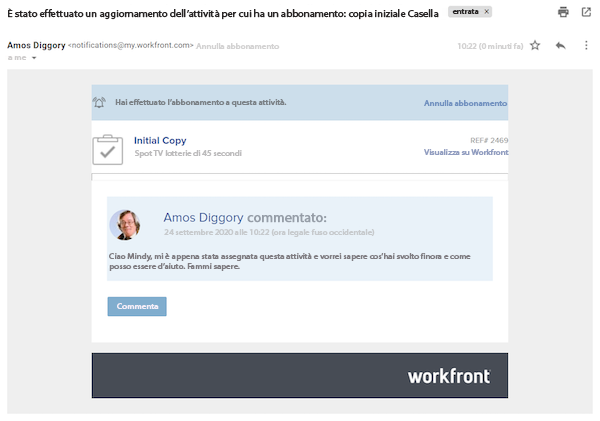
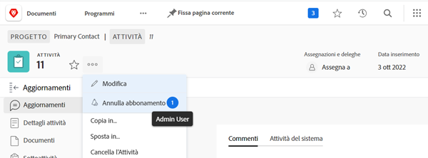

# Iscriviti agli elementi di lavoro

Le notifiche degli eventi ti aggiornano sul lavoro a cui sei stato assegnato. Tuttavia, in alcuni casi è possibile che si desideri seguire gli elementi di lavoro a cui non si è assegnati, in quanto ciò potrebbe influire sul lavoro svolto. L&#39;iscrizione a un elemento specifico è la soluzione perfetta.

Ad esempio, sei interessato all’avanzamento dell’attività Copia iniziale . Non sei assegnato a questa attività, ma sei responsabile della modifica della copia iniziale e desideri sapere cosa sta succedendo. Puoi abbonarti all’attività e, quando vengono effettuati gli aggiornamenti, ricevere una notifica e-mail con un aggiornamento in tempo reale sull’avanzamento di tale lavoro.

È importante notare che le e-mail di abbonamento e le notifiche in-app vengono inviate solo quando vengono inseriti commenti sull’elemento. Le e-mail e le notifiche non vengono inviate su altre azioni, ad esempio modifiche alla data di scadenza o modifiche all’assegnazione.

Per abbonarti a un elemento di lavoro devi disporre almeno di un&#39;autorizzazione di condivisione Visualizza per quell&#39;elemento.

![[!UICONTROL Accesso attività] finestra](assets/admin-fund-user-notifications-11.png)

Una volta effettuato l’accesso all’elemento di lavoro, iscriviti a tale elemento:

1. Vai alla pagina di destinazione del progetto, dell’attività o del problema.
1. Fai clic su **[!UICONTROL Azioni]** menu.
1. Clic **[!UICONTROL Abbonati]**.

![[!UICONTROL Abbonati] opzione nel menu attività](assets/admin-fund-user-notifications-12.png)

Per vedere chi altro ha effettuato la sottoscrizione all’elemento di lavoro, passa il cursore sul numero accanto a [!UICONTROL Abbonati/Annulla sottoscrizione] nel menu .

Se [!UICONTROL Gestisci] o [!UICONTROL Condividi] autorizzazioni per l&#39;elemento di lavoro, è possibile abbonare altri utenti a un progetto, un&#39;attività o un problema:

1. Fai clic sul numero accanto al **[!UICONTROL Abbonati]** opzione .
1. Aggiunta del nome della persona o delle persone che si desidera sottoscrivere all&#39;elemento di lavoro.
1. Clic **[!UICONTROL Salva]**.

![[!UICONTROL Abbonati] finestra](assets/admin-fund-user-notifications-15.png)

Gli abbonati non ricevono alcuna notifica dell’abbonamento. A tutti gli abbonati vengono assegnate le autorizzazioni di visualizzazione all’elemento. Tuttavia, se l&#39;abbonato aveva già [!UICONTROL Collaborare] o [!UICONTROL Gestisci] autorizzazioni per l&#39;elemento, tali autorizzazioni rimangono invariate.

Una voce nel campo [!UICONTROL Aggiornamenti] la scheda del singolo elemento indica anche chi ha effettuato l’abbonamento e quando. La [!UICONTROL Aggiornamenti] La scheda registra anche quando un utente è iscritto da un altro utente.

![[!UICONTROL Aggiornamenti] pagina di un&#39;attività che mostra la sottoscrizione](assets/admin-fund-user-notifications-16.png)

Per annullare l’iscrizione di un utente, fai nuovamente clic sulla bolla per aprire la [!UICONTROL Abbonati] finestra. Quindi fai clic sulla X accanto al nome della persona. L’utente non riceve una notifica del suo annullamento dell’abbonamento.

![[!UICONTROL Annulla sottoscrizione] opzione di menu in un progetto](assets/admin-fund-user-notifications-14.png)

<!---
learn more URL: Subscribe to items in Workfront
--->
