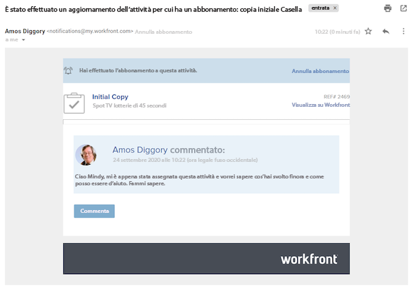
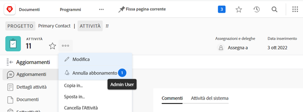

# Iscriversi agli elementi di lavoro

Le notifiche degli eventi ti aggiornano sul lavoro che ti è stato assegnato. Tuttavia, in alcuni casi potrebbe essere utile seguire elementi di lavoro a cui non sei assegnato, in quanto potrebbero influire sul tuo lavoro. A tale scopo puoi iscriverti per un elemento specifico.

Supponiamo ad esempio che tu sia interessato all’avanzamento dell’attività Copia iniziale. Non ti è stata assegnata, ma sei responsabile della modifica della copia iniziale e vuoi sapere come procede. Se ti iscriverti all’attività, quando vengono apportati aggiornamenti riceverai una notifica e-mail con un aggiornamento in tempo reale sull’avanzamento del lavoro.

È importante notare che le e-mail delle iscrizioni e le notifiche in-app vengono inviate solo quando vengono aggiunti commenti all’elemento. Le e-mail e le notifiche non vengono inviate per altre azioni, come modifiche della data di scadenza o modifiche delle assegnazioni.

Per iscriverti a un elemento di lavoro è necessario disporre almeno di un’autorizzazione alla condivisione per visualizzazione per tale elemento.

![[!UICONTROL Finestra Accesso attività]](assets/admin-fund-user-notifications-11.png)

Una volta che hai accesso all’elemento di lavoro, puoi iscriverti come segue:

1. Dalla pagina di destinazione del progetto, dell’attività o del problema.
1. Facendo clic sul menu **[!UICONTROL Azioni]**.
1. Fai clic su **[!UICONTROL Iscrizione]**.

![[!UICONTROL Opzione Iscrizione] nel menu dell’attività](assets/admin-fund-user-notifications-12.png)

Per vedere le altre persone iscritte all’elemento di lavoro, passa il puntatore sul numero accanto a [!UICONTROL Iscrizione/Annulla iscrizione] nel menu.

Se disponi di autorizzazioni [!UICONTROL Gestisci] o [!UICONTROL Condividi] dell’elemento di lavoro, puoi iscrivere altri utenti a un progetto, un’attività o un problema come segue:

1. Fai clic sul numero accanto all’opzione **[!UICONTROL Iscrizione]**.
1. Aggiungi il nome delle persone da iscrivere all’elemento di lavoro.
1. Fai clic su **[!UICONTROL Salva]**.

![[!UICONTROL Finestra Iscrizione]](assets/admin-fund-user-notifications-15.png)

Le persone che iscrivi non riceveranno una notifica dell’iscrizione. A tutte le persone iscritte vengono assegnate le autorizzazioni di visualizzazione per l’elemento. Tuttavia, se l’iscritto disponeva già di autorizzazioni [!UICONTROL Contribuisci] o [!UICONTROL Gestisci] all’elemento, tali autorizzazioni rimangono invariate.

Una voce nella scheda [!UICONTROL Aggiornamenti] sul singolo elemento indica anche chi ha effettuato l’iscrizione e quando. La scheda [!UICONTROL Aggiornamenti] registra anche quando un utente è stato iscritto da un altro utente.

![[!UICONTROL Pagina Aggiornamenti] di un’attività che mostra l’iscrizione](assets/admin-fund-user-notifications-16.png)

Per annullare l’iscrizione di un utente, fai nuovamente clic sul fumetto per aprire la finestra [!UICONTROL Iscrizione]. Quindi fai clic sulla X accanto al nome della persona. L’utente non viene informato dell’annullamento dell’iscrizione.

![[!UICONTROL Opzione di menu Annulla iscrizione] di un progetto](assets/admin-fund-user-notifications-14.png)

<!--
learn more URL: Subscribe to items in Workfront
-->
