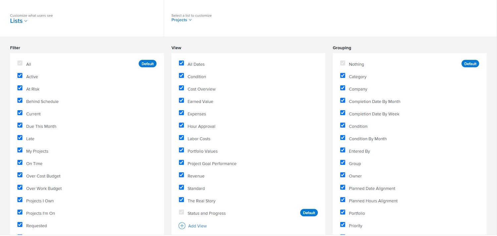

# Personalizza gli elenchi di reporting con i modelli layout

In questo video scoprirai come:

* passare alle impostazioni dell’elenco dei rapporti in un modello layout
* Rimuovere filtri, visualizzazioni e raggruppamenti
* Aggiungere filtri, visualizzazioni e raggruppamenti

>[!VIDEO](https://video.tv.adobe.com/v/3432912/?quality=12&learn=on&enablevpops&captions=ita)

## Impostare le impostazioni predefinite dell’elenco

L’impostazione di filtri, visualizzazioni e/o raggruppamenti predefiniti per gli utenti offre loro un accesso più rapido a informazioni vitali che possono far avanzare il lavoro più velocemente.

Come amministratore di sistema o di gruppo, puoi determinare cosa gli utenti vedono inizialmente quando consultano un elenco di progetti, attività, problemi, ecc., impostando filtri, visualizzazioni e/o raggruppamenti predefiniti tramite un modello layout.

Finestra [!UICONTROL Elenchi] 

>[!NOTE]
>
>Anche se è possibile impostare filtri, visualizzazioni e/o raggruppamenti predefiniti, il sistema è fisso e mostrerà qualsiasi filtro, visualizzazione e/o raggruppamento utilizzati l’ultima volta dall’utente.

Se desideri impostare un elenco predefinito, puoi:

* passare il mouse su un’opzione già elencata e fare clic su [!UICONTROL Imposta come predefinito].

Finestra [!UICONTROL Elenchi] ![Modello layout con l’opzione [!UICONTROL Imposta come predefinito] visibile](assets/admin-fund-layout-template-default-lists-1-2.JPG)

* Oppure puoi aggiungere un filtro, una visualizzazione o un raggruppamento personalizzato e selezionare la casella accanto a [!UICONTROL Imposta predefinito].

Finestra ![[!UICONTROL Aggiungi una visualizzazione esistente]](assets/admin-fund-layout-template-default-lists-1-3.JPG)

Al termine, vedrai il tag [!UICONTROL Predefinito].

Tag ![[!UICONTROL Predefinito] accanto all’opzione dell’elenco](assets/admin-fund-layout-template-default-lists-1-4.JPG)
