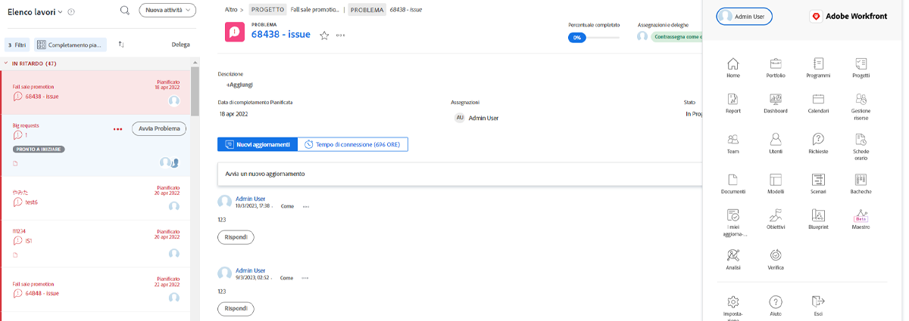
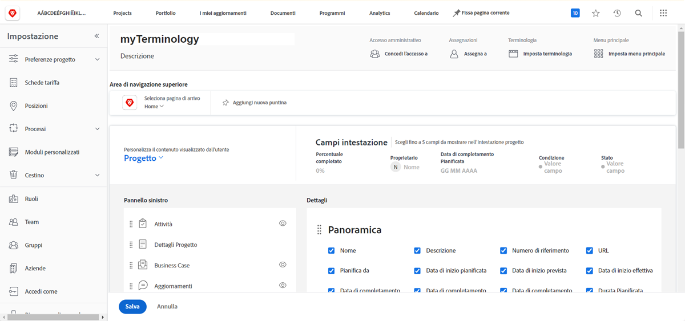
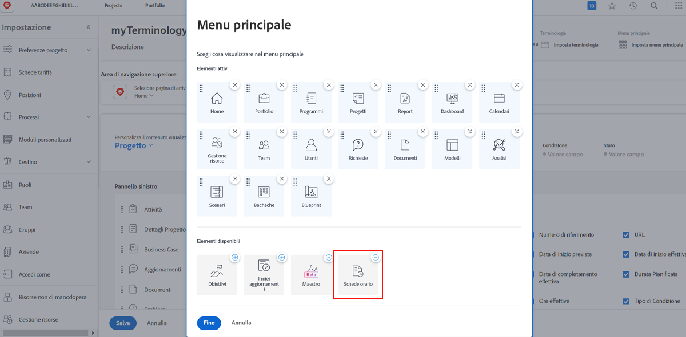
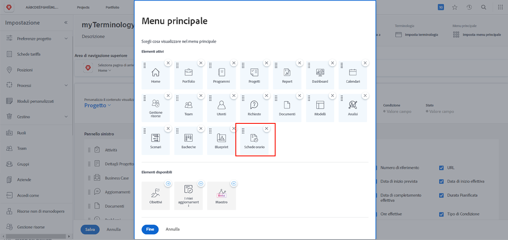

# Cosa sono i modelli di layout?

Workfront dispone di diversi ottimi strumenti per aiutarti nello svolgimento del lavoro. Ma a volte il troppo “stroppia”.

I modelli di layout consentono agli amministratori di sistema e di gruppo di personalizzare l’esperienza utente e agli utenti di concentrarsi su ciò che ritengono importante.

Ad esempio, la maggior parte dell’organizzazione non registra le ore. Tuttavia, il team di consulenti emette fatture per la clientela, quindi deve registrare le ore per garantire una fatturazione precisa. Con un un modello di layout, le schede orario possono essere nascoste per chi non ne ha bisogno e mostrate per chi ne ha.

## Prima della creazione

Workfront consiglia di parlare con gli utenti prima di creare un modello di layout. Il coinvolgimento di coloro che utilizzeranno il modello di layout, come gli amministratori di gruppo, renderà molto più semplice il posizionamento delle informazioni e degli strumenti giusti davanti alle persone giuste.

E non avere paura di apportare modifiche dopo la creazione di un modello. Continua a ricevere feedback sugli elementi di cui hanno bisogno, che desiderano visualizzare e a cui vogliono accedere. Ricorda che i modelli di layout hanno lo scopo di creare un’esperienza chiara e semplice per i tuoi utenti.
