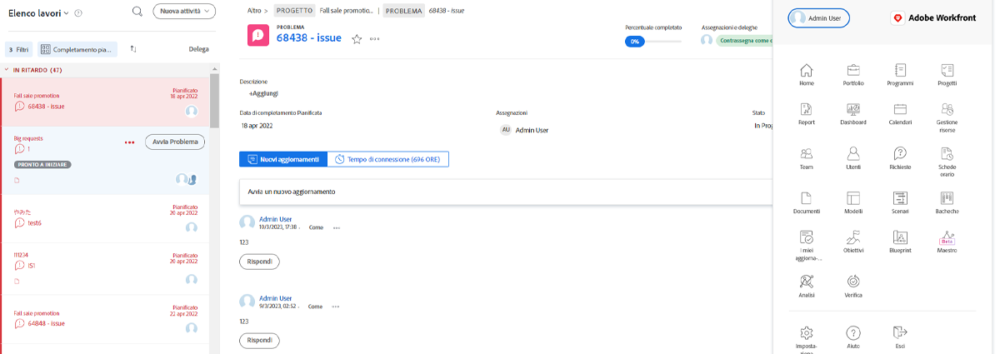
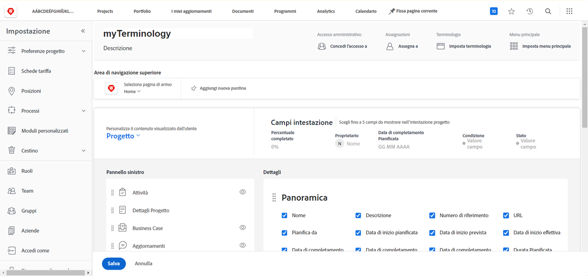
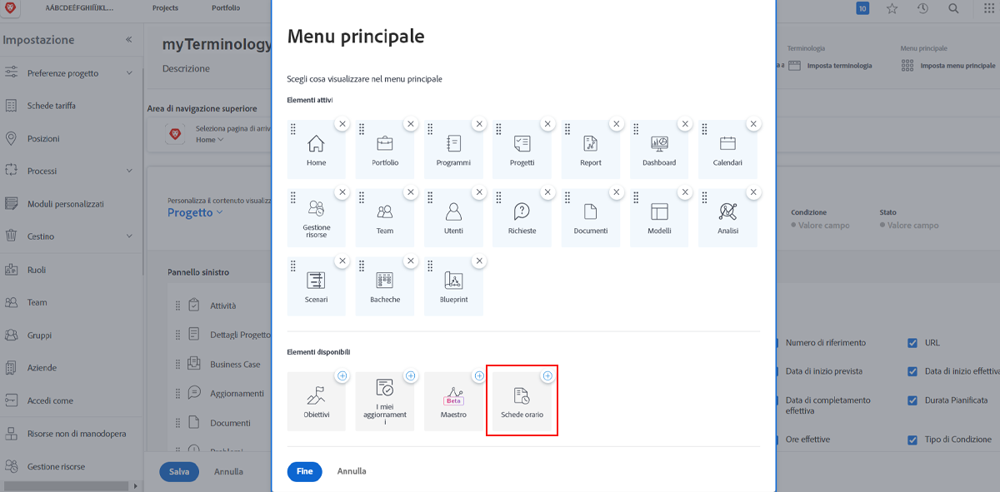
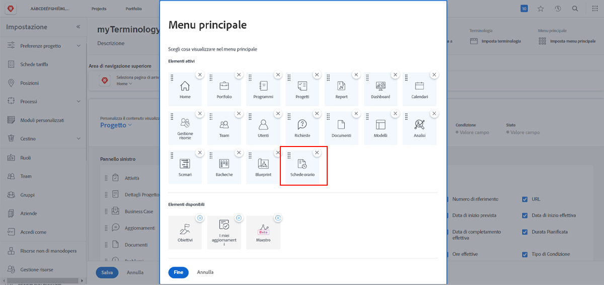

# Cosa sono i modelli layout?

Workfront dispone di diversi ottimi strumenti per aiutarti nello svolgimento del lavoro. Ma a volte il troppo “stroppia”.

I modelli layout consentono agli amministratori di sistema e di gruppi di personalizzare l’esperienza utente, in modo che gli utenti possano concentrarsi su ciò che è più importante per il loro lavoro.

Ad esempio, la maggior parte dell’organizzazione non registra le ore. Tuttavia, il team di consulenti emette fatture per la clientela, quindi deve registrare le ore per garantire una fatturazione precisa. Con un un modello layout, le schede orario possono essere rese visibili a chi ne ha bisogno, e nascoste agli altri utenti.

## Prima della creazione

Workfront consiglia di parlare con gli utenti prima di creare un modello layout. Con i coinvolgimento delle persone che utilizzeranno il modello layout, come gli amministratori di gruppi, sarà molto più semplice assicurarsi che ogni utente abbia a portata di mano le informazioni e gli strumenti di cui ha bisogno.

E non avere paura di apportare modifiche dopo la creazione di un modello. Continua a ricevere feedback sugli elementi di cui hanno bisogno, che desiderano visualizzare e a cui vogliono accedere. Ricorda che i modelli layout hanno lo scopo di creare un’esperienza chiara e semplice per i tuoi utenti.
