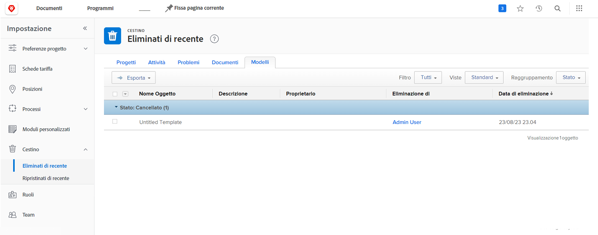
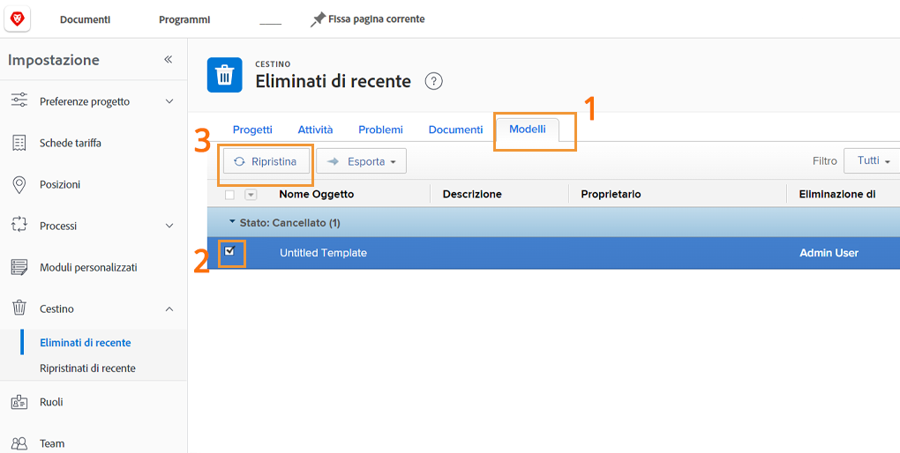
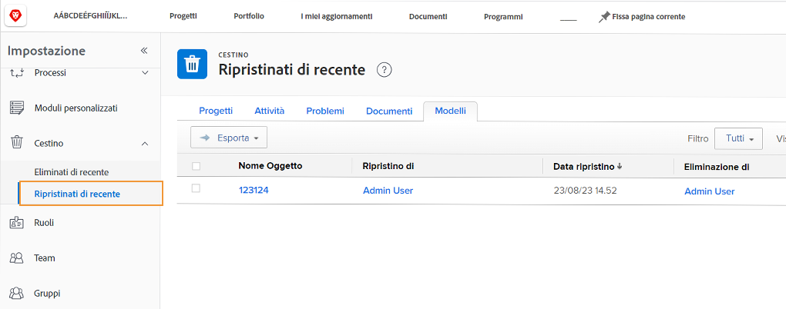

# Ripristinare gli oggetti dal Cestino

Il lavoro del progetto attraversa molti cambiamenti. Si potrebbe eliminare qualcosa, solo per capire 30 minuti dopo che l&#39;attività era necessaria o il documento era vitale per il problema che si sta cercando di risolvere.

Con il Cestino, quando l’oggetto viene eliminato, Workfront lo inserisce nel per un massimo di 30 giorni. L’amministratore di sistema può ripristinare l’oggetto nella posizione originale in Workfront, insieme a tutte le informazioni (aggiornamenti, ore registrate, documenti, ecc.).

## Ripristinare un oggetto

1. Seleziona la **Configurazione** nella zona **Menu principale**.
1. Fai clic su **Cestino** nel pannello a sinistra.
1. Seleziona **Eliminato di recente**.

Ogni oggetto ripristinabile ha una scheda per facilitare la ricerca del particolare elemento da ripristinare.

1. Fare clic sulla scheda dell’oggetto desiderato.
1. Selezionare la casella accanto agli oggetti da ripristinare.
1. Fai clic sul pulsante **Ripristina** pulsante .

Gli oggetti che vengono ripristinati verranno brevemente visualizzati in un [!UICONTROL In corso] sezione . Una volta aggiornata la schermata, gli oggetti non vengono più visualizzati sullo schermo perché sono stati ripristinati. Gli elementi vengono visualizzati nella posizione in cui si trovavano in precedenza [!DNL Workfront], che puoi verificare nel [!UICONTROL Ripristinato di recente] schermo.

Gli amministratori dei gruppi possono ripristinare un progetto associato al gruppo che gestiscono, insieme a tutte le attività, i problemi o i documenti associati al progetto.

<!---
learn more URL
Restoring deleted items
Viewing items that have been recently restored
--->
