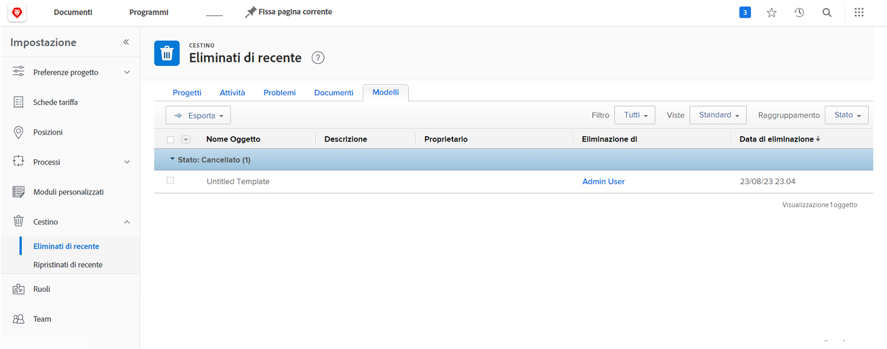
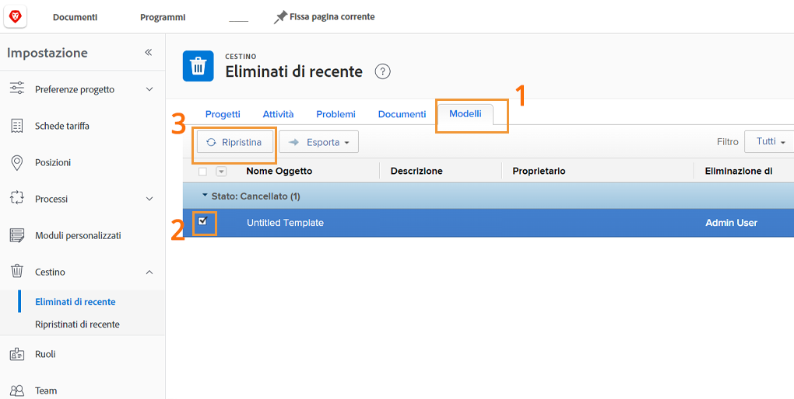
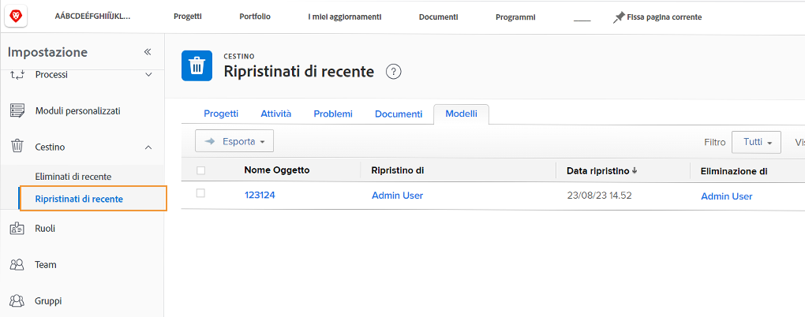

# Ripristinare oggetti dal Cestino

Il lavoro del progetto subisce molti cambiamenti. Può capitare di cancellare qualcosa e rendersi conto 30 minuti dopo che si trattava di un’attività necessaria o di un documento importante per il problema che si sta cercando di risolvere.

Quando un oggetto viene eliminato, Workfront lo inserisce nel Cestino per un massimo di 30 giorni. L’amministratore di sistema può ripristinare la posizione originale dell’oggetto in Workfront, insieme a tutte le relative informazioni (aggiornamenti, ore registrate, documenti, ecc.).

## Ripristinare un oggetto

1. Seleziona l’area **Configurazione** nel **Menu principale**.
1. Fai clic su **Cestino** nel pannello a sinistra.
1. Seleziona **Eliminati di recente**.

Ogni oggetto ripristinabile dispone di una scheda per facilitare la ricerca dell’elemento da ripristinare.

1. Fai clic sulla scheda dell’oggetto desiderato.
1. Seleziona la casella accanto agli oggetti da ripristinare.
1. Fai clic sul pulsante **Ripristina**.

Gli oggetti in corso di ripristino verranno visualizzati brevemente in una sezione [!UICONTROL In corso]. Una volta aggiornata la schermata, gli oggetti non sono più visualizzati in questa schermata perché sono stati ripristinati. Gli elementi vengono visualizzati nel punto in cui erano precedentemente presenti in [!DNL Workfront] e li puoi verificare nela schermata [!UICONTROL Ripristinati di recente].

Gli amministratori di gruppi possono ripristinare un progetto associato al gruppo che gestiscono, insieme ad attività, problemi o documenti associati al progetto.

<!--
learn more URL
Restoring deleted items
Viewing items that have been recently restored
-->
