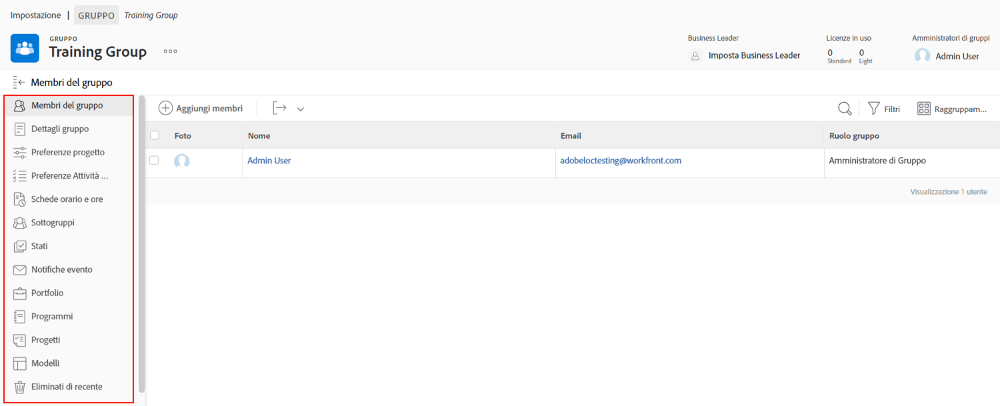

# Comprendere la necessità di amministratori di gruppi

<!---
21.4 updates have been made
--->

Se sei l’amministratore di sistema in una grande impresa o in un’azienda con molti utenti di [!DNL Workfront], la gestione delle impostazioni di [!DNL Workfront] per ciascun gruppo e sottogruppo può richiedere parecchio tempo.

Nominando degli amministratori di gruppi che potranno eseguire alcune funzioni amministrative per i propri gruppi in [!DNL Workfront], potrai bilanciare meglio il carico di lavoro in termini di aggiornamento e manutenzione del sistema.

In genere, gli amministratori dei gruppi conoscono le sfide quotidiane del proprio gruppo e possono gestirne meglio le esigenze. L’amministratore di sistema potrà quindi concentrarsi sulle configurazioni di [!DNL Workfront] a vantaggio dell’organizzazione nel suo complesso.

Gli amministratori dei gruppi possono eseguire diverse operazioni in [!DNL Workfront], tra cui:

* Creare sottogruppi e aggiungere utenti ai sottogruppi.
* Crea modelli di layout per il gruppo.
* Creare processi di approvazione per il gruppo.
* Creare stati del flusso di lavoro a livello di gruppo.
* Dalla pagina del gruppo è possibile accedere a progetti, programmi e portfolio associati al gruppo.
* Gestire le preferenze per progetti, attività e problemi a livello di gruppo.
* Gestire le preferenze delle schede orario a livello di gruppo.
* Gestire le notifiche degli eventi a livello di gruppo.
* Accedere come altri membri del gruppo.
* Assegnare un business leader al gruppo.
* Gestire un’azienda.

In qualità di amministratore di sistema o di gruppo, puoi creare sottogruppi all’interno dei gruppi e dei sottogruppi amministrati. A tali sottogruppi possono essere assegnati i propri amministratori di gruppo.

>[!NOTE]
>
>Un gruppo può contenere fino a 14 livelli di sottogruppi.

**Ulteriori informazioni sugli amministratori di gruppi**

<!---
bullet points below need hyperlinks
--->

Per un elenco delle operazioni che gli amministratori di sistema, di gruppi e di sottogruppi possono eseguire in [!DNL Workfront], consulta l’articolo Azioni consentite per diversi tipi di amministratori.

## Gestire un gruppo

Dalla pagina del gruppo in [!DNL Workfront] puoi gestire in modo rapido ed efficiente i membri, i sottogruppi, gli stati dei gruppi, le preferenze dei progetti dei gruppi e altro ancora.

1. Seleziona **[!UICONTROL Configurazione]** dal **[!UICONTROL Menu principale]**.
1. Vai a **[!UICONTROL Gruppi]** nel pannello a sinistra.
1. Seleziona il nome di un gruppo per aprirlo.
1. Apri la sezione in cui desideri apportare aggiornamenti facendo clic su di essa nel pannello a sinistra.

<!---
learn more URLs
Create and manage groups 
Create and manage subgroups 
Business leader overview 
--->
