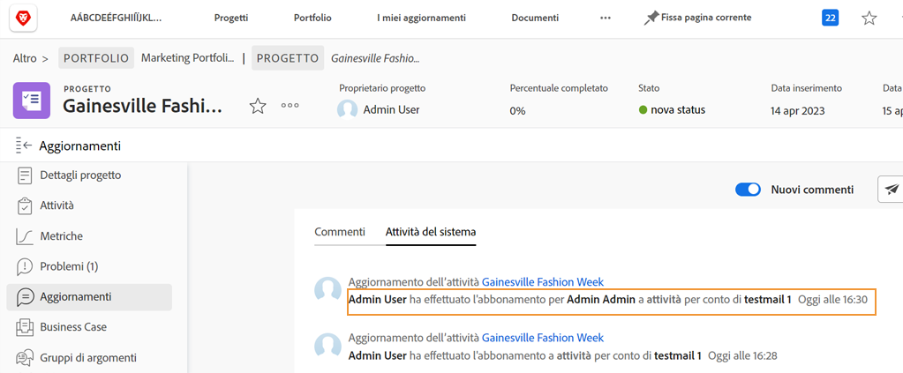

# Accedere come un altro utente

Una funzione che gli amministratori di Workfront trovano utile durante la configurazione dell’esperienza utente è la funzione Accedi come. Questa funzione, nell’area[!UICONTROL Configurazione], consente di accedere come un altro utente senza dover uscire dal proprio account.

Pagina![[!UICONTROL Accedi come] nell’area [!UICONTROL Configurazione] ](assets/admin-fund-log-in-as-1.png)

## Vantaggi della funzione Accedi come

Questa funzione è utile per diversi motivi:

* Gli amministratori possono visualizzare in anteprima i modelli di layout assegnati agli utenti per garantire che le voci di menu o le dashboard vengano visualizzati correttamente.
* È utile durante il test del flusso di lavoro, per garantire che le autorizzazioni di un utente siano impostate correttamente.
* Gli amministratori possono anche utilizzare questa funzione per contrassegnare un’attività come completata o effettuare un’approvazione per qualcuno che non può farlo.

## Accesso alla funzione Accedi come

1. Seleziona **[!UICONTROL Configurazione]** dal **[!DNL Main Menu]**.
1. Fai clic su **[!UICONTROL Accedi come]** nel pannello a sinistra.
1. Immetti il nome dell’utente con cui devi accedere.

Scheda![[!UICONTROL Registro degli accessi] nella pagina [!UICONTROL Accedi come]](assets/admin-fund-log-in-as-3.png)

Una volta effettuato l’accesso, una notifica nella parte superiore della schermata indica l’utente con cui hai effettuato l’accesso.

Messaggio![[!UICONTROL Attualmente connesso come] nella parte superiore della finestra di [!DNL Workfront] ](assets/admin-fund-log-in-as-2.png)

## La scheda Aggiornamenti tiene traccia dell’attività

Quando un amministratore accede come un altro utente e apporta modifiche/aggiornamenti per conto di tale utente, le modifiche vengono visualizzate nell’area Aggiornamenti per quell’elemento specifico. L’esempio seguente mostra che Joan Harris ha modificato una data di scadenza per conto di Roy Campbell.

