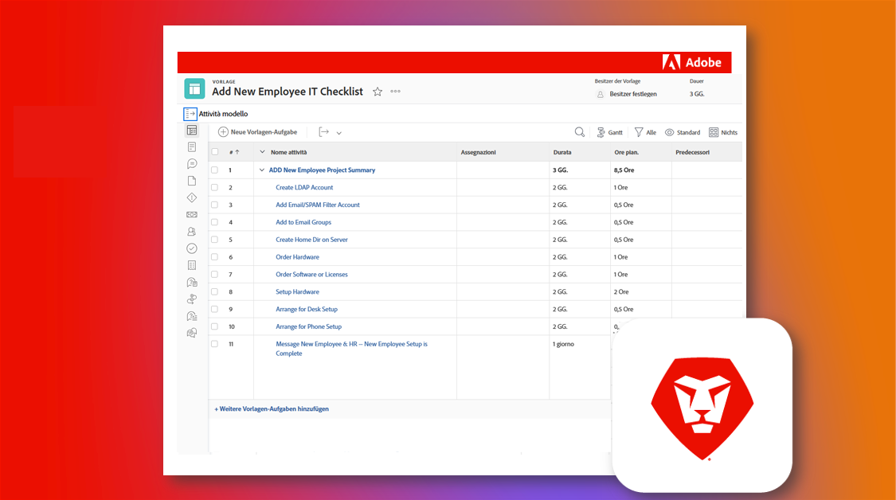

# Farsi carico di un’istanza Adobe Workfront esistente

L&#39;aspetto meraviglioso di Workfront è la sua elevata personalizzazione. L&#39;aspetto impegnativo di Workfront è quello di essere molto personalizzabile. Se non hai familiarità con il sistema, o un amministratore di gruppo che sostituisce un’istanza di Workfront esistente, può essere difficile capire come sia stata configurata e impostata originariamente.

Tuttavia, tramite l’elenco di controllo delle istanze ereditate, puoi imparare tutto ciò che devi sapere sull’istanza.

  

Nell’elenco di controllo dell’istanza ereditata esaminerai una serie completa di domande, risorse e collegamenti per comprendere chiaramente come è stata configurata.

L’elenco di controllo è stato creato sia come blueprint di Workfront che come foglio di calcolo Excel scaricabile. Ti consigliamo di utilizzare il blueprint per gestire e documentare il tuo lavoro direttamente in Workfront.

Sia il blueprint che il foglio di calcolo sono organizzati per argomento, anziché per timeline, in modo che tu possa progredire nel modo più sensato per te e la tua organizzazione. Le durate fornite sono solo un esempio e dovresti adattarle alle tue esigenze specifiche. Ma non devi farlo tutto in una volta sola!

Ove possibile, ti invitiamo a collaborare con altri nella tua organizzazione per rivedere e documentare questi elementi e per mantenere aggiornata la documentazione in caso di modifiche importanti. I futuri amministratori nella tua istanza ti ringrazieranno.

* <b>Per scaricare il blueprint</b>, passa al menu principale nella tua istanza di Workfront e seleziona Blueprint. Trova il blueprint con il titolo “Nozioni di base sulle istanze ereditate: lista di controllo” e fai clic su Installa. Scegli il tuo ambiente di produzione o sandbox e continua a configurare. È possibile trovare ulteriori informazioni sull’installazione e la configurazione dei blueprint [qui](https://experienceleague.adobe.com/docs/workfront/using/administration-and-setup/blueprints/blueprints-install.html?lang=it).

* <b>Per scaricare la lista di controllo di Excel</b>, fai clic [qui](assets/adobe-workfront-system-admin-playbook-inherited-instance.xlsx).

Sia che utilizzi il blueprint o l’elenco di controllo di Excel, puoi pensare a questo processo in 3 fasi chiave: scoperta, audit e documentazione. Le descrizioni e i risultati ideali sono elencati di seguito.

 
 

## Fase 1: apprendimento e scoperta

<b>Intervallo temporale consigliato: 4 settimane</b>

La prima cosa da fare è capire come è configurata oggi la tua istanza di Workfront.

Ciò comporta l’esecuzione di colloqui con gli stakeholder e la revisione di tutta la documentazione esistente per comprendere in che modo i vari gruppi all’interno dell’organizzazione sfruttano Workfront.

Se non hai familiarità con Workfront dal punto di vista tecnologico, segui il corso di formazione per Amministratore di sistema. Questo fornisce le informazioni necessarie su come funzionano le diverse impostazioni e influenzano ogni strumento, e potenzialmente ogni utente, in Workfront.

Al termine di questa fase, dovresti disporre di:

* Una chiara comprensione del PERCHÉ la tua organizzazione utilizza Workfront

* Un senso generale dello stato della tua istanza, inclusi i casi d’uso chiave

* Un documento che illustra cosa funziona bene, nonché i problemi e/o le lacune tra le esigenze dei processi e quelle degli utenti
 
 

## Fase 2: controllo del sistema

<b>Intervallo temporale consigliato: 4 settimane </b>

Dopo il rilevamento iniziale, ti consigliamo di eseguire un controllo più tecnico della tua istanza. Ciò significa che è necessario determinare le modifiche o i miglioramenti che potrebbero essere necessari per garantire che la configurazione e l’installazione correnti soddisfino i requisiti e le esigenze aziendali.

Al termine di questa fase, dovresti disporre di:

* Una visualizzazione più approfondita dello stato corrente dell’istanza

* L&#39;identificazione di modifiche o miglioramenti da apportare all’istanza per soddisfare le esigenze aziendali.
 
 

## Fase 3: documentazione e ottimizzazione

<b>Intervallo temporale consigliato: iniziale = 2 settimane; aggiornamento continuo </b>

In base a quanto appreso nelle fasi 1 e 2, creerai, o aggiornerai la documentazione dell’istanza e svilupperai alcune roadmap per affrontare le sfide strategiche e a livello di programma.

Mentre questa fase è in corso, dovresti avere:

* Una documentazione centralizzata scritta che risponde alle domande presenti nelle schede di questo documento

* Un diagramma visivo di flussi di lavoro, automazioni e integrazioni con la massima priorità

* Un backlog o roadmap che documenta i miglioramenti futuri per ottimizzare le sfide organizzative e strategiche

 
Passando attraverso ogni fase e con l’aiuto dell’elenco di controllo Istanza ereditata, il nuovo amministratore di sistema o di gruppo dovrebbe comprendere meglio come è configurata l’istanza Workfront, quali modifiche o miglioramenti devono essere apportati e consolidare la documentazione per ottimizzare l’esperienza Workfront dell’organizzazione.

 
 

Ulteriori informazioni sono disponibili di seguito:
* [Webinar: Suggerimenti per sostituire un’istanza ereditata](https://experienceleaguecommunities.adobe.com/t5/workfront-discussions/webinar-system-admin-essentials-tips-for-taking-over-an-existing/td-p/571873)
* [Definizione degli obiettivi per l’implementazione di Workfront](https://experienceleague.adobe.com/docs/workfront/using/administration-and-setup/get-started-administration/define-wf-goals-objectives.html?lang=it)
* [Post di blog: Sponsorizzazione esecutiva e valore per la leadership](https://experienceleaguecommunities.adobe.com/t5/workfront-blogs/customer-success-tips-executive-sponsorship-and-value-to/ba-p/518353)
* [Post di blog: introduzione ai KPI di Adobe Workfront](https://experienceleaguecommunities.adobe.com/t5/workfront-blogs/kpi-dashboards-in-the-new-workfront-experience-introduction-to/ba-p/549001)
