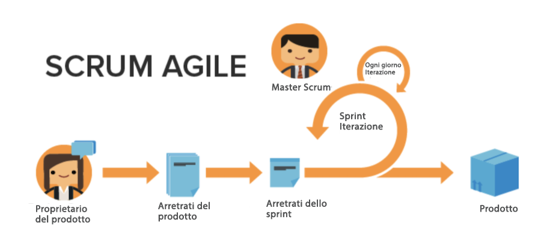

# Vantaggi dell’utilizzo della metodologia Agile

## Possibilità di adattarsi e cambiare rapidamente

Come suggerisce il nome, la metodologia Agile consente ai team di essere meglio preparati a cambiare rapidamente direzione e focus. Le società di software e marketing sono particolarmente consapevoli della tendenza ai cambiamenti nella domanda che avvengono di settimana in settimana. Una metodologia Agile consente ai team di rivalutare il lavoro che stanno svolgendo e di adattarsi a determinati incrementi nella domanda affinché, man mano che si verificano cambiamenti dal punto di vista del lavoro e del cliente, il focus del team possa adattarsi di conseguenza.

## Trasparenza nel lavoro di un team

I team agili utilizzano riunioni quotidiane chiamate “stand-up” per assicurarsi che il team rimanga concentrato sull’elenco prioritario di funzionalità o prodotti da sviluppare. Non vivono più nell’incertezza di non sapere su cosa stanno lavorando tutti gli altri membri del team. Tengono regolarmente sotto controllo ciò che il team ha realizzato dal giorno precedente, eventuali problemi o ostacoli che potrebbero richiedere attenzione, e cosa prevedono di affrontare nella giornata in corso.

Grazie a questa trasparenza e direzione unificata, tutti possono progredire più rapidamente.

## Feedback frequenti

L’ultimo grande vantaggio dell’adozione di una metodologia Agile è rappresentato dal ciclo di feedback incorporato alla fine di ogni iterazione (per iterazione si intende la quantità di tempo che il team deve dedicare per arrivare a risultati specifici). Il ciclo di feedback consente a un team di esaminare le ultime due settimane per determinare quali problemi sono emersi, come il piano potrebbe cambiare in futuro, cosa serve ora al cliente se le esigenze precedenti sono cambiate, e quali lezioni sono state apprese come team.
