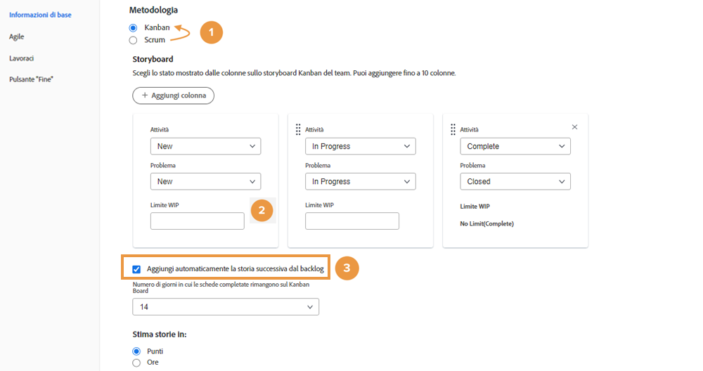
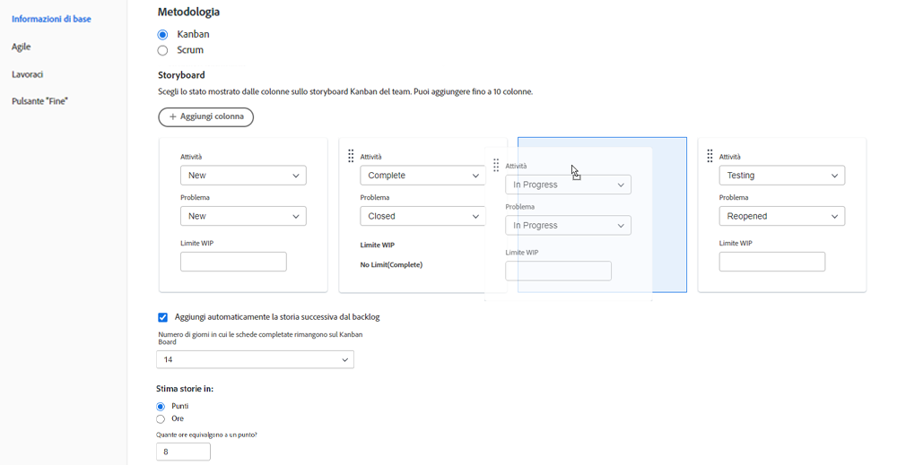
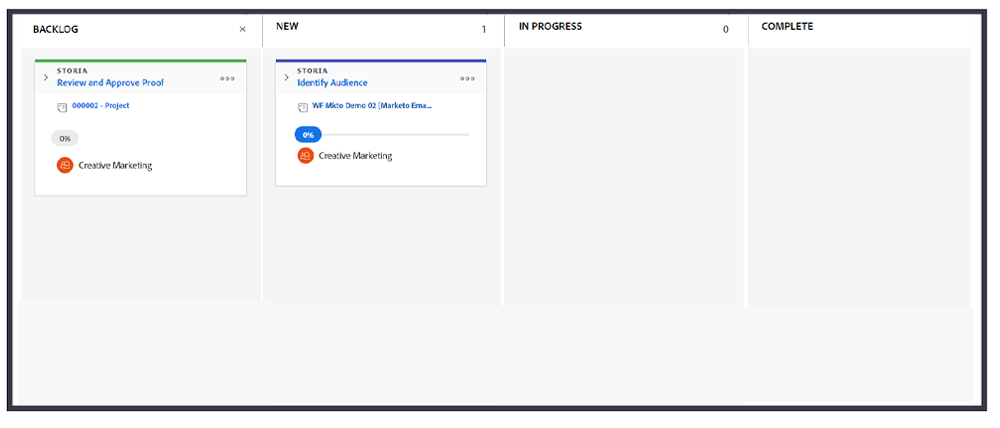

# Creare un team Kanban

Il team Creative Marketing utilizza Scrum da un po’. Apprezza l’ambiente flessibile di un team agile, ma trova difficile dedicare le storie a un arco temporale specifico a causa di quanto spesso le priorità cambiano per il proprio team.

Hanno un&#39;alternativa a Scrum. Si chiama Kanban.

Kanban funziona per i team che non desiderano definire su cosa stanno lavorando entro l’intervallo di tempo richiesto da un’iterazione basata su Scrum. Al contrario, Kanban consente ai team di lavorare in modo continuo attraverso il backlog.

Passiamo dal team Creative Marketing di Scrum a un team Kanban [1]. Apporta questa modifica nella sezione Agile delle Impostazioni team.

Dopo aver modificato la metodologia, è necessario specificare il numero di storie che un team Kanban può avere alla volta in ogni colonna regolando il &quot;limite WIP&quot;. [2]. WIP è l&#39;acronimo di Work in Progress. Il numero che si sceglie di inserire dipende dal numero di elementi attivi che il team è in grado di gestire. Verrà visualizzato nello storyboard del team per ricordare all’utente se è sovrassegnato o meno. È inoltre possibile modificare il limite WIP direttamente dallo storyboard, insieme a qualsiasi membro del team con diritti di modifica.

Puoi trascinare e rilasciare le colonne di stato per riportarle nell’ordine in cui desideri che si trovino.

I team Kanban possono inoltre scegliere di visualizzare automaticamente sullo storyboard la storia successiva nel backlog al completamento di una storia [vedi il numero 3 nell&#39;immagine in alto]. Questo aiuterà i team che preferiscono un ciclo di lavoro continuo.

L&#39;immagine seguente mostra l&#39;aspetto di una nuova storia che viene visualizzata automaticamente sullo storyboard quando viene completata una storia.

Per gestire in modo più efficiente il lavoro completato, per impostazione predefinita le storie rimangono sulla bacheca per 14 giorni.

Se necessario, tale impostazione può essere regolata tra 1 e 30 giorni nella finestra delle impostazioni del team.

Tieni presente che, anche se si tratta di una metodologia diversa, è comunque importante, quando si lavora in un ambiente agile, gestire continuamente il backlog discutendo i requisiti della storia e regolando la priorità della storia. Ogni volta che si desidera ridefinire la priorità del backlog, è necessario spostare una scheda nella scheda Backlog per riorganizzarla.
