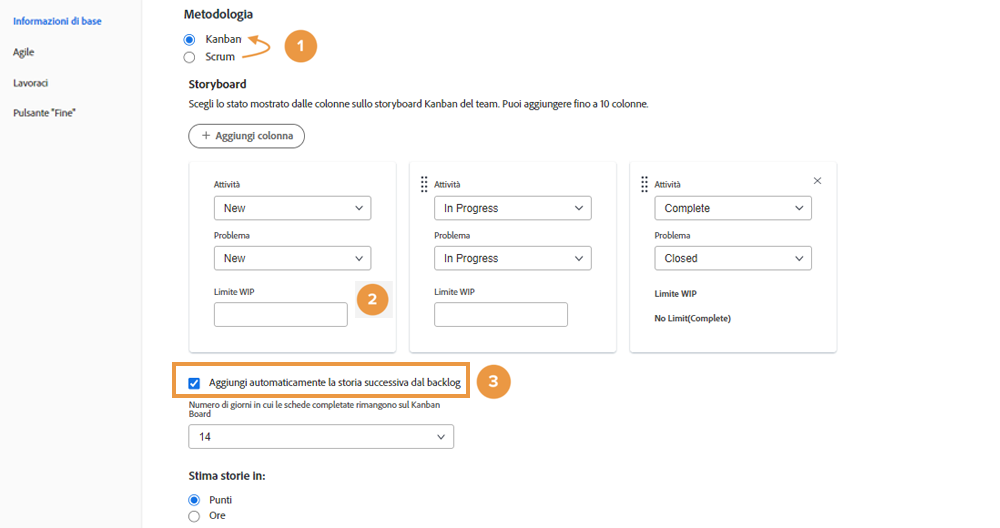
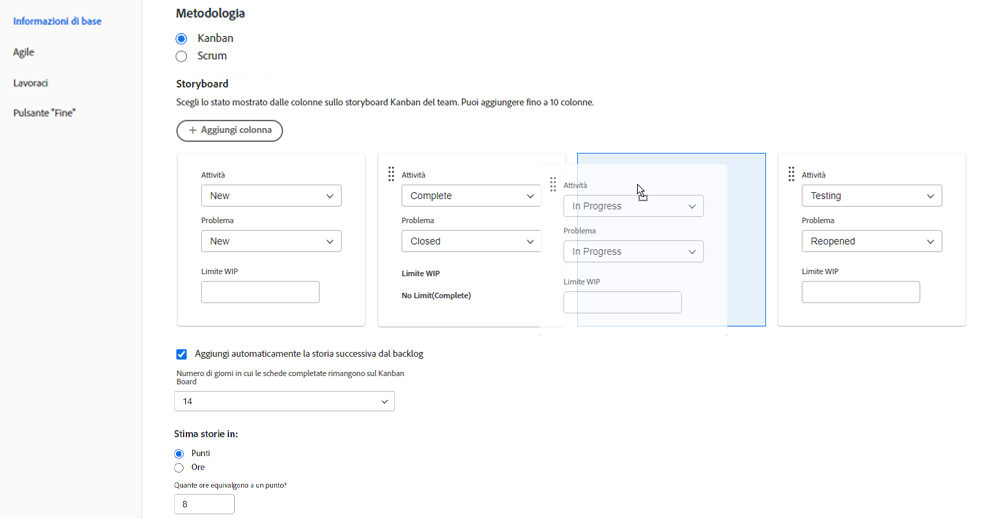
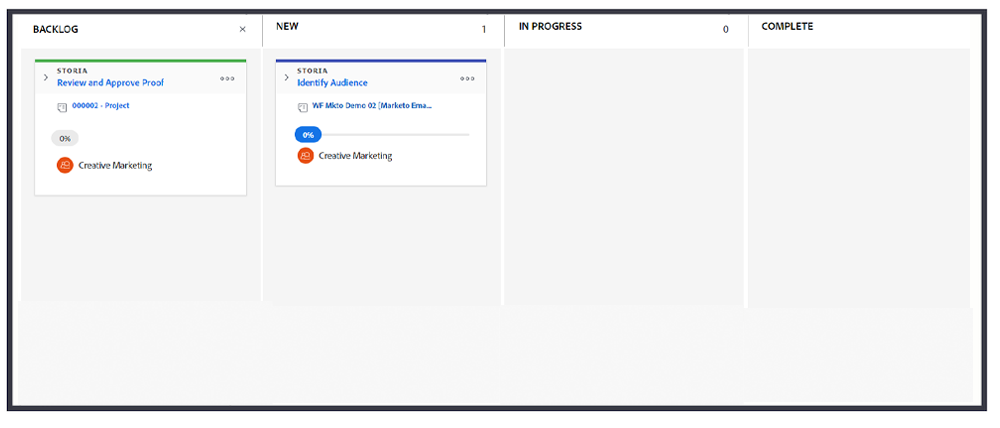

# Creare un team Kanban

Il team di Creative Marketing utilizza Scrum da un po’ di tempo. Apprezza l’ambiente flessibile di un team agile, ma trova difficile completare le storie in un arco temporale specifico, poiché le priorità del team cambiano spesso.

È disponibile un’alternativa a Scrum. Si chiama Kanban.

Kanban funziona per i team che non vogliono definire su cosa stanno lavorando in un arco temporale specifico, come avviene nell’iterazione basata su Scrum. Al contrario, Kanban consente ai team di lavorare in modo continuo attraverso il backlog.

Passiamo da un team di marketing creativo a un team Scrum e ancora a un team Kanban [1]. Apporta questa modifica nella sezione Agile delle impostazioni del team.

Dopo aver modificato la metodologia, è necessario specificare il numero di storie che un team Kanban può avere alla volta in ogni colonna modificando il &quot;limite WIP&quot;. [2]. WIP (Work in Progress) sta per lavoro in corso. Il numero che scegli di inserire qui dipende da quanti elementi attivi il team può gestire. Verrà visualizzato nello storyboard del team per ricordare ai membri del team se è presente una sovrassegnazione o meno. Ogni membro del team con diritti di modifica, potrà cambiare il limite WIP direttamente dallo storyboard.

Puoi trascinare e rilasciare le colonne di stato per riportarle nell’ordine in cui desideri che si trovino.

I team Kanban possono anche scegliere di far apparire automaticamente la storia successiva nel backlog sullo storyboard quando una storia viene completata [vedi numero 3 nell’immagine in alto]. Questo aiuterà i team che preferiscono un ciclo di lavoro continuo.

L’immagine seguente mostra l’aspetto di una nuova storia che viene visualizzata automaticamente sullo storyboard quando una storia viene completata.

Per gestire in modo più efficiente il lavoro completato, per impostazione predefinita le storie rimangono sulla bacheca per 14 giorni.

Se necessario, tale impostazione può essere modificata tra 1 e 30 giorni nella finestra delle impostazioni del team.

Tieni presente che, anche se si tratta di una metodologia diversa, è comunque importante quando si lavora in un ambiente agile gestire continuativamente il backlog, discutendo i requisiti della storia e modificandone la priorità. Ogni volta che desideri ridefinire la priorità del backlog, è necessario spostare una scheda nella scheda Backlog per riorganizzarla.
