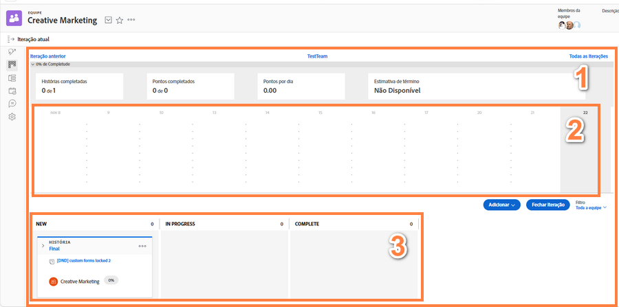

# Creare un team agile Scrum

## Configurare un team Scrum

Un team agile in Workfront completa il proprio lavoro dalla pagina di iterazione [1]. Il grafico di lavoro [2] nella parte superiore della pagina rappresenta una panoramica dei progressi compiuti finora durante questa iterazione. Sotto il grafico di lavoro ci sono le storie [3] nelle quali il team è impegnato per questa iterazione.

Questo video illustra come creare un team agile, selezionare la metodologia Scrum e determinare le impostazioni per il team Scrum.

### Configurare un team Scrum da zero

Ora che sai come si presenterà una volta configurato, puoi passare direttamente alla procedura di configurazione in Workfront. Esaminiamo le configurazioni utilizzando un caso di successo per un’azienda chiamata Swains. Sei responsabile delle operazioni per il team creativo e hai dato l’OK affinché il team di marketing creativo possa passare alla metodologia Agile.

Questo team in particolare ha deciso di adottare la metodologia Scrum poiché apprezza il fatto che lo storyboard offra molta più visibilità sia su chi sta facendo cosa, sia sullo stato o sulla fase di lavoro in cui si trovano gli elementi di lavoro. La possibilità di pianificare brevi iterazioni è utile per le loro attuali esigenze di lavoro. Il team riceve in genere campagne di marketing di 2-3 settimane e deve essere in grado di definire l’ordine di priorità delle azioni o delle operazioni che può svolgere in un lasso di tempo così breve.

## Creare un team agile Scrum in Workfront

In questo video scoprirai come:

- Creare un team agile
- Selezionare la metodologia Scrum
- Determinare le impostazioni per il team Scrum

>[!VIDEO](https://video.tv.adobe.com/v/3412165/?quality=12&learn=on&enablevpops=1&captions=ita)

Hai già un team in Workfront che desideri convertire in un team agile? Nessun problema! Vai a Impostazioni team e seleziona la casella “Questo è un team agile”.

## Modificare la configurazione del team Scrum

L’opzione “Nella scheda Problemi, mostra” non è più inclusa nella pagina delle impostazioni del team perché la scheda Problemi non è più necessaria ai team agile. I problemi assegnati a un team si trovano nella scheda Backlog, che semplifica la pianificazione delle iterazioni che includono sia attività che problemi.
