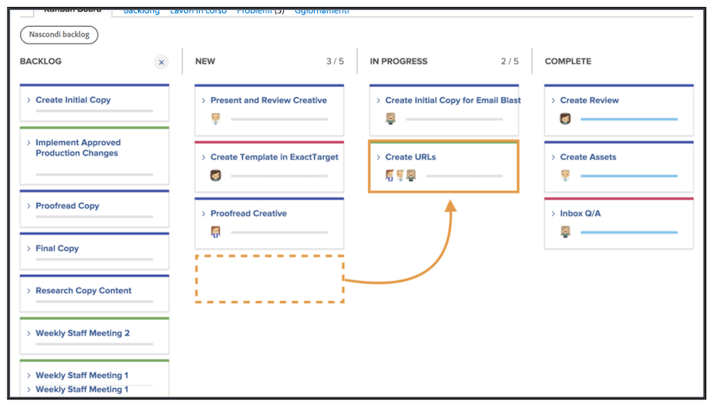
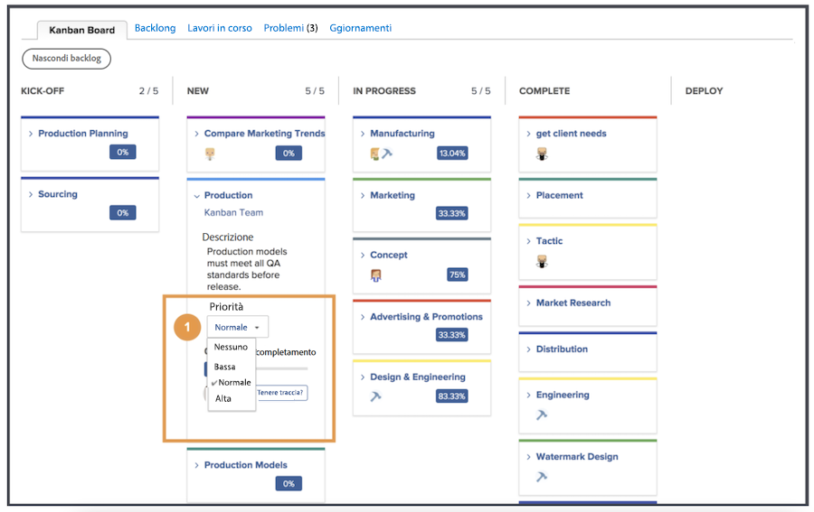
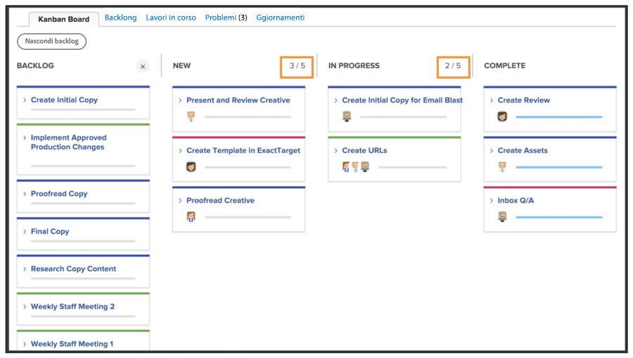
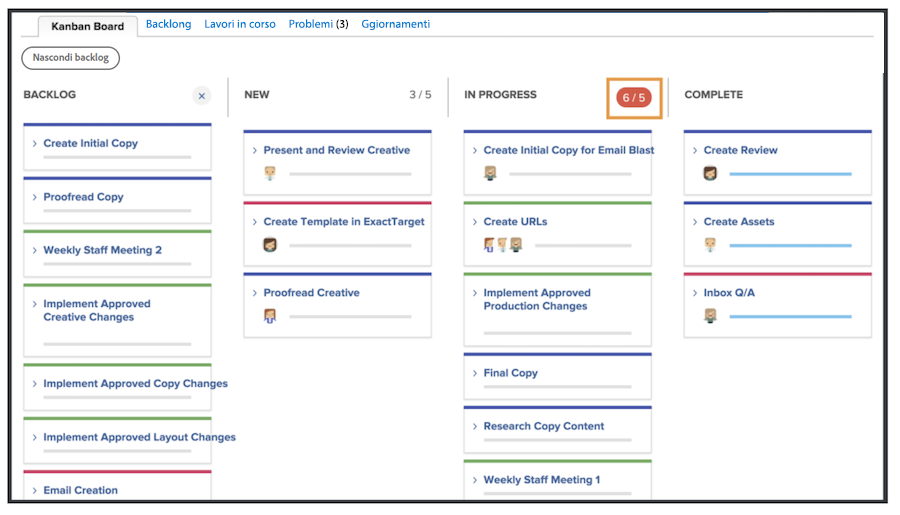

# Gestire il lavoro come team Kanban

Gestire il lavoro come team Kanban Aggiungere storie al backlog Kanban Esistono diversi modi per aggiungere storie al backlog del team di Creative Marketing.

Il team può aggiungere storie direttamente dal loro backlog.
Possono anche essere assegnate delle attività a un progetto. Se il team di Creative Marketing riceve delle richieste, queste vengono visualizzate nella scheda Richieste del team. Questi verranno visualizzati nel backlog del team se il team seleziona la richiesta e la converte in una storia.

## Utilizzo della bacheca Kanban

Dopo aver assegnato la priorità alle storie nel backlog, è ora di passare alla bacheca Kanban. Puoi fare delle assegnazioni trascinando gli avatar dei membri del gruppo che lavoreranno su quella storia sulla scheda della storia.

Man mano che le storie progrediscono, il team le sposta nello stato appropriato sullo storyboard. I membri del team possono utilizzare i flag Kanban per indicare se una storia è in esecuzione, bloccata o pronta per essere trascinata. Questo comunica ad altri membri del team quali elementi di lavoro sono in fase di elaborazione e se sono pronti per essere lavorati o meno.

I membri del team possono inoltre apportare aggiornamenti alle schede direttamente sullo storyboard per riflettere modifiche in elementi quali descrizione, stato o priorità. A tale scopo, l&#39;utente fa clic sul menu a discesa di una scheda dello schema e apporta le modifiche desiderate al campo appropriato [1].

## Esecuzione di una storia kanban

Si noti che si sta utilizzando un limite Work In Progress di cinque piani. Osservando la bacheca, si nota che quando si spostano le attività nelle colonne di stato, il numero di attività in ciascuna corsia viene visualizzato in alto a destra di ogni colonna di stato.

Se in una colonna di stato si supera il limite corrispondente a Nuovo o In corso, viene visualizzato un messaggio di errore per indicare che è stato superato il limite di lavoro in corso.

Se il team decide di poter gestire più o meno elementi alla volta, è possibile modificare il numero Work in Progress direttamente dallo storyboard facendo clic sul numero WIP e modificandolo per riflettere la nuova decisione.
