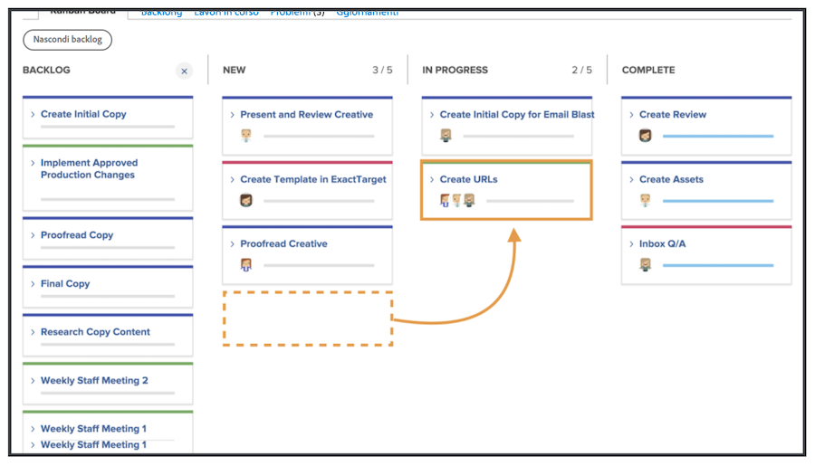
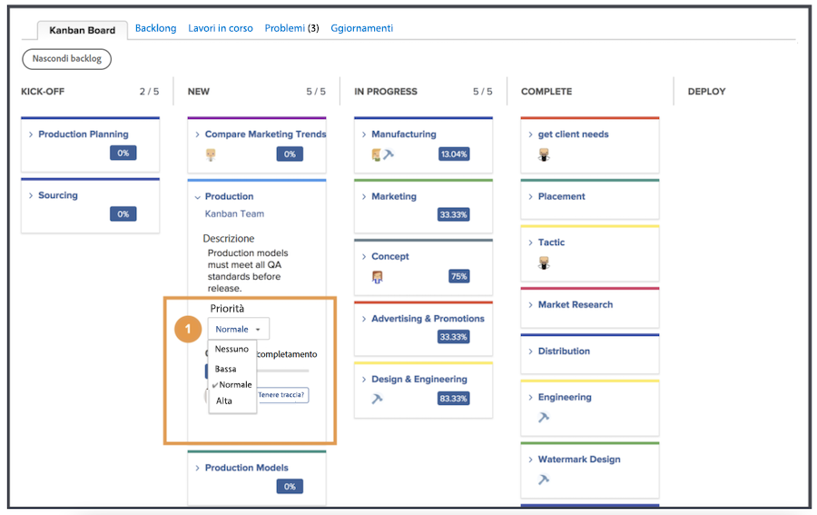
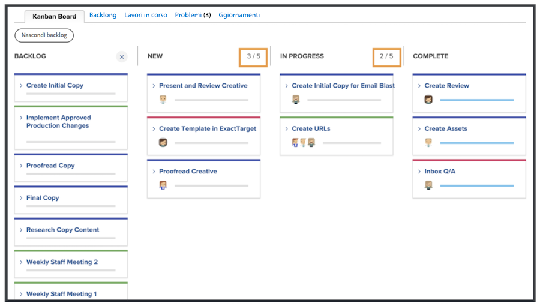
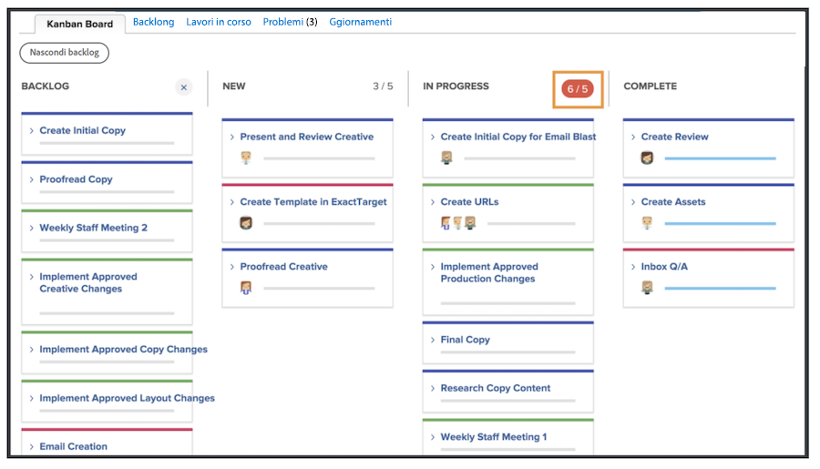

# Gestire il lavoro come team Kanban

Gestire il lavoro come team Kanban
Aggiungi storie al backlog Kanban
Esistono diversi modi per aggiungere storie al backlog del team di marketing Creative.

Il team può aggiungere storie direttamente dal proprio backlog.
È inoltre possibile assegnare al team attività di un progetto. Se delle richieste vengono indirizzate al team di marketing creativo, queste vengono visualizzate nella scheda Richieste del team. Ogni richiesta verrà visualizzata nel backlog del team se quest’ultimo la seleziona e la converte in storia.

## Utilizzo della board di Kanban

Dopo aver assegnato la priorità alle storie nel backlog, è il momento di passare alla board di Kanban. Per effettuare delle assegnazioni, trascina nella scheda della storia gli avatar dei membri del gruppo che lavoreranno a quella storia.

Man mano che le storie progrediscono, il team le passerà allo stato appropriato nello storyboard. I membri del gruppo possono utilizzare i contrassegni Kanban per indicare se una storia è in corso, bloccata o pronta per la fase successiva. Questo comunica ad altri membri del team quali elementi di lavoro sono in linea con le tempistiche previste e se sono pronti per la fase successiva.

I membri del gruppo possono inoltre apportare aggiornamenti alle schede direttamente nello storyboard per rispecchiare le modifiche in elementi quali descrizione, stato o priorità. A tale scopo, l’utente fa clic sul menu a discesa in una scheda della storia e apporta le modifiche desiderate nel campo appropriato [1].

## Esecuzione di una storia Kanban

Osserva che in questo caso il limite di Lavoro in corso è di cinque storie. Osservando la bacheca, puoi vedere che quando si spostano le attività nelle colonne di stato, il numero di attività in ciascuna corsia viene riportato in alto a destra di ogni colonna di stato.

Se in una colonna di stato viene superato il limite corrispondente ai lavori nuovi o in corso, un messaggio di errore indica che è stato superato il limite di lavori in corso.

Se il team decide di poter gestire più o meno elementi alla volta, tu e gli altri membri del gruppo con diritti di modifica potete modificare il numero di lavori in corso direttamente dallo storyboard facendo clic sul numero corrispondente e modificandolo per rispecchiare la nuova decisione.
