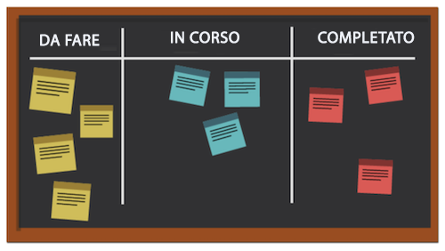
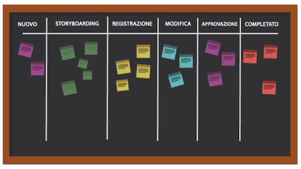
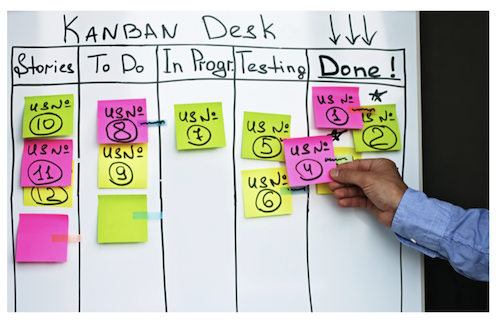

# Che cos’è la metodologia Kanban e come funziona?

A differenza di altre metodologie agili che si concentrano su un processo ciclico, la metodologia Kanban si concentra su un flusso di lavoro ottimizzato. Kanban cerca di migliorare il flusso di lavoro visualizzando il lavoro utilizzando una bacheca Kanban, impostando un limite sulla quantità di lavoro che può essere in corso e analizzando il flusso per apportare continui miglioramenti.

Diamo un’occhiata ad alcuni degli elementi chiave di Kanban.

## Soggetti chiave

I soggetti chiave in un team Kanban sono simili a quelli di un team Scrum, tranne per il fatto che non esiste uno Scrum master. Può ancora avere senso che qualcuno agisca come project manager o supervisore, ma in teoria questo ruolo dovrebbe avvenire naturalmente in caso di necessità.

## Visualizzazione: board Kanban

Esistono molti modi per formattare la tua board Kanban. I team operano su una board che può avere un numero qualsiasi di colonne. Ogni colonna rappresenta lo stato del lavoro in corso.

Nella board più semplicistica, la prima colonna potrebbe essere “da fare”, la seconda “in corso” e la terza “completato”.

Molte aziende hanno una propria terminologia per i nomi delle colonne o addirittura elencano ogni fase di un processo, ma l’intento è lo stesso. I membri del team spostano le storie da una colonna all’altra a seconda dello stato in cui si trova il lavoro.

## Definizione delle priorità

I membri del team collaborano con un product manager o un project manager per assicurarsi che le storie nel backlog e in altre colonne di stato abbiano la priorità e che il lavoro continui ad avanzare verso il completamento. Il product manager è ancora responsabile di garantire che la voce del cliente sia ascoltata e che il prodotto si muova nella direzione corretta.

## Limitare il lavoro in corso

Un aspetto unico di Kanban è che i team hanno un limite di capacità per quanto riguarda la quantità di storie che possono gestire in un dato momento. I team scelgono una certa quantità di storie che sono disposti ad avere nelle loro colonne “da fare” e “in corso”, e non vanno oltre quel numero al fine di prevenirne l’esaurimento. Una volta che una storia è stata spostata su “completa”, una storia dal backlog si colloca nella colonna “da fare”.

## Miglioramento continuo

Kanban consente un miglioramento continuo fornendo ai team un sistema per misurare la propria efficacia. Possono vedere chiaramente come funzionano i flussi di lavoro, quanto tempo impiega ogni parte del flusso di lavoro e quanto spesso riescono a consegnare i risultati finali in tempo. Questo rende più facile sperimentare diversi modi di fare le cose per ottimizzare l’output.
