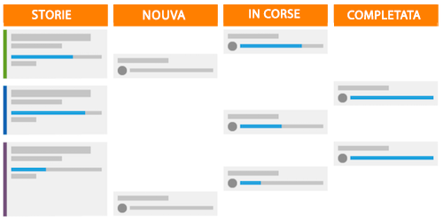

# Che cos’è la metodologia Scrum e come funziona?

La metodologia Scrum comprende il modello di flessibilità ma differisce dalle altre metodologie in quanto definisce determinati ruoli per coloro che fanno parte del team, come proprietario del prodotto, Scrum Master, ecc. e pratiche per definire e completare il lavoro.

## Panoramica del team Scrum

Quando decidi se passare o meno a Scrum, dovrai esaminare la struttura dei tuoi team per vedere se possono passare facilmente alla nuova metodologia. Un team Scrum è composto da tre tipi di membri: un proprietario del prodotto, uno Scrum Master e i membri del team.

### Proprietari del prodotto

I proprietari del prodotto possiedono il prodotto e hanno la visione di ciò che il prodotto è o sarà. Sono la voce del cliente e il motore principale delle decisioni aziendali e della definizione delle priorità delle caratteristiche del prodotto.

### Scrum master

Gli Scrum Master aiutano il team a portare a termine il lavoro trovando le risorse necessarie e creando consenso all’interno del team per svolgere il proprio lavoro nel modo più efficiente possibile. Facilitano inoltre la comunicazione e il consenso durante tutto il processo.

### Membri team

Un team è solitamente interfunzionale e comprende membri con mansioni e competenze diverse. Sono responsabili della pianificazione, dell’esecuzione e della fornitura degli incrementi del prodotto. Trarranno beneficio dal trovarsi fisicamente nello stesso luogo o dall’avere accesso a strumenti che consentano una collaborazione rapida e semplice, sia tra loro durante il giorno che nelle riunioni quotidiane del team.

## Lavorare come team Scrum

Dopo aver assemblato questi attori chiave, segui un nuovo stile di flusso di lavoro per svolgere il loro lavoro e consegnare un prodotto al cliente. Ancora una volta, rispetto alla metodologia tradizionale o a cascata, non seguiranno più un processo lineare di elaborazione di un piano per un prodotto finale, per poi passare attraverso i passaggi o le fasi necessarie per consegnare quel prodotto. Piuttosto, i team Scrum creano per prima cosa un backlog.

### Creazione di un backlog

Il team Scrum esamina un elenco di caratteristiche prioritarie e funzionalità desiderate denominate storie. È necessario che il team chieda al cliente e discuta in qualità di team che cosa desidera/ciò di cui ha bisogno dal sistema o dal prodotto che sta per creare.

Una volta che le storie principali sono state create, il team deve gestire il backlog. Come team, deve passare attraverso quattro passaggi principali.

* Suddividere le storie di grande entità in incrementi più piccoli discutendo cosa è necessario fare per ciascuna storia.

* Dare la priorità alle storie e decidere quali funzionalità dovrebbero essere sviluppate per prime.

* Chiarire i requisiti e i criteri di accettazione affinché una storia possa essere considerata realizzata.

* Stimare la quantità di impegno che il team deve spendere per completare ogni storia e il backlog. Questo può essere eseguito in ore o in punti. I punti consentono di dire quanto sia difficile o complessa la storia invece di pianificare il tempo richiesto per ciascun componente della storia.

### Pianificazione dell’iterazione

Una volta pulita e assegnata la priorità al backlog, è necessario pianificare l’iterazione. Molte organizzazioni utilizzano le parole &quot;sprint&quot; e &quot;iterazione&quot; in modo intercambiabile. Il team decide quali storie completare in base a quelle considerate pronte per essere avviate. Il team effettua le assegnazioni e decide la durata dell’iterazione.

### Esecuzione dell’iterazione

Ora è il momento di eseguire l’iterazione. I membri del team iniziano a svolgere il proprio lavoro come farebbe un team tradizionale, ma adesso includono un breve incontro quotidiano chiamato riunione di stand-up.

I membri del team si alzeranno letteralmente in piedi per partecipare a questo breve incontro e risponderanno a tre domande:

* Cosa ho portato a termine ieri?
* Cosa porterò a termine oggi?
* Quali sono gli ostacoli che sto incontrando e che stanno impededendo il progresso delle mie assegnazioni?

Queste riunioni fanno sì che tutti siano sempre aggiornati e consentono un avanzamento rapido.

## Utilizzo di un grafico di lavoro e di uno storyboard per tenere traccia del progresso

Poiché un team risponde alle tre domande principali nelle proprie standup, è importante monitorare e tenere traccia dei progressi compiuti verso il completamento dell&#39;iterazione. Ciò consente loro di determinare se si stanno muovendo abbastanza velocemente attraverso le loro storie per fornire tutte le funzionalità in tempo per la fine dell’iterazione. Esistono due componenti per eseguire questa operazione nel processo Scrum.

### Storyboard

Utilizzando uno storyboard, i team spostano le proprie storie attraverso le colonne di stato per mostrare quando gli elementi di lavoro sono Nuovi, In corso o Completati.

### Grafico burn-down

È possibile utilizzare un grafico lavoro per monitorare se il team sta completando le storie a un ritmo sufficientemente rapido. I grafici lavoro possono essere utilizzati su singole iterazioni o sull’intera versione del prodotto.

