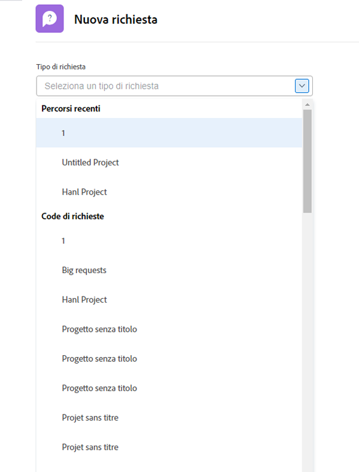
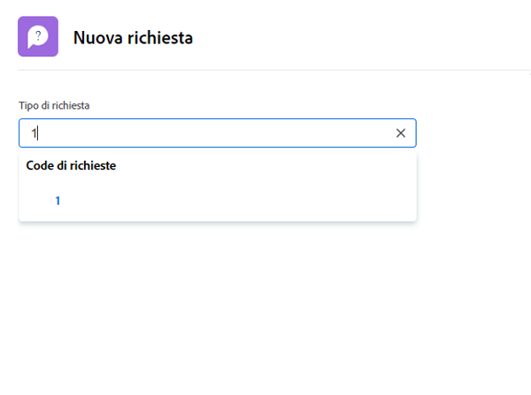

# Effettuare una richiesta

In questo video scoprirai come:

* Passare all’area richieste
* Effettuare una richiesta
* Visualizzare le richieste inviate
* Trovare una bozza di una richiesta

>[!VIDEO](https://video.tv.adobe.com/v/336092/?quality=12&learn=on)

## Accedere ai percorsi della coda richieste in modo rapido e semplice

Quando fai clic sul campo [!UICONTROL Tipo di richiesta], gli ultimi tre percorsi di richiesta inviati di recente verranno visualizzati automaticamente nella parte superiore dell’elenco. Seleziona un’opzione per inviare un’altra richiesta alla stessa coda.

Nella parte inferiore dell’elenco ci sono tutte le code di richieste a cui hai accesso. Se non sei sicuro di quale coda utilizzare per la tua richiesta, utilizza la ricerca per parole chiave per trovare velocemente e facilmente quella di cui hai bisogno.

Mentre digiti le parole chiave, [!DNL Workfront] visualizza le corrispondenze in modo da poter trovare il percorso della coda di richiesta adatto alle tue esigenze. Ad esempio, per effettuare una richiesta per un post sui social media, inizia a digitare “social media” nel campo [!UICONTROL Tipo di richiesta] e l’elenco si aggiorna dinamicamente per mostrare eventuali corrispondenze.

Seleziona l’opzione desiderata, compila il modulo di richiesta e invialo.

<!---
Learn more
Requests area overview
Create and submit Workfront requests
Guides
Make a work request
--->
