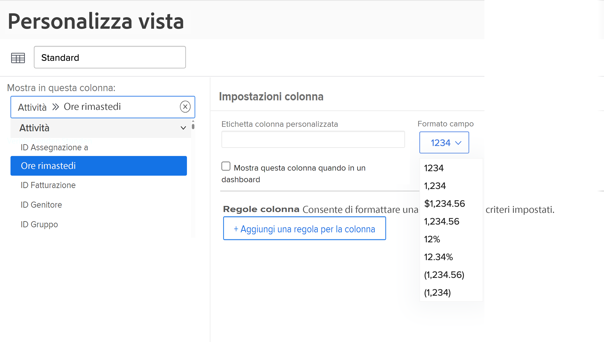
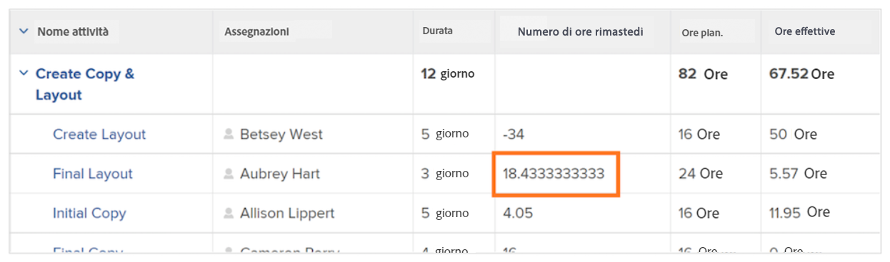
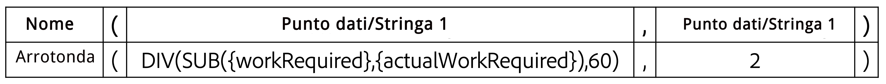

# Creare un&#39;espressione di dati SUB, SUM, DIV o PROD

Questo video illustra:

* Funzionamento delle espressioni SUB, SUM, DIV e PROD
* Come creare un’espressione di dati SUB in un campo calcolato

>[!VIDEO](https://video.tv.adobe.com/v/335177/?quality=12&learn=on)

## Ulteriori informazioni: espressione ROUND

### Creare un&#39;espressione ROUND

L&#39;espressione ROUND accetta qualsiasi numero e lo arrotonda a un determinato numero di cifre decimali.

Nella maggior parte dei casi, l&#39;espressione di dati ROUND viene utilizzata insieme a un&#39;altra espressione di dati e quando il campo di formato viene lasciato come Testo o Numero.

Creiamo un campo calcolato per determinare la differenza tra il numero di ore pianificate e quelle effettivamente registrate per un’attività, che richiederà l’espressione SUB e avrà un aspetto simile al seguente:

**SUB({workRequired},{actualWorkRequired})**

Poiché il tempo viene tracciato in minuti e il formato preferito è quello di visualizzare le informazioni in ore, anche l’espressione deve essere divisa per 60 e avere un aspetto simile al seguente:

**DIV(SUB({workRequired},{actualWorkRequired}),60)**

Se il formato viene modificato in Numero durante la creazione del campo calcolato nel modulo personalizzato, è possibile modificare il formato numerico quando si aggiunge il campo in una visualizzazione.

Tuttavia, se il formato del campo durante la creazione di un campo personalizzato viene lasciato come Testo, non sarà possibile modificarlo facilmente all’interno della visualizzazione. L’espressione ROUND deve essere utilizzata per evitare di visualizzare numeri come questo nel progetto:

<b>Utilizzare l&#39;espressione di dati ROUND in un campo calcolato</b>

L&#39;espressione ROUND include il nome dell&#39;espressione (ROUND) e, in genere, due coordinate. Queste coordinate possono essere un’espressione o un campo in Workfront, seguiti da un numero per indicare quante cifre decimali desideri spostare.

Un&#39;espressione è strutturata nel modo seguente: ROUND(data point, #)

Nell&#39;espressione che calcola la differenza tra le ore pianificate e quelle effettive, utilizzare l&#39;espressione —DIV(SUB({workRequired},{actualWorkRequired}),60) - come primo punto dati. Assicurati quindi che qualsiasi numero provenga da quell’espressione non vada oltre 2 posizioni a destra del decimale.

L’espressione potrebbe essere scritta nel modo seguente: ROUND(DIV(SUB({workRequired},{actualWorkRequired}),60),2).
