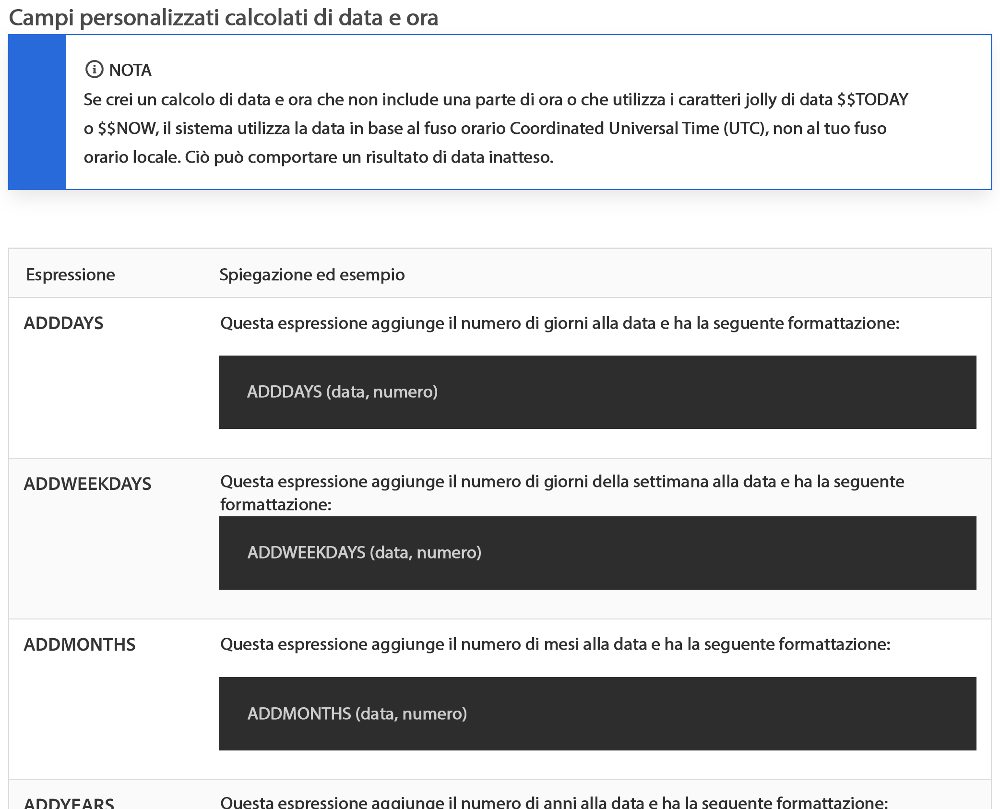
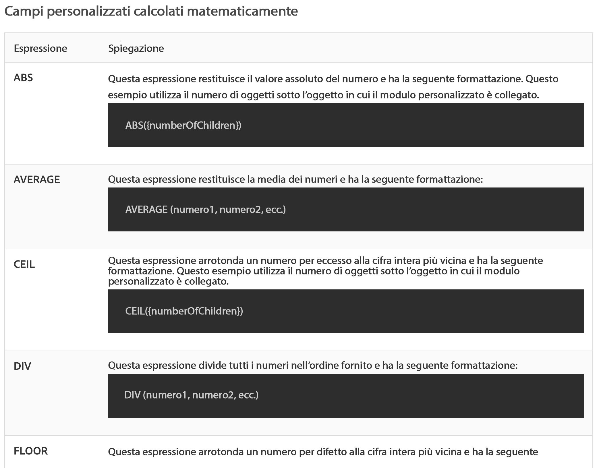

# Comprendere le espressioni matematiche e di data e ora

## Espressioni di data e ora

Le espressioni di data e ora consentono di richiamare date importanti all’inizio dei rapporti, calcolare automaticamente il numero di giorni lavorativi necessari per completare un’attività o rimuovere le marche temporali dalla visualizzazione quando non sono necessarie.

Esaminando le espressioni di data e ora disponibili, si troveranno diverse opzioni disponibili.

Esistono due set di espressioni di data e ora utilizzati più spesso dai clienti di [!DNL Workfront] :

* ADDDAYS/ADDWEEKDAY/ADDMONTHS/ADDYEARS e
* DATEDIFF / WEEKDAYDIFF

## Espressioni matematiche

Le espressioni matematiche consentono a [!DNL Workfront] di eseguire calcoli in modo automatico, semplici o complessi.

Osservando le espressioni di data e ora disponibili, si troveranno diverse opzioni disponibili.

I clienti di Workfront utilizzano in genere questi due set di espressioni matematiche:

* SUB, SUM, DIV, PROD
* ROUND

>[!NOTE]
>
>Per un elenco completo delle espressioni e per ulteriori informazioni su ognuna, visitare la pagina della documentazione [Espressioni dati calcolate](https://experienceleague.adobe.com/it/docs/workfront/using/reporting/reports/calculated-custom-data/calculated-data-expressions).

