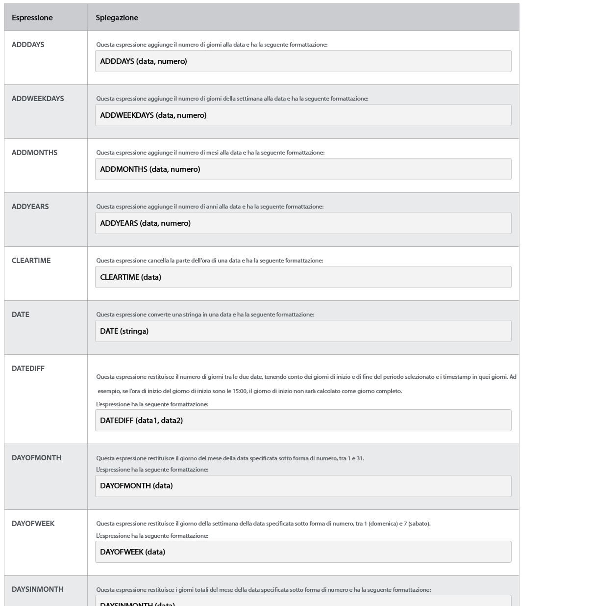
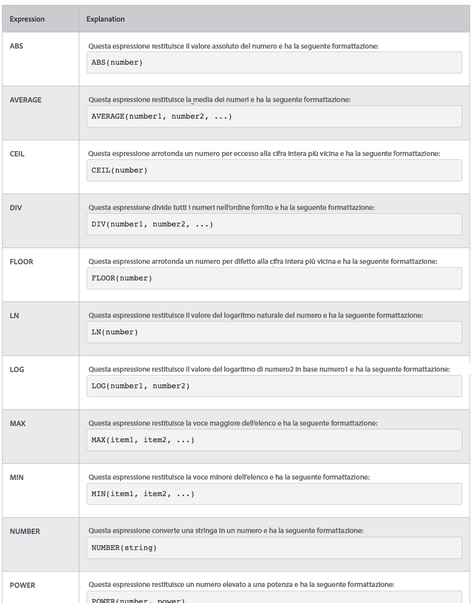

# Comprendere le espressioni matematiche relative a data e ora

## Espressioni data e ora

Le espressioni data e ora consentono di richiamare date importanti in primo piano nei rapporti, calcolare automaticamente il numero di giorni lavorativi necessari per completare un&#39;attività o rimuovere le marche temporali dalla visualizzazione quando non sono necessarie.

Osservando le espressioni data e ora disponibili, sono disponibili diverse opzioni.

Esistono due set di espressioni data e ora utilizzati più spesso da [!DNL Workfront] clienti:

* ADDDAYS/ADDWEEKDAY/ADDMONTHS/ADDYEARS e
* DATEDIFF/WEEKDAYDIFF

## Espressioni matematiche

Le espressioni matematiche consentono [!DNL Workfront] eseguire automaticamente calcoli semplici o complicati.

Osservando le espressioni di data e ora disponibili, è possibile individuare diverse opzioni disponibili.

[!DNL Workfront] i clienti utilizzano comunemente questi due set di espressioni matematiche:

* SUB, SUM, DIV, PROD
* ROUND
