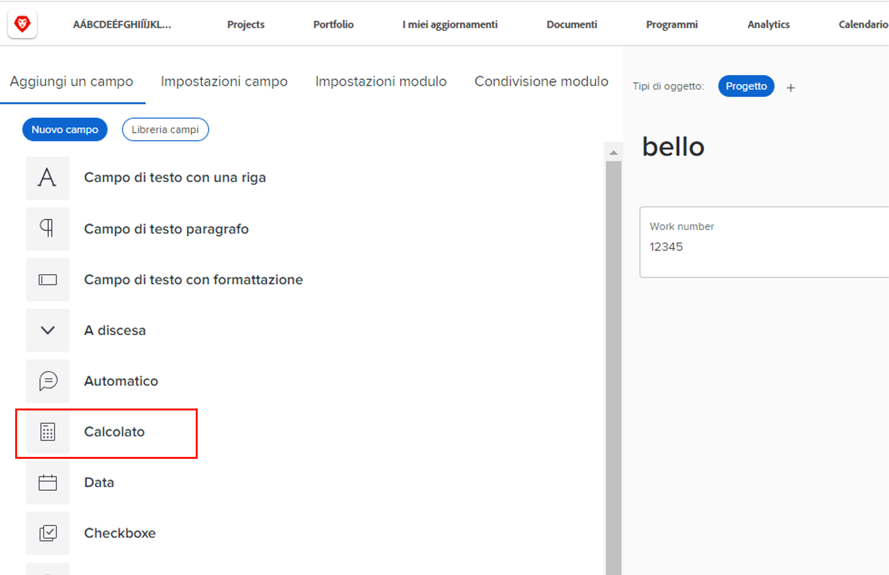
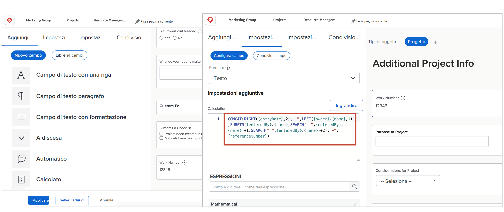
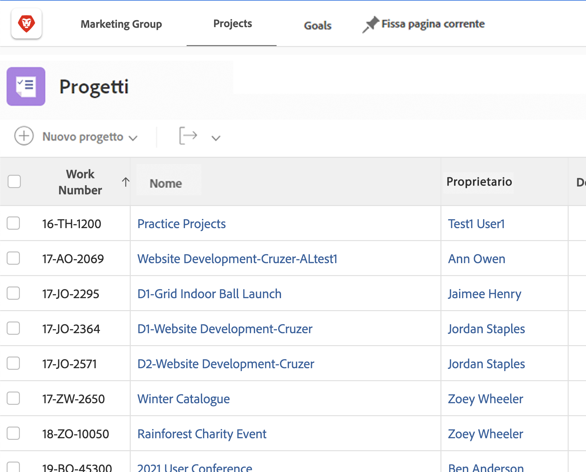
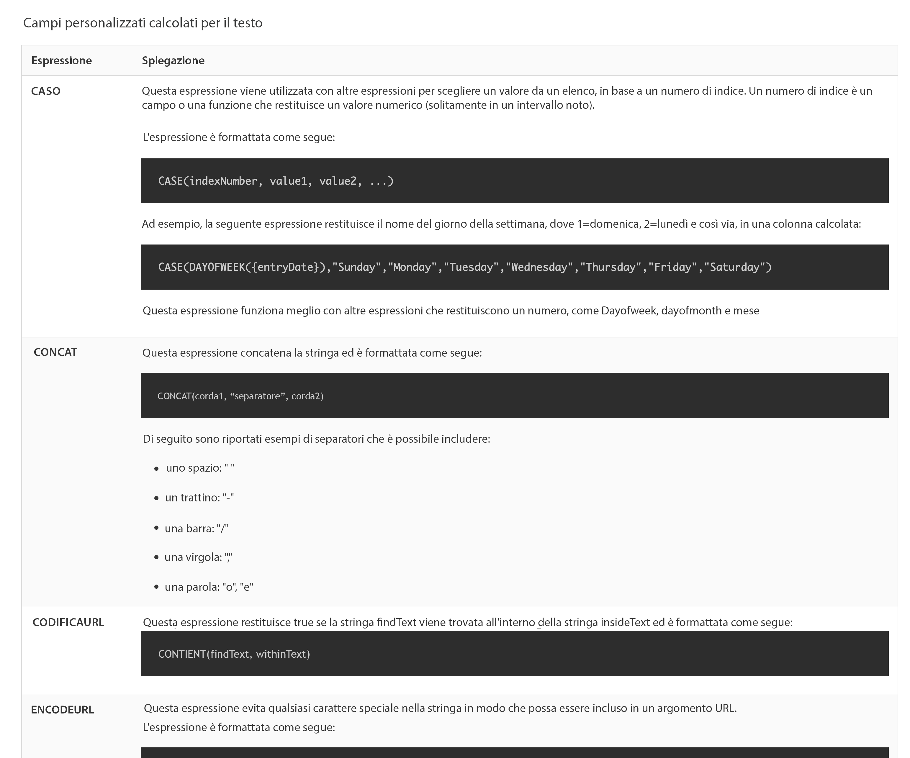

# Introduzione ai campi calcolati e alle espressioni

<!-- **Note**: The expression examples shown are simple and some may be mitigated by fields already supplied by  . However, the examples are used to illustrate the foundational knowledge needed in order to build expressions in Workfront.-->

Workfront offre una varietà di campi comuni a più aree di business e utilizzati regolarmente per la gestione del lavoro. Campi come data di completamento pianificata, budget progetto, nome assegnatario attività, ecc.

Tuttavia, ogni organizzazione dispone di dati specifici per il proprio settore e la propria azienda che devono essere raccolti per capire se gli obiettivi aziendali vengono raggiunti. Ad esempio, la tua organizzazione desidera tenere traccia di:

* A quale linea di business contribuirà un progetto?
* Se il finanziamento proviene da fornitori, interni o entrambi.
* Quale risoluzione è necessaria per le immagini utilizzate.

Anche se questi campi non sono incorporati in [!DNL Workfront], è possibile creare campi di immissione dati personalizzati e campi di risposta precompilati e a selezione multipla tramite un modulo personalizzato.

Questo percorso di apprendimento si concentra sul campo calcolato. Scoprirai cos’è un campo calcolato, i diversi tipi di informazioni che puoi richiamare nel campo calcolato tramite espressioni di dati e come creare tali campi calcolati per migliorare la raccolta dati e il reporting.

## Che cos&#39;è un campo calcolato?

Un campo calcolato contiene dati personalizzati creati utilizzando espressioni di dati e campi Workfront esistenti.

Ad esempio, l’organizzazione dispone di un sistema specifico di numerazione dei progetti, o numero del lavoro, che include:

* Anno di creazione del progetto,
* Iniziali del proprietario del progetto e
* Il [!DNL Workfront] numero di riferimento del progetto.

Utilizzando le espressioni in un campo calcolato, è possibile acquisire ogni informazione già memorizzata in [!DNL Workfront] e crea l&#39;ID progetto univoco, o numero di lavoro, che può quindi essere aggiunto a un rapporto come questo:

A seconda dei dati specifici necessari, i campi calcolati possono essere semplici, utilizzando una o due espressioni oppure più complicati, utilizzando diverse espressioni incorporate. Tieni presente che Workfront può utilizzare solo dati già memorizzati o estratti nel sistema per campi calcolati.

## Espressioni di testo

Le espressioni di testo ricercano, sezionano e combinano le informazioni presenti in [!DNL Workfront] per creare dati più significativi o ottenere informazioni più approfondite sul lavoro svolto per la tua organizzazione.

Le espressioni di testo, ad esempio, possono essere utilizzate per:

* Mostra &quot;Oltre $5.000&quot; quando le spese del progetto sono superiori a $5.000, o &quot;Sotto $5.000&quot; quando le spese sono inferiori a quelle, in una colonna della visualizzazione del progetto.

* Assegna a ogni progetto un numero univoco che include l&#39;anno di creazione, l&#39;anno di  [!DNL Workfront] numero di riferimento, nome del progetto e iniziali del proprietario del progetto.

* Creare un report in cui sono elencati tutti i progetti non assegnati a un portfolio e/o a un programma in modo da poterli utilizzare nelle riunioni dei manager.

Le espressioni di testo possono essere utilizzate in un campo personalizzato per eseguire questi tipi di ricerche e combinazioni in Workfront.

Esaminando le possibili espressioni di testo, sono disponibili diverse opzioni.

Esistono sei espressioni di testo utilizzate più spesso:

* CONCAT
* SINISTRA/DESTRA
* CONTAINS
* IF
* ISBLANK