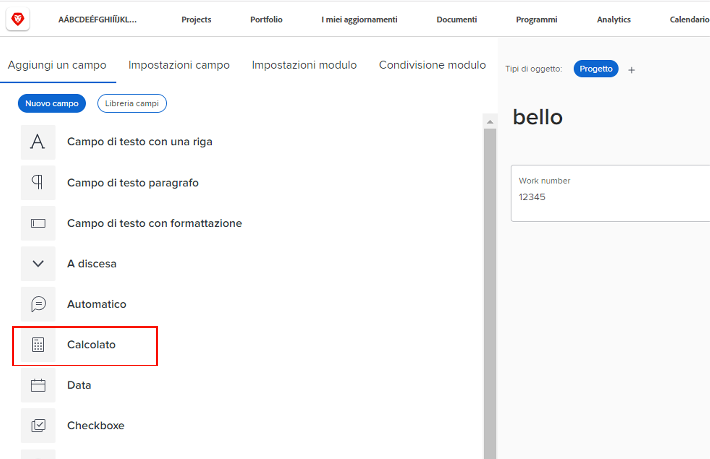
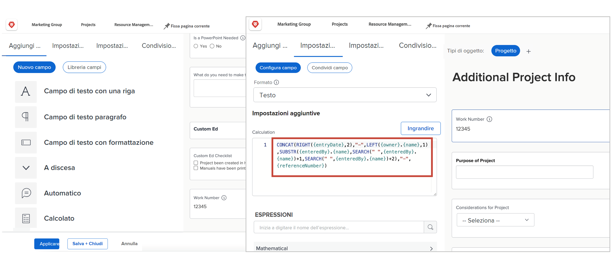
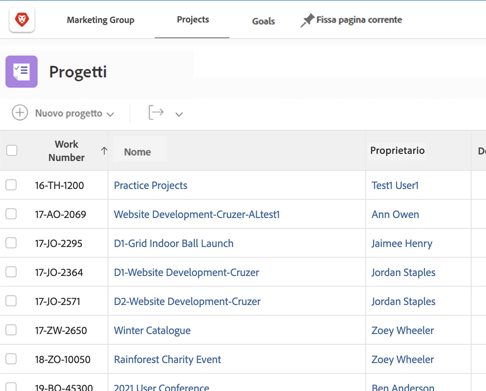
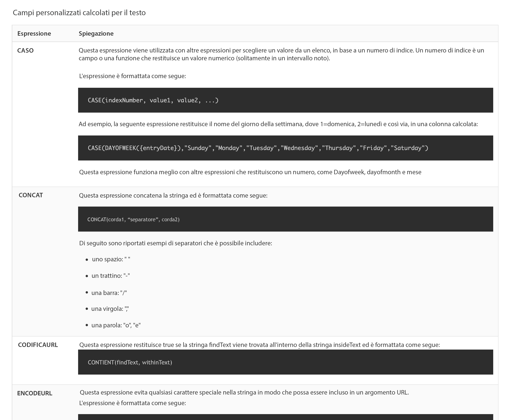

# Introduzione ai campi calcolati e alle espressioni

<!--
**Note**: The expression examples shown are simple and some may be mitigated by fields already supplied by  . However, the examples are used to illustrate the foundational knowledge needed in order to build expressions in Workfront.
-->

Workfront offre una varietà di campi comuni a più aree aziendali che vengono regolarmente utilizzati per la gestione del lavoro. Campi come data di completamento pianificata, budget del progetto, nome dell&#39;assegnatario dell&#39;attività, ecc.

Tuttavia, ogni organizzazione dispone di dati specifici del proprio settore e della propria azienda che devono essere raccolti per capire se gli obiettivi aziendali vengono raggiunti. Ad esempio, la tua organizzazione desidera tenere traccia di:

* A quale linea di business contribuirà un progetto.
* Se il finanziamento proviene da fornitori, interni o entrambi.
* Quale risoluzione è necessaria per le immagini utilizzate.

Sebbene questi campi non siano intrinsecamente integrati in [!DNL Workfront], è possibile creare campi di immissione dati personalizzati e campi di risposta precompilati e a selezione multipla tramite un modulo personalizzato.

Questo percorso di apprendimento si concentra sul campo calcolato. Imparerai cos&#39;è un campo calcolato, i diversi tipi di informazioni che puoi inserire nel campo calcolato tramite espressioni di dati e come creare tali campi calcolati per migliorare la raccolta dati e i report.

## Che cos’è un campo calcolato?

Un campo calcolato ospita dati personalizzati creati utilizzando espressioni di dati e campi di Workfront esistenti.

Ad esempio, l’organizzazione dispone di un sistema specifico di numerazione dei progetti, o numero del lavoro, che include:

* anno di creazione del progetto,
* iniziali del proprietario del progetto e
* il numero di riferimento del progetto [!DNL Workfront].

Utilizzando le espressioni in un campo calcolato, puoi prendere ogni informazione già archiviata in [!DNL Workfront] e creare l’ID progetto univoco, o numero di lavoro, che può quindi essere aggiunto a un report come questo:

A seconda dei dati specifici necessari, i campi calcolati possono essere semplici, utilizzando una o due espressioni, o più complicati, utilizzando diverse espressioni incorporate. Tieni presente che per i campi calcolati Workfront può utilizzare solo i dati già archiviati o estratti nel sistema.

## Espressioni di testo

Le espressioni di testo cercano, analizzano e combinano le informazioni trovate in [!DNL Workfront] per creare dati più significativi o ottenere maggiore comprensione del lavoro svolto per la tua organizzazione.

Le espressioni di testo, ad esempio, possono essere utilizzate per:

* Mostrare “Oltre $ 5.000” quando le spese del progetto sono superiori a $ 5.000, o “Meno di $ 5.000” quando le spese sono inferiori, in una colonna della vista Progetto.

* Assegnare a ciascun progetto un numero univoco che includa l’anno di creazione del progetto, quello del numero di riferimento del progetto di [!DNL Workfront], il nome del progetto e le iniziali del proprietario del progetto.

* Creare un report che elenchi tutti i progetti che non sono assegnati a un portfolio e/o programma in modo da poterlo utilizzare durante le riunioni con il tuo manager.

Le espressioni di testo possono essere utilizzate in un campo personalizzato per eseguire questi tipi di ricerche e combinazioni in Workfront.

Osservando le possibili espressioni di testo, troverai diverse opzioni.

Esistono sei espressioni di testo utilizzate più spesso:

* CONCAT
* LEFT/RIGHT
* CONTAINS
* IF
* ISBLANK