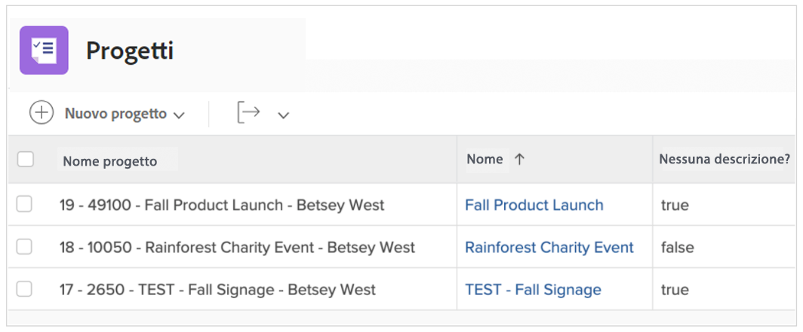
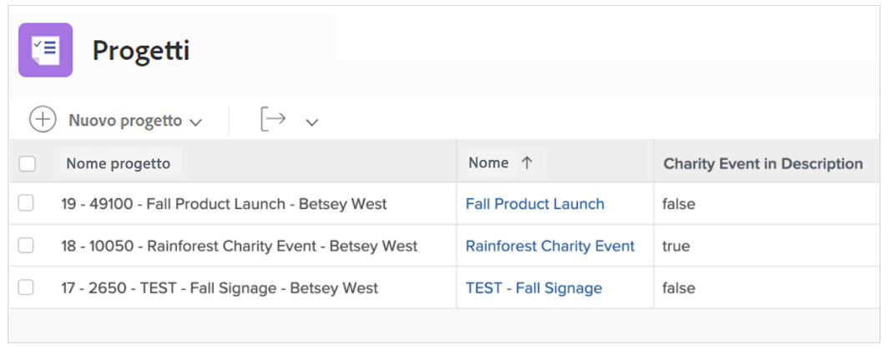
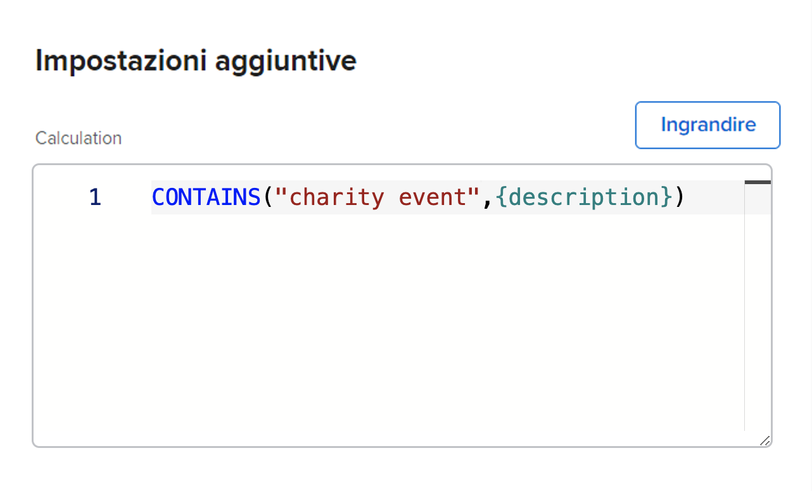

# Utilizzare le espressioni ISBLANK e CONTAINS

Entrambe le espressioni CONTAINS e ISBLANK vengono utilizzate per fornire valori true o false semplici. La differenza consiste nel fatto che l&#39;espressione ISBLANK controlla se il campo contiene un valore mentre l&#39;espressione di testo CONTAINS cerca una stringa specifica all&#39;interno di un campo.

Ad esempio, per verificare se un progetto ha una descrizione, utilizza l’espressione ISBLANK. Se il campo descrizione è vuoto, l’espressione restituisce il valore true. Se il campo descrizione non è vuoto, restituisce il valore false.

Per cercare un valore specifico nella descrizione, come &quot;evento benefico&quot;, utilizza l’espressione di testo CONTAINS. Se trova &quot;evento benefico&quot; nella descrizione, il campo calcolato indica &quot;true&quot;. Se non viene trovato un &quot;evento di beneficenza&quot;, viene visualizzato &quot;false&quot;.

## ISBLANK

L&#39;espressione di testo ISBLANK include il nome dell&#39;espressione e una coordinata.

**ISBLANK({data point})**

Nell’esempio precedente, dove desideri sapere se il progetto ha una descrizione, l’espressione sarebbe:

ISBLANK({description})

## CONTAINS

L&#39;espressione di testo CONTAINS include il nome dell&#39;espressione, la parola o la frase che si sta cercando e il campo in cui eseguire la ricerca.

**CONTAINS(&quot;phrase&quot;,{fields})**

Assicurati di racchiudere tra virgolette la parola o la frase che stai cercando, altrimenti l’espressione non sarà valida.

Nell’esempio precedente (cercando &quot;evento di beneficenza&quot; nella descrizione del progetto), l’espressione sarebbe:

**CONTAINS(&quot;evento di beneficenza&quot;,{description})**

**Nota**: l’espressione CONTAINS distingue tra maiuscole e minuscole. Ad esempio, se &quot;Evento di beneficenza&quot; è scritto in maiuscolo nel campo di descrizione, inserisci tale frase nell’espressione.

**CONTAINS(&quot;Evento benefico&quot;,{description})**

Entrambe le espressioni ISBLANK e CONTAINS sono utili per verificare se è presente un valore. Tuttavia, può essere più utile sapere qual è il valore, visualizzarlo effettivamente o avere una sorta di descrittore per fornire informazioni migliori.

Ad esempio, invece di sapere che un progetto è stato convertito da una richiesta, vuoi conoscere il nome della richiesta originale.

In tal caso, utilizzare l&#39;espressione CONTAINS insieme a un&#39;espressione IF.

Nella maggior parte dei casi, le espressioni di testo ISBLANK e CONTAINS vengono utilizzate con un&#39;espressione di testo IF.
