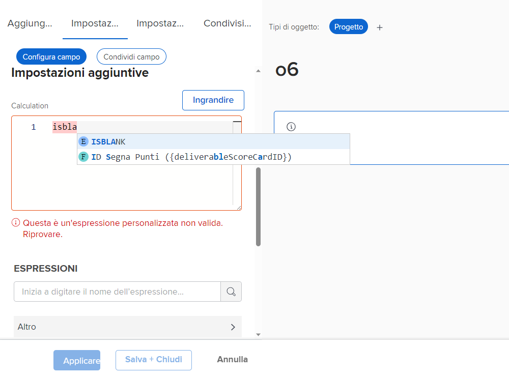
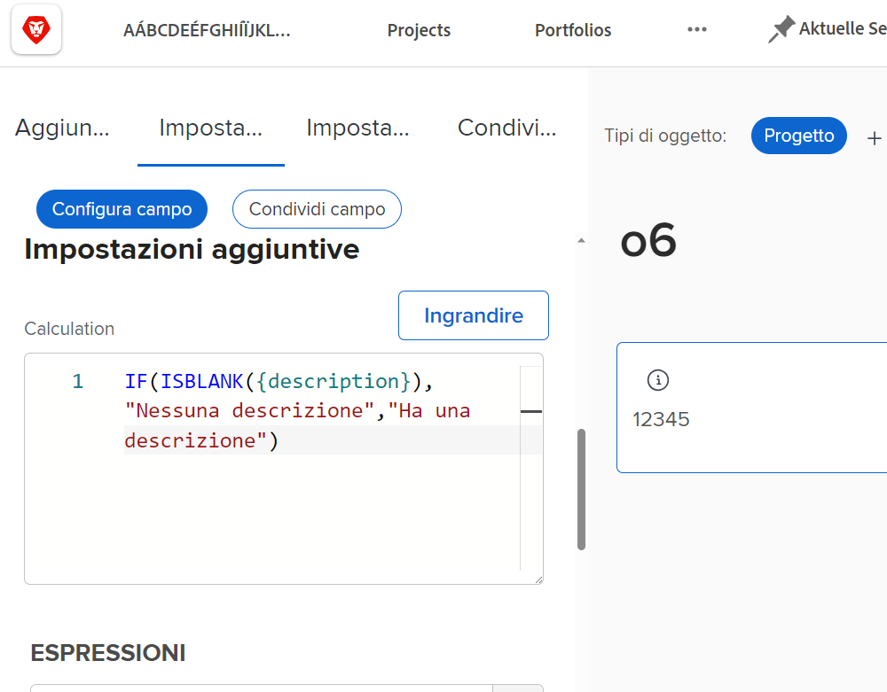
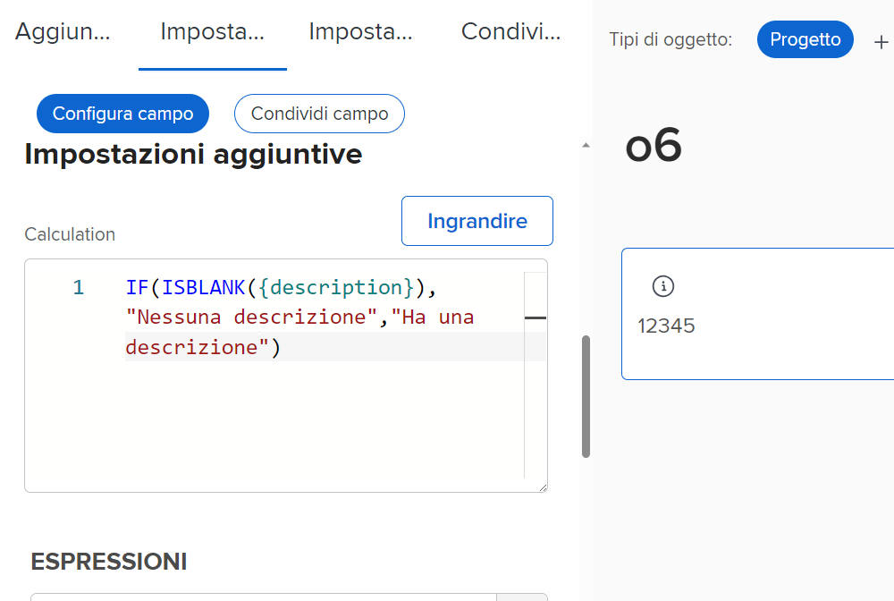
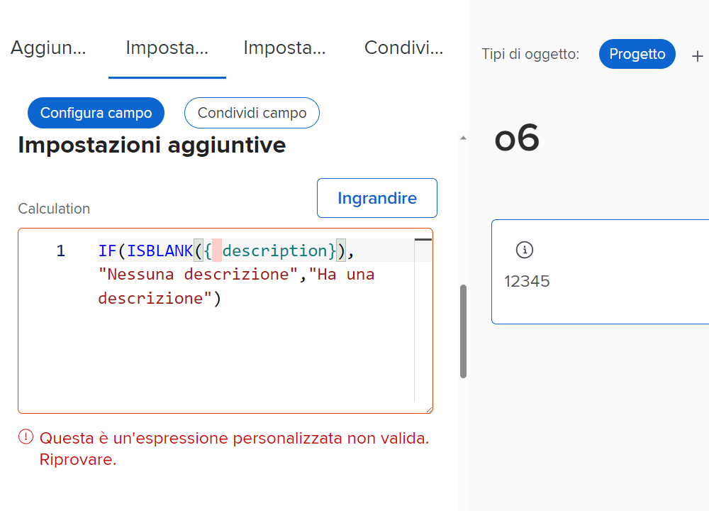
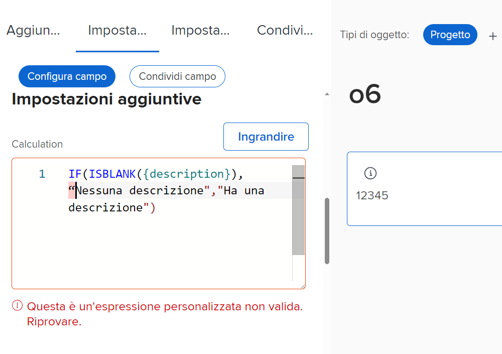
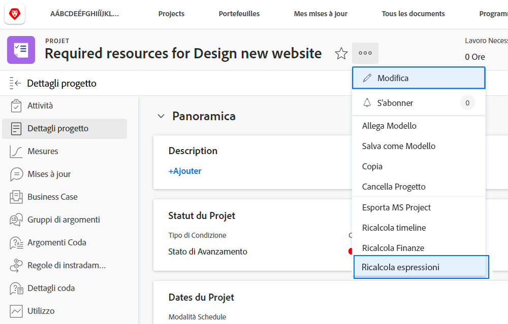
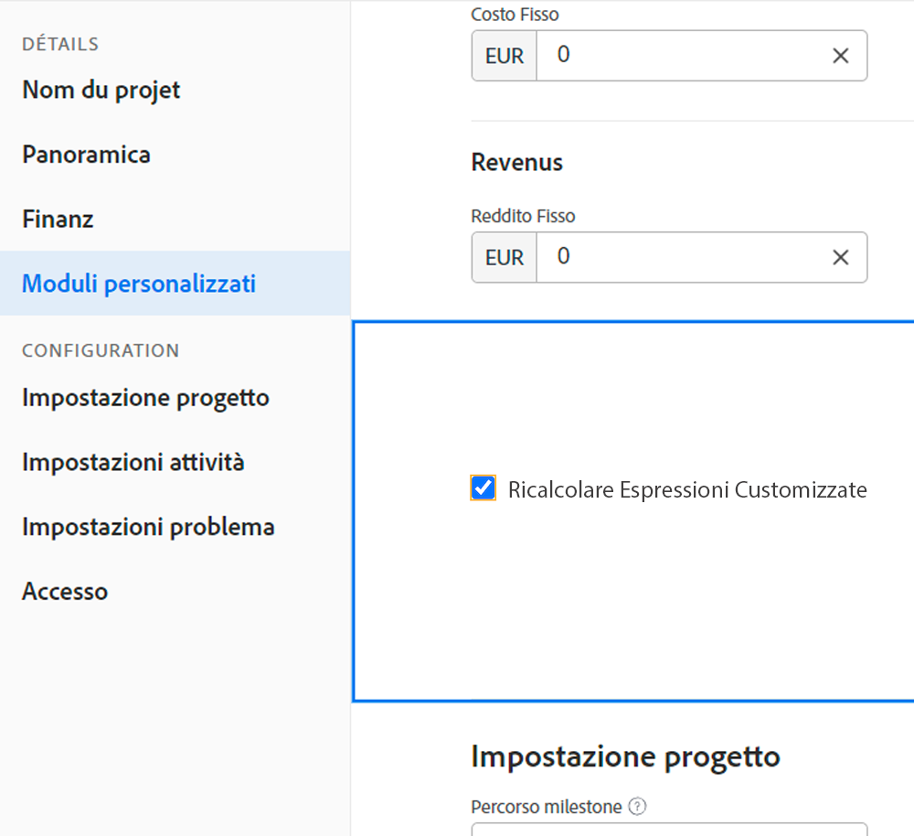

# Informazioni sulle espressioni di campo calcolato

Di seguito è riportato un elenco di concetti utili per l’utilizzo dei campi calcolati personalizzati in Workfront.

## Casella degli argomenti nei nomi delle espressioni

Quando si tratta di nomi di espressioni, il carattere maiuscolo/minuscolo è importante. Durante la scrittura iniziale di un nome di espressione è possibile utilizzare lettere maiuscole, lettere minuscole o una combinazione di entrambe.

Tuttavia, l’espressione deve essere scritta come tutte le lettere maiuscole affinché il sistema possa riconoscerla e salvare il campo.

## Le ore vengono memorizzate in minuti

Le ore nel database di Workfront vengono memorizzate in minuti. Se fai riferimento a campi come Ore pianificate o Ore effettive, dividi per 60 per mostrare il tempo in ore e non in minuti.

## La spaziatura non influisce sulle espressioni

Il modo consigliato per scrivere le espressioni prevede una spaziatura minima o nulla tra ciascuna espressione.

* IF(ISBLANK({description}),&quot;Nessuna descrizione&quot;,&quot;Ha descrizione&quot;)

Tuttavia, se la spaziatura consente di vedere cosa sta succedendo, è possibile aggiungerla alle espressioni. Gli spazi aggiuntivi non devono impedire all’espressione di raccogliere o calcolare un valore in [!DNL Workfront].

* IF (ISBLANK ({description}), &quot;Nessuna descrizione&quot; , &quot;Ha descrizione&quot; )

Le uniche cose che non possono avere spazi tra di loro sono i campi e le parentesi graffe. In caso contrario, verrà visualizzato un messaggio di errore e non sarà possibile salvare il campo o il modulo personalizzato.

## Le virgolette devono essere diritte

Quando si utilizzano le virgolette in un&#39;espressione, assicurarsi che siano rette (&quot;). Se le virgolette sono curve (&quot;), [!DNL Workfront] Il sistema continuerà a visualizzare il messaggio &quot;Espressione personalizzata non valida&quot;.

## Aggiornamento dei calcoli al salvataggio del modulo e alla modifica dell’oggetto

Questo è un aspetto importante dei campi calcolati da comprendere.

Le informazioni visualizzate in un campo calcolato rimarranno invariate e diventeranno obsolete a meno che il modulo personalizzato non venga ricalcolato.

Le espressioni possono essere aggiornate utilizzando l&#39;opzione Ricalcola espressioni nel menu Altro di un oggetto.

Desideri visualizzare il numero di giorni in cui un problema è stato aperto. Creare un campo calcolato denominato &quot;Days Open&quot; con l&#39;espressione DATEDIFF.

* Nome Campo = Giorni Aperti
* Espressione = DATEDIFF({entryDate},$$TODAY)

Una volta salvato, il numero di giorni tra la creazione del problema o l’immissione in Workfront e la data odierna può essere visualizzato nella pagina dei dettagli di un oggetto o in una visualizzazione di rapporto.

Il giorno successivo, quando visualizzerai la stessa pagina dei dettagli o la stessa visualizzazione del rapporto, prevedi che tale numero venga incrementato di uno. Se il numero è 5 oggi, dovrebbe essere 6 domani. Il giorno successivo dovrebbe essere 7, poi 8, ecc.

Tuttavia, il campo continuerà a essere 5 ogni giorno. Il campo deve essere &quot;rieseguito&quot; o ricalcolato per aggiornare le informazioni.

Per aggiornare un campo utilizzando l&#39;opzione Ricalcola espressioni:

* Fare clic sul nome dell&#39;oggetto per aprirlo.
* Fare clic sul menu Altro.
* Selezionare Ricalcola espressioni dall&#39;elenco.

È inoltre possibile ricalcolare più espressioni contemporaneamente utilizzando la funzione di &quot;modifica in serie&quot; in un elenco o in un report. Si supponga di aver creato un report contenente un elenco di problemi con il calcolo Giorni aperti visualizzato in una colonna. Se si desidera ricalcolare tutti i problemi contemporaneamente:

* Seleziona tutti i problemi nel rapporto.
* Seleziona l’opzione di modifica per modificare in blocco tutti i problemi selezionati.
* Fai clic sull’etichetta Forms personalizzato a sinistra per scorrere verso il basso fino alla sezione Moduli personalizzati.
* Seleziona la casella Ricalcola espressioni personalizzate nella parte inferiore della sezione Forms personalizzate.
* Fai clic su Salva modifiche.

La schermata si aggiorna per mostrare le informazioni aggiornate nel campo calcolato.

**Nota**: anche se esistono altri modi per aggiornare o ricalcolare le espressioni in un campo calcolato, questo è il modo più rapido e semplice.

## I calcoli possono variare da modulo a modulo all’interno dello stesso campo

Non appena un campo calcolato viene salvato in un modulo personalizzato e il modulo personalizzato viene salvato, il campo calcolato viene aggiunto alla Libreria campi in modo che possa essere utilizzato in altri moduli personalizzati.

Tuttavia, se si dispone di un campo calcolato nel modulo A e dello stesso campo calcolato nel modulo B, il pensiero iniziale è che i calcoli sono esattamente gli stessi. Non sempre è così. Il campo calcolato nel modulo A potrebbe essere calcolato in modo completamente diverso nel modulo B.

Quando un campo personalizzato calcolato viene selezionato dalla libreria dei campi e aggiunto a un modulo personalizzato, il campo viene aggiunto ma il calcolo è vuoto. Questo accade perché il calcolo potrebbe fare riferimento a campi che non esistono per un altro tipo di oggetto.

Ad esempio, è stato creato un campo calcolato, &quot;Giorni per il completamento&quot;, per determinare il tempo necessario per completare un&#39;attività in un progetto.

* WEEKDAYDIFF({actualStartDate},{actualCompletionDate})

Si desidera fare la stessa cosa per un&#39;iterazione. È possibile utilizzare la stessa espressione, ma i campi disponibili per un oggetto attività non sono sempre disponibili per un oggetto iterazione. Quindi [!DNL Workfront] consente di generare il calcolo con i campi oggetto corretti.

**Suggerimento**: durante la creazione di campi personalizzati, copia l’espressione calcolata dalla casella Calcolo nel campo Istruzioni. Questo campo non viene cancellato quando un campo personalizzato calcolato viene aggiunto al modulo personalizzato dalla Libreria campi.

A seconda delle esigenze, i campi calcolati nei moduli personalizzati possono essere molto semplici o molto complessi. Le espressioni possono incorporare o nidificare altre espressioni e valori per fornire il livello di dettaglio necessario per ottenere un quadro migliore di ciò che accade nel lavoro svolto nell’organizzazione.

<!--Depending on the need, calculated fields in custom forms can be quite simple or very complex. Expressions can embed, or nest, other expressions and values to provide the level of detail needed to get a better picture of what is going on with the work being done at your organization. 

Most of the examples and exercises in this course have been relatively simple to provide a base understanding of the expressions most commonly used and how to build those expressions in a custom calculated field. 

Now you’re ready to start building your own calculated custom fields.-->
