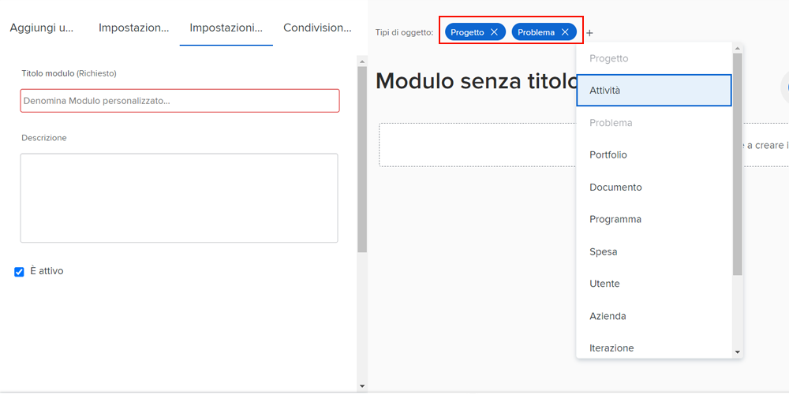

# Creazione e condivisione di un modulo personalizzato

Questo video illustra come:

* Determinare gli oggetti da utilizzare per il modulo
* Aggiungere campi univoci in diversi formati
* Organizzare i campi utilizzando sezioni e logica
* Condivisione di moduli con altri utenti

>[!VIDEO](https://video.tv.adobe.com/v/335172/?quality=12)

## I moduli personalizzati funzionano con più tipi di oggetto

Quando fai clic sul pulsante [!UICONTROL Nuovo modulo personalizzato] È possibile selezionare tutti gli oggetti che si desidera utilizzare con un singolo modulo personalizzato. Tutti i campi aggiunti a questo modulo saranno disponibili per uno qualsiasi degli oggetti selezionati quando il modulo personalizzato è ad essi associato.

![Finestra del modulo personalizzato che mostra [!UICONTROL Nuovo modulo personalizzato] opzioni oggetto](assets/create-custom-form.png)

Quando si modifica un modulo personalizzato è possibile visualizzare tutti i tipi di oggetto selezionati. È possibile aggiungere o eliminare tipi di oggetti da questo elenco.

È possibile creare un modulo personalizzato di tipo progetto ed problema. Quando è allegato a un problema, puoi compilare uno qualsiasi dei campi relativi al problema. Successivamente, se si decide di convertire il problema in un progetto, il modulo personalizzato verrà caricato automaticamente nel progetto e i dati inseriti nei campi del modulo personalizzato del problema saranno disponibili per la visualizzazione o la modifica nel modulo personalizzato del progetto.

## Opzioni del campo personalizzato

**[!UICONTROL Etichetta] e [!UICONTROL Nome] field**

La [!UICONTROL Etichetta] e [!UICONTROL Nome] i campi di un campo personalizzato hanno scopi diversi. [!UICONTROL Etichetta] è il nome del campo che verrà visualizzato dagli utenti [!DNL Workfront]. [!UICONTROL Nome] è ciò che può essere utilizzato con le integrazioni, ad esempio API.

![Finestra del modulo personalizzata visualizzata [!UICONTROL Etichetta] e [!UICONTROL Nome] field](assets/custom-forms-field-label-and-name.png)

Questo offre la flessibilità di modificare l’etichetta rivolta all’utente in modo che corrisponda alle modifiche nell’organizzazione, senza influire sulle integrazioni o altre connessioni che si basano su un nome di campo specifico.

**[!UICONTROL Campo di testo con formattazione]**

La [!UICONTROL Campo di testo con formattazione ]contiene strumenti di base per il markup del testo che consentono agli utenti di aggiungere testo in grassetto, corsivo o sottolineato durante la compilazione del campo in un modulo personalizzato.

![Finestra del modulo personalizzata visualizzata [!UICONTROL Campo di testo con formattazione] opzione](assets/custom-forms-text-field-with-formatting.png)

Il campo dispone inoltre di un limite di 15.000 caratteri, che consente uno spazio sufficiente per fornire informazioni vitali e utilizzare la formattazione per facilitare la lettura da parte di altri.

**[!UICONTROL Tipo] field**

La [!UICONTROL Tipo] consente al sistema di compilare automaticamente un elenco di opzioni in base all’oggetto selezionato per il campo.

![Finestra del modulo personalizzata visualizzata [!UICONTROL Tipo] opzione campo](assets/custom-forms-typeahead-1.png)

Ad esempio, se crei una [!UICONTROL Tipo] campo denominato &quot;Nome approvazione di Marketing Manager&quot; e seleziona [!UICONTROL Utente] quando un utente compila il campo in un modulo personalizzato, come tipo di oggetto a cui si fa riferimento viene visualizzato un elenco di nomi utente. La [!UICONTROL Tipo] Questo campo è progettato per collegare i dati personalizzati con le informazioni acquisite nel sistema ed eliminare la necessità di mantenere manualmente molte opzioni nei campi a discesa.

![Finestra del modulo personalizzata visualizzata [!UICONTROL Tipo] menu a discesa](assets/custom-forms-typeahead-2.png)
