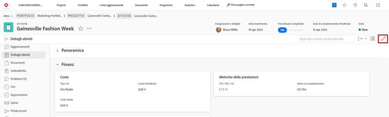

# Modificare un modulo personalizzato

<!--
21.4 updates have been made here
-->

È possibile modificare le informazioni di un modulo personalizzato dopo che il modulo è stato allegato a un oggetto.

1. Passare all’oggetto per il quale desideri modificare le informazioni nel modulo personalizzato.
1. Fai clic su [Tipo di oggetto] **[!UICONTROL Dettagli]** nel pannello a sinistra.
1. Espandi il modulo personalizzato facendo clic sulla freccia accanto al nome.
1. Fai clic su un singolo campo nel modulo personalizzato per accedere alla modalità di modifica su quel campo. Puoi anche fare clic sul pulsante [!UICONTROL Modifica] nell’angolo in alto a destra per modificare tutti i moduli personalizzati o le relative sezioni.
1. Digita le informazioni in un singolo campo personalizzato, anche se i campi obbligatori in altri moduli personalizzati sull’oggetto non sono ancora stati compilati.
1. Fai clic su **[!UICONTROL Salva modifiche]**.

