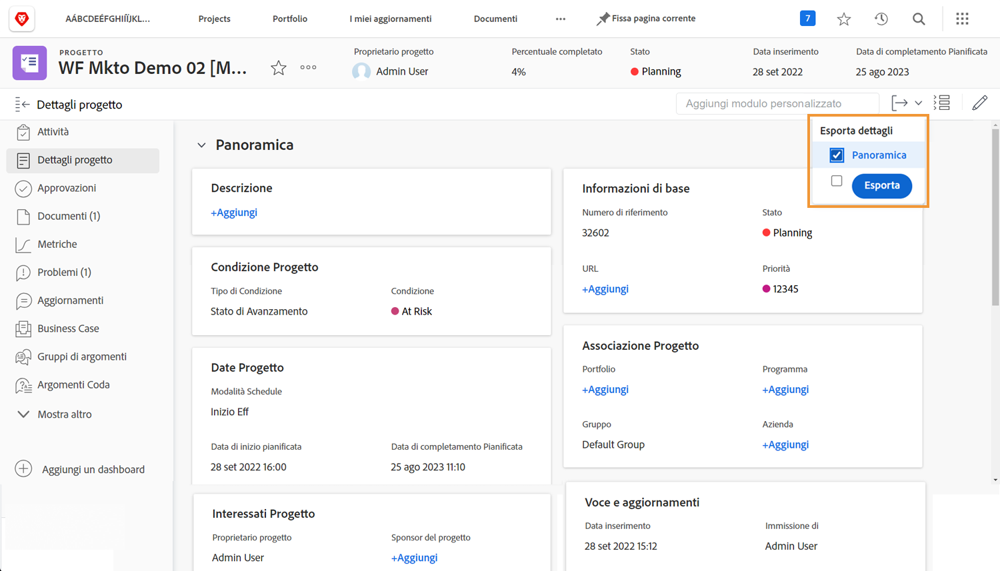
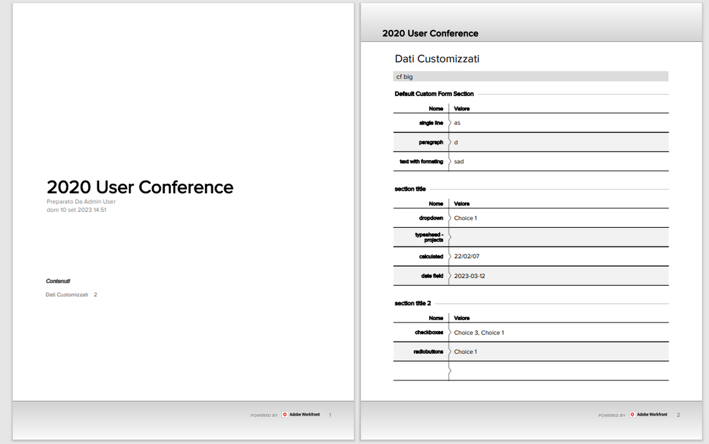

# Esportare un modulo personalizzato come PDF

L&#39;acquisizione dei dati univoci di un&#39;organizzazione è una parte essenziale della gestione del lavoro. I moduli personalizzati vengono comunemente utilizzati a questo scopo. La possibilità di esportare moduli personalizzati ne agevola la circolazione e la condivisione. È possibile esportare moduli personalizzati da progetti, attività o problemi quando si accede al modulo in [!UICONTROL Dettagli] sezione degli oggetti.

È inoltre possibile includere [!UICONTROL Panoramica] nell&#39;area del PDF esportato.

Ad esempio, per esportare un modulo personalizzato denominato Video Marketing Information allegato a un progetto:

1. Fai clic su **[!UICONTROL Esporta]** icona. Tutti i moduli personalizzati allegati al progetto vengono visualizzati nel menu a discesa, incluso [!UICONTROL Panoramica] sezione.
1. Seleziona Video Marketing Information (Informazioni di marketing video) dall’elenco.
1. Clic **[!UICONTROL Esporta]** in fondo all’elenco.

Viene scaricato un file di PDF formattato.

