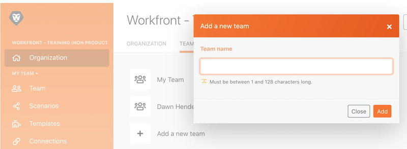

# Procedura dettagliata per l’amministrazione

Scopri come passare da un’organizzazione o un team a un altro e come aggiungere utenti al sistema.

## Procedura dettagliata per l’amministrazione

Questo video illustra:

* Come navigare tra organizzazioni e team
* Come creare i team
* Come invitare utenti in un’organizzazione e in un team

>[!VIDEO](https://video.tv.adobe.com/v/3418192/?captions=ita&quality=12&learn=on&enablevpops=1)

>[!NOTE]
>
>Se l’organizzazione è stata integrata in Adobe Admin Console, consulta [Aggiungere utenti in Adobe Workfront Fusion tramite Adobe Admin Console](https://experienceleague.adobe.com/docs/workfront/using/adobe-workfront-fusion/fusion-in-experience-cloud/add-fusion-users-admin-console.html?lang=it).

## Desideri ulteriori informazioni? Consigliamo quanto segue:

[Documentazione di Workfront Fusion](https://experienceleague.adobe.com/it/docs/workfront-fusion/using/get-started-with-fusion/understand-workfront-fusion/workfront-fusion-overview)
