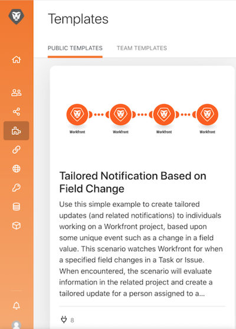
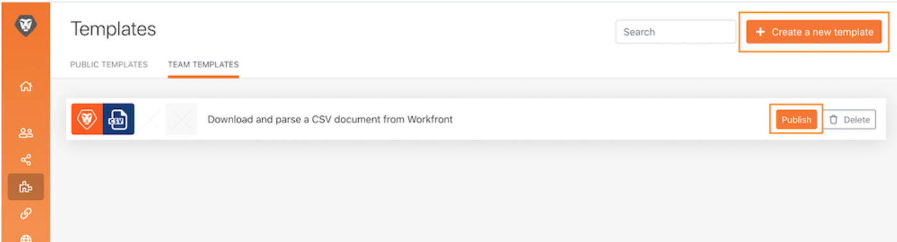

# Accessibilità e chiarezza

Nelle prime fasi del corso di formazione su Workfront Fusion, hai imparato alcune best practice di base per semplificare la lettura, la condivisione e la comprensione degli scenari. Queste procedure semplificano la risoluzione dei problemi o il supporto dell’istanza di Workfront Fusion per gli utenti futuri di Workfront Fusion. Esegui il pagamento seguendo le linee guida riportate di seguito durante la progettazione degli scenari.

## Etichette e note

Come regola generale, un obiettivo principale in Workfront Fusion è sempre quello di disporre di semplici progettazioni di scenari. Di seguito sono riportati alcuni modi per creare progettazioni semplici da interpretare.

* Assicurati di nominare tutti i moduli. Fai clic con il pulsante destro del mouse su un modulo e seleziona Rinomina. Le etichette dei moduli devono essere brevi ma comprensibili per le prestazioni del modulo. Ad esempio, “Crea Mktg Proj (progetto di marketing) con Modello Ch (Canale)”.
  
* Etichetta anche i percorsi di indirizzamento. Anche se un percorso non utilizza un filtro direttamente dopo un router, puoi applicare un’etichetta senza compilare la logica del filtro. In questo modo altri utenti possono capire quali pacchetti passano lungo quali percorsi e perché. Per creare un’etichetta per un percorso di router senza filtro, fai clic con il pulsante destro del mouse sul percorso, aggiungi un’etichetta e salva.
  
* Se applicabile, aggiungi note in uno scenario quando l’etichetta di un modulo o di un percorso di indirizzamento sarà troppo breve per chiarire cosa sta effettivamente accadendo. È possibile aggiungere note ogni volta che si desidera durante il processo di progettazione e iterazione.

Tuttavia, potrebbe essere più semplice da leggere e comprendere se aggiungi note alla fine del progetto dello scenario, quando sei pronto per il lancio. Lavora dalla fine della progettazione dello scenario (l’angolo in basso a destra) a ritroso. In questo modo, le note applicabili all’inizio dello scenario si trovano in cima all’elenco quando si apre il pannello note.

Dopo aver salvato o chiuso il pannello note, le note vengono ordinate in base all’ultima creazione. Nell’immagine seguente, la prima nota creata viene visualizzata nella parte inferiore dell’elenco. Le note venivano create intenzionalmente dall’angolo in basso a destra fino al percorso indicato sopra e fino al trigger, essenzialmente nell’ordine inverso in cui un pacchetto di dati passava attraverso lo scenario. In questo modo le note vengono visualizzate nell’ordine in cui lo scenario viene effettivamente eseguito sul pacchetto di dati.

## Modelli Workfront Fusion

Un ottimo modo per semplificare l’etichettatura di moduli e percorsi di indirizzamento consiste nell’utilizzare i modelli. I modelli di best practice consentono di creare più rapidamente scenari per casi d’uso comuni.

### Esempio di modello

Quando avvii uno scenario, controlla innanzitutto se è disponibile un modello che possa essere utile. Ad esempio, se desideri creare uno scenario che inizi scaricando un documento CSV da Workfront, lo analizza.

Fai clic sulla sezione Modelli per verificare se eventuali modelli pubblici soddisfano le tue esigenze.

Fai clic sulla scheda Modelli di team per verificare se un utente del team ha creato un modello che potrebbe essere utile.

Se trovi un modello da utilizzare, fai clic sul nome per aprirlo.

Quindi vai all’angolo in alto a destra, fai clic su Opzioni e seleziona Crea scenario.

### Creare un modello

Puoi creare un modello nella sezione Modelli team. Il modello creato è disponibile per te e per il tuo team, ma quando fai clic sul pulsante Pubblica puoi condividerlo con persone esterne al team.

Durante la creazione di un modello, puoi includere una procedura guidata per guidare gli utenti che lo utilizzano nella creazione dei loro scenari, modificando le connessioni, i dati mappati e altri campi del pannello a seconda delle necessità.

Seleziona la casella di controllo “Usa in procedura guidata” per aggiungere le istruzioni che saranno disponibili quando qualcuno crea uno scenario utilizzando il modello. Queste informazioni verranno visualizzate nel campo Aiuto. Per consentire agli utenti di visualizzare questo testo quando utilizzano il modello, abilita Usa come valore predefinito.

## Desideri ulteriori informazioni? Consigliamo quanto segue:

[Documentazione di Workfront Fusion](https://experienceleague.adobe.com/it/docs/workfront-fusion/using/get-started-with-fusion/understand-workfront-fusion/workfront-fusion-overview)
