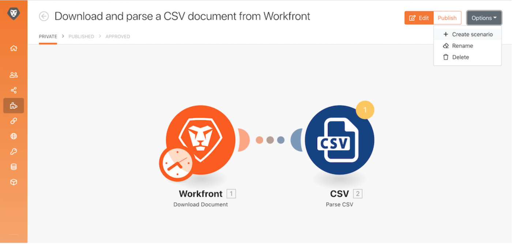

# Accessibilità e chiarezza

All&#39;inizio del corso di formazione Workfront Fusion, hai appreso alcune best practice di base per semplificare la lettura, la condivisione e la comprensione degli scenari. Queste pratiche aiutano a semplificare le operazioni per i futuri utenti di Workfront Fusion o per chiunque risolva o supporti la tua istanza di Workfront Fusion. Pagalo in avanti seguendo le linee guida riportate di seguito durante la progettazione degli scenari.

## Etichette e note

Come regola generale, un obiettivo primario in Workfront Fusion è sempre quello di avere progettazioni di scenari semplici. Di seguito sono riportati alcuni modi per creare progetti semplici da interpretare.

* Assicurati di assegnare un nome a tutti i moduli. Fare clic con il pulsante destro del mouse su un modulo e selezionare Rinomina. Le etichette del modulo devono essere brevi ma comprensibili per le prestazioni del modulo. Ad Esempio, &quot;Crea Un Proj Mktg Con Modello Ch&quot;.
   
* Etichettare anche i percorsi di indirizzamento. Anche se un percorso non utilizza un filtro direttamente dopo un router, è possibile applicare un&#39;etichetta senza riempire la logica del filtro. Questo permette agli altri di capire quali bundle passano attraverso quali percorsi e perché. Per creare un&#39;etichetta per un percorso router senza filtro, fare clic con il pulsante destro del mouse sul percorso, aggiungere un&#39;etichetta e salvare.
   
* Aggiungi note, se applicabile, in uno scenario se un’etichetta modulo o un’etichetta di percorso di indirizzamento sarà troppo breve per chiarire cosa sta effettivamente accadendo. È possibile aggiungere note ogni volta che si desidera durante il processo di progettazione e iterazione.

Tuttavia, potrebbe essere più semplice leggere e comprendere se aggiungi note alla fine della progettazione dello scenario quando sei pronto per essere avviato. Lavorare all&#39;indietro dalla fine del progetto dello scenario (l&#39;angolo in basso, a destra). In questo modo le note applicabili all&#39;inizio dello scenario si trovano in cima all&#39;elenco quando si apre il pannello note.

Dopo aver salvato o chiuso il pannello note, le note vengono ordinate in base all&#39;ultima creazione effettuata nella parte superiore. Nell’immagine seguente, la prima nota creata viene visualizzata in fondo all’elenco. Le note sono state create intenzionalmente dal basso a destra al percorso sopra e infine al trigger— essenzialmente l&#39;ordine inverso un bundle di dati passerebbe attraverso lo scenario. In questo modo le note vengono visualizzate nell&#39;ordine in cui lo scenario viene eseguito sul bundle di dati.

## Modelli Workfront Fusion

Un ottimo modo per semplificare l’etichettatura dei moduli e dei percorsi di indirizzamento consiste nell’utilizzare i modelli. I modelli di best practice consentono di accelerare la creazione di scenari per casi d’uso comuni.

### Esempio di modello

Quando si avvia uno scenario, controlla innanzitutto se è disponibile un modello che ti aiuterà. Ad esempio, vuoi creare uno scenario che inizia scaricando un documento CSV da Workfront, quindi analizzarlo.

Fai clic sulla sezione Modelli per verificare se i modelli pubblici soddisfano le tue esigenze.

Fai clic sulla scheda Modelli team per verificare se un utente del team ha creato un modello utile.

Se trovi un modello da utilizzare, fai clic sul nome per aprirlo.

Quindi andare nell&#39;angolo in alto a destra, fare clic su Opzioni e selezionare Crea scenario.

### Creare un modello

È possibile creare un modello nella sezione Modelli team . Il modello creato è disponibile per te e il tuo team, ma quando fai clic sul pulsante Pubblica puoi condividerlo con persone esterne al tuo team.

Quando crei il modello, puoi includere una procedura guidata per guidare le persone che lo utilizzano a creare i loro scenari, modificando le connessioni, i dati mappati e altri campi del pannello in base alle necessità.

Seleziona la casella di controllo &quot;Usa nella procedura guidata&quot; per aggiungere istruzioni che saranno disponibili quando qualcuno crea uno scenario utilizzando il tuo modello. Queste informazioni verranno visualizzate nel campo Aiuto. Per consentire agli utenti di visualizzare questo testo quando utilizzano il modello, abilita Usa come valore predefinito.

## Vuoi saperne di più? Si consiglia quanto segue:

[Documentazione di Workfront Fusion](https://experienceleague.adobe.com/docs/workfront/using/adobe-workfront-fusion/workfront-fusion-2.html?lang=en)
