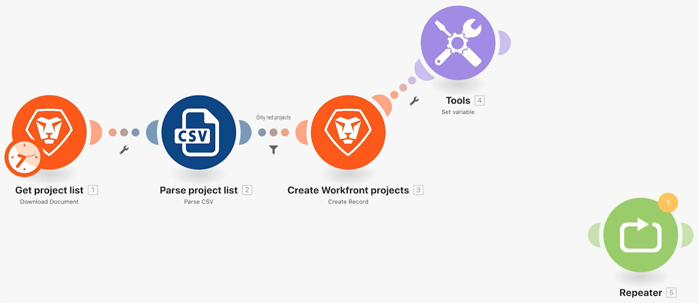

# Esercizio sull’accesso alle versioni precedenti

Scopri come tornare a una versione precedente di uno scenario.

## Panoramica dell’esercizio

Scopri come ripristinare le versioni precedenti dopo aver apportato delle modifiche a uno scenario e averlo salvato più volte.

## Passaggi da seguire

1. Crea un clone dello scenario Utilizzo del filtro potente e denominalo “Accesso alle versioni precedenti”.
1. Aggiungi un modulo Imposta variabile dopo il modulo Crea progetti Workfront. Denomina la variabile “Test”.
1. Trascinala in una nuova posizione e salva lo scenario.

   

1. Aggiungi un modulo Repeater, scollegalo dal modulo precedente e salva di nuovo lo scenario.

   

1. Ora elimina tutti i moduli e salva.
1. Nella barra degli strumenti, fai clic sul menu a tre punti e sull’opzione Versioni precedenti. L’elenco a discesa mostra la data e l’ora di ogni versione salvata.

   

1. Scegli una versione precedente e osserva come lo scenario nel designer ritorna nel punto in cui hai salvato.
