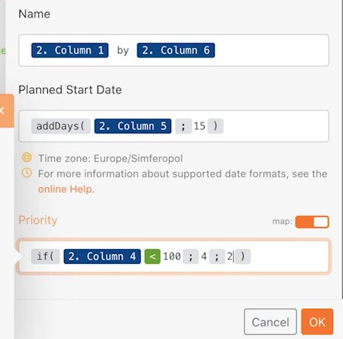

# Esercizio oltre la mappatura di base

Scopri come utilizzare le formule del pannello di mappatura per manipolare o convertire i campi inviati a un modulo.

## Panoramica dell’esercizio

Modifica il nome del progetto, la data di inizio pianificata e la priorità dagli esercizi di procedura dettagliata Oltre la mappatura di base utilizzando le formule del pannello di mappatura.

## Passaggi da seguire

**Crea un clone dello scenario di progettazione iniziale.**

1. Seleziona l’opzione Clona a destra della progettazione dello scenario iniziale nella sezione dello scenario, come illustrato di seguito. Denominalo “Oltre la mappatura di base”.

   

   **Ora utilizzeremo il pannello di mappatura nel modulo Crea progetti Workfront per configurare i campi Nome del progetto, Data di inizio pianificata e Priorità.**

1. Fai clic sul modulo Crea progetti Workfront per modificare le impostazioni. Utilizzando il pannello di mappatura, imposta il campo Nome su “[Nome progetto personale] da [Sponsor]”.

   + [Nome progetto personale] è la colonna 1 del modulo Analizza CSV, mentre [Sponsor] è la colonna 6. Il termine “per” è solo scritto tra le due colonne.

1. Passa quindi alla Data di inizio pianificata e utilizza la formula addDays per aggiungere 15 giorni al campo, come descritto nel video della procedura dettagliata relativa a Oltre la mappatura di base.
1. Trova il campo Priorità e attiva il pulsante Mappa in alto a destra del campo. Il menu dell’elenco a discesa diventa un numero. Crea un’istruzione “if” per etichettare un progetto come priorità Alta(4) se il livello di affidabilità del file CSV è inferiore a 100, altrimenti può essere Normale(2).

   + Il valore di affidabilità è riportato nella colonna 4.

   **A questo punto, il pannello di mappatura sarà simile al seguente:**

   

1. Fai clic su OK e quindi su Esegui una volta.
1. Trova il progetto nell’istanza Workfront per assicurarti che tutto sia stato mappato correttamente.
1. Salva lo scenario.
