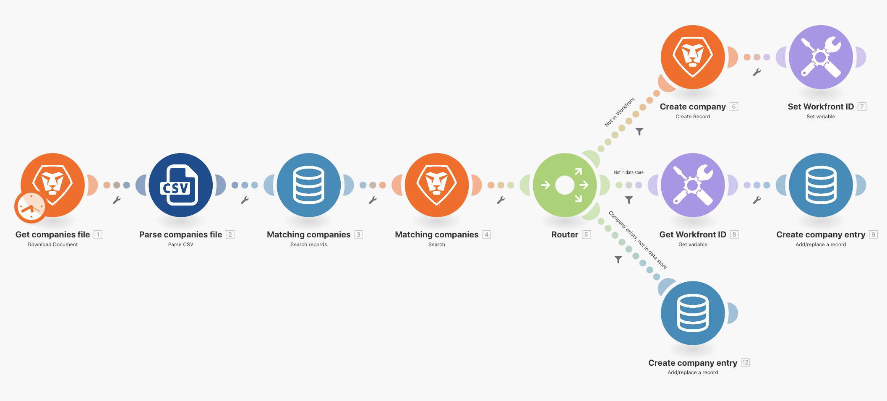
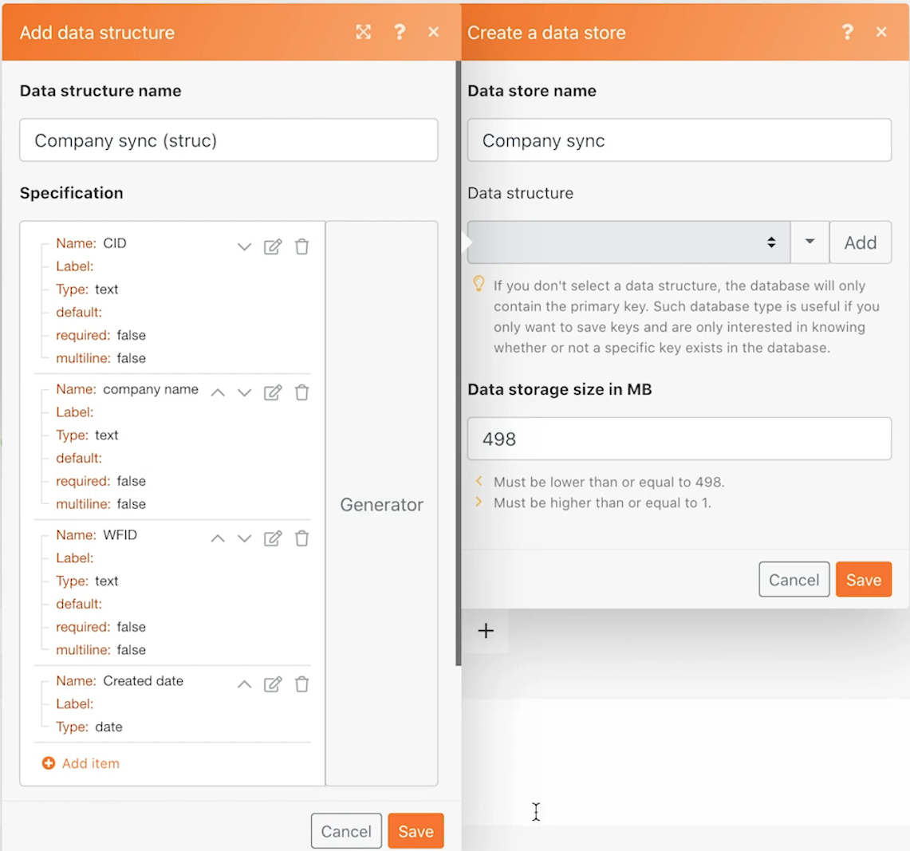

# Archivi di dati

Scopri come sincronizzare i nomi delle società tra due sistemi.

## Panoramica dell’esercizio

Questa è la prima parte di una sincronizzazione unidirezionale delle aziende tra Workfront e un altro sistema. Per ora, la sincronizzazione avviene solo tra un archivio dati Fusion e Workfront. Una tabella in un archivio dati tiene traccia dell’ID Workfront (WFID) e dell’ID azienda nel file CSV (CID) per ciascuna azienda. In futuro questo consentirà una sincronizzazione bidirezionale.

## Passaggi da seguire

**Scarica il file da Workfront.**

1. Nella cartella Workfront “Fusion Exercise Files”, seleziona “_Companies.csv” e fai clic su Dettagli documento.
1. Copia il primo numero ID dall’indirizzo URL.
1. In Fusion, crea un nuovo scenario denominato “Utilizzo degli archivi dati per la sincronizzazione”.
1. Per il modulo trigger, seleziona il modulo di download del documento di Workfront.
1. Configura la connessione Workfront e includi l’ID documento copiato dall’URL di Workfront.
1. Denomina questo modulo “Ottieni file aziende.”
1. Ora aggiungi un modulo CSV di analisi.
1. Digita 2 per il campo Numero di colonne.
1. Mappa i dati dal modulo di download del documento nel campo CSV.
1. Denomina questo modulo “Analizza file delle società.”
1. Salva lo scenario e fai clic su Esegui una volta.

   **Crea un archivio dati e una struttura dati.**

1. Aggiungi un modulo di record di ricerca dell’archivio dati.
1. Crea un nuovo archivio dati denominato “Sincronizzazione azienda.”
1. All’interno dell’archivio dati, crea una struttura di dati denominata “Sincronizzazione azienda (struc).”
1. Crea quattro campi.

   + CID: ID azienda nel file CSV
   + Nome azienda
   + WFID: ID azienda Workfront
   + Data di creazione: assicurati che il tipo di dati sia una data

   

1. Fai clic su Salva nella struttura dati, quindi imposta la dimensione di archiviazione dei dati su 1 e salva l’archivio dati.
1. Continuando nel modulo Archivio dati, imposta un filtro in cui il CID è uguale all’ID dell’azienda dal modulo CSV di analisi (colonna 1).
1. Fai clic su Mostra impostazioni avanzate e seleziona l’opzione per “continuare l’esecuzione dello scenario o del percorso, anche se questo modulo non restituisce alcun risultato.”

   

1. Rinomina questo modulo “Aziende corrispondenti.”
1. Aggiungi un modulo di record di ricerca di Workfront.
1. Scegli Azienda come tipo di record.
1. Il criterio di ricerca è che il nome dell’azienda in Workfront è uguale al nome dell’azienda nel file CSV.
1. Per gli output, seleziona il nome dell’azienda e l’ID.

   

1. Fai clic su OK e rinomina il modulo “Aziende corrispondenti.”

   **Crea percorsi diversi a seconda che l’azienda esista all’interno di Workfront o nell’archivio dati.**

   **Percorso di indirizzamento 1: creare un’azienda.**

1. Aggiungi un modulo router a destra del modulo di record di ricerca di Workfront.
1. Aggiungi un modulo di record di ricerca di Workfront al percorso principale.
1. Imposta il tipo di record su Azienda.
1. Seleziona il nome dai campi alla mappa. Mappa il campo del nome sull’output del modulo CSV di analisi (colonna 2).
1. Rinomina questo modulo “Crea azienda”.

   

1. Aggiungi un filtro dopo il router per creare un’azienda solo se non è già presente in Workfront. Denominalo “Non in Workfront.”
1. Imposta la condizione per l’ID dal modulo di ricerca Workfront e non esiste.

   

   **Prepara l’aggiornamento dell’archivio dati nel percorso successivo.**

1. Aggiungi un modulo Imposta variabile alla fine del percorso principale.
1. Imposta il nome della variabile su “Workfront ID.”
1. Imposta il valore della variable sull’ID dal modulo Crea azienda.
1. Rinomina il modulo “Imposta Workfront ID.”

   **Percorso di indirizzamento 2: aggiorna l’archivio dati.**

1. Crea un filtro sul percorso di indirizzamento 2. Denominalo “Non nell’archivio dati.”

1. Imposta la condizione sulla chiave dal modulo archivio dati e non esiste.

   

1. Il primo modulo di questo percorso è il modulo variabile Get.
1. Imposta il nome della variabile su “Workfront ID.”
1. Rinomina questo modulo “Ottieni ID Workfront.”
1. Aggiungi un altro modulo dall’app archivio dati e aggiungi/sostituisci un record.
1. Nel campo archivio dati, scegli Sincronizzazione azienda. Questo è l’archivio dati creato in precedenza.
1. Lascia vuoto il campo chiave.
1. Mappa il campo CID dalla colonna 1 nel modulo CSV di analisi.
1. Mappa il campo del nome dell’azienda dalla colonna 2 nel modulo CSV di analisi.
1. Mappa il campo WFID dal modulo Ottieni ID Workfront.
1. Per il campo data di creazione, utilizza la funzione formatDate dalla scheda Data e ora per formattare la data corrente come GG/MM/AAAA.

   

1. Fai clic su OK e rinomina il modulo “Crea voce azienda.”

   **Percorso di indirizzamento 3: sincronizza l’archivio dati tra i sistemi.**

1. Inizia creando un filtro sul percorso di indirizzamento 3. Denominalo “L’azienda esiste, non nell’archivio dati.”
1. Imposta la condizione sulla chiave dal modulo Record di ricerca dell’archivio dati e non esiste.
1. Fai clic sul pulsante Aggiungi regola AND e specifica che il nome dell’azienda dal file CSV (colonna 2) è uguale al nome dell’azienda trovato nel modulo di ricerca Workfront.

   

1. Aggiungi un altro modulo Aggiungi/sostituisci un record clonando quello alla fine del percorso di indirizzamento 2.
1. Trascina il modulo clonato in posizione alla fine del percorso di instradamento 3. Elimina il modulo vuoto presente.
1. Fai clic sul modulo clonato. Tutti i campi dovrebbero rimanere invariati tranne il campo WFID. Mappalo dal modulo di ricerca delle aziende corrispondenti.

   

1. Fai clic su OK e rinomina il modulo “Crea voce azienda.”
