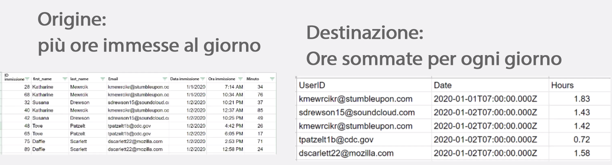
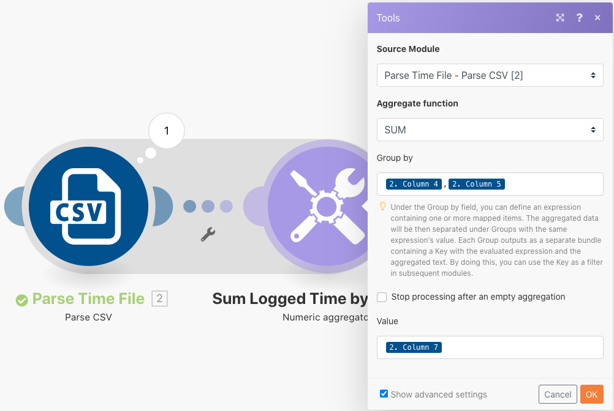

# Esercizio sulle strutture di dati

Trasformare i dati da un file di origine ad un file di destinazione.

## Panoramica dell’esercizio

Apri un file CSV che contiene un elenco di voci di tempo. Queste voci di tempo riguardano i minuti registrati in determinati giorni da più utenti. L’obiettivo è prendere queste informazioni e produrre un nuovo CSV che mostri il tempo totale, in ore, registrato da ciascun utente, ogni giorno.

In questo scenario, aprirai un file che contiene un elenco di voci sul tempo per i minuti lavorati, incluse la data e l’ora, il numero di minuti immessi e l’indirizzo e-mail di chi ha effettuato l’inserimento. Sono presenti 100 inserimenti sul tempo, alcuni effettuati dalle stesse persone e alcuni lo stesso giorno di altri.

Per creare un file che mostri il tempo totale, in ore, lavorato ogni giorno da ciascun individuo, seguirai questi passaggi:

1. Nel modulo trigger, ottieni un file dalla cartella Workfront. Scarica il file.
1. Nel primo modulo CSV, analizza i dati di immissione del tempo per generare un bundle per ogni immissione. Questo è un iteratore.
1. Il primo modulo Strumenti è un aggregatore numerico. Questo SOMMERÀ tutti i minuti e raggrupperà le righe per indirizzo email, quindi per data. Il risultato è il totale dei minuti lavorati ogni giorno per indirizzo e-mail.
1. Il secondo modulo Strumenti è un modulo Imposta variabile. Utilizzalo per formattare i minuti da dividere per 60 e arrotondare a 2 decimali.
1. Nel secondo modulo CSV, imposta il file di output.
1. Nel modulo finale, carica il file CSV in Workfront.

## Passaggi da seguire

**Scarica il file da Workfront.**

1. Nella cartella “Fusion Exercise Files” di Workfront, seleziona “Fusion1.0JanTime.csv” e fai clic su Dettagli documento.
1. Copia il primo numero ID dall’indirizzo URL.
1. Crea un nuovo scenario. Denominalo “Creazione e utilizzo di strutture dati.”
1. Inizia con il modulo Scarica documento dall’app Workfront.
1. Configura la connessione Workfront e includi l’ID documento copiato dall’URL di Workfront.

   

   **Analizzare i dati di immissione del tempo.**

1. Aggiungi un altro modulo, selezionando Analizza CSV.
1. Imposta CSV di analisi per 7 colonne. Verifica se la casella CSV contiene intestazioni. Scegli la virgola come delimiterType e inserisci i dati nel campo CSV.

   

1. Fai clic su Esegui una volta per visualizzare l’output.
1. Apri l’execution inspector (controllo di ispezione) per vedere gli input e gli output del modulo CSV di analisi. Ci sono un pacchetto (un file CSV) come input e diversi pacchetti come output (un pacchetto per ogni riga nel file CSV). La schermata sarà simile all’immagine seguente:

   

   **Successivamente, trasforma i dati nel modulo di output desiderato, con i totali di tempo aggregati espressi in ore anziché in minuti.**

1. Aggiungi un modulo dello strumento Aggregatore numerico.
1. Seleziona il modulo di origine, che è il modulo CSV di analisi.
1. Seleziona SOMMA per la funzione di aggregazione.
1. Il campo Valore è la colonna 7 del file CSV. Questo è il numero di minuti registrati da ciascun utente.
1. Per sommare i campi per gruppo, fai clic su Impostazioni avanzate e imposta Raggruppa per email (colonna 4), data (colonna 5).

   + Questo verrà sommato per ogni combinazione di e-mail e data. Assicurati di inserire una virgola tra la colonna 4 e la colonna 5. Questa verrà utilizzata come delimitatore in seguito.

   **Il pannello di mappatura dovrebbe essere simile al seguente:**

   

1. Fai clic su Esegui una volta per verificare l’output dell’aggregazione.

   **I bundle di output dovrebbero essere simili a questo:**

   

   **Ora converti i minuti aggregati in ore.**

1. Aggiungi un altro modulo strumenti, selezionando Imposta variabile.
1. Assegna un nome alla variabile “Ore”
1. Imposta il valore della variabile su formatNumber(result/60;2;.;,)

   **Il pannello di mappatura dovrebbe essere simile al seguente:**

   

   **Successivamente, ottieni i valori impostati per il file di output. Desideri che l’ID utente e il valore della data vengano utilizzati per i raggruppamenti. Desideri anche le ore che sono state calcolate.**

1. Aggiungi un altro modulo CSV utilizzando l’aggregatore Crea CSV (avanzato).
1. Il modulo di origine è Strumenti - Aggregatore numerico.
1. Fai clic su Aggiungi nel campo Struttura dati e denomina la struttura dati “Somma giornaliera registrata nel tempo.”
1. Fai clic su Aggiungi elemento per creare il primo elemento.
1. Denomina l’elemento “UserID” e imposta il tipo su Testo. Fai clic su Aggiungi.
1. Fai di nuovo clic su Aggiungi elemento per creare il secondo elemento.
1. Denomina l’elemento “Data”, imposta il tipo su Data e fai clic su Aggiungi.
1. Fai clic su Aggiungi elemento ancora una volta.
1. Denomina l’elemento “Ore”, imposta il tipo su Numero e fai clic su Aggiungi.

   **La struttura dei dati dovrebbe essere simile alla seguente:**

   

1. Fai clic su Salva per completare la struttura dei dati della somma giornaliera registrata nel tempo.

   **Ora fornisci i valori per i tre campi che hai appena creato. Dovresti visualizzare questi tre campi nel pannello di mappatura CSV.**

1. Fai clic nel campo UserID e scegliere GET dalla scheda funzioni generali. Nel primo parametro, inserisci SPLIT dalla scheda testo e funzioni binarie. Il primo parametro per la funzione SPLIT è il campo chiave. Aggiungi una virgola come delimitatore e 1 come indice. Ciò indica che desideri che GET recuperi il primo campo nell’array Chiave.
1. Copia questa espressione nel campo Data. Modifica l’indice da 1 a 2 per GET il secondo valore nell’array.
1. Per il campo Ore, aggiungi il campo Ore dallo strumento Imposta variabile.

   **Il pannello di mappatura CSV dovrebbe essere simile al seguente:**

   

   **Se esegui lo scenario ora, dovresti vedere questo output:**

   

   **Ora aggiungi un modulo per acquisire questo output e caricarlo come documento in un progetto esistente in Workfront.**

1. Apri il progetto in Workfront e copia l’ID del progetto dall’URL.
1. Torna allo scenario in Fusion e aggiungi un altro modulo: il modulo Carica documento dall’app Workfront.
1. Incolla l’ID progetto nel campo ID record correlato.
1. Scegli Progetto per il tipo di record correlato.
1. Scegli l&#39;opzione Mappa per il file di origine.
1. Per Nome documento, utilizza il nome file scaricato, aggiungendovi davanti “Aggiornato”.
1. Per il contenuto del file, utilizza l’output di testo del modulo Crea CSV.

   **Il pannello di mappatura dovrebbe essere simile al seguente:**

   

1. Fai clic su OK e salva lo scenario.
1. Fai clic su Esegui una volta per eseguire lo scenario.

   **Controlla la finestra di ispezione dell’esecuzione nel modulo Carica documento per confermare che il documento è stato caricato.**

   
