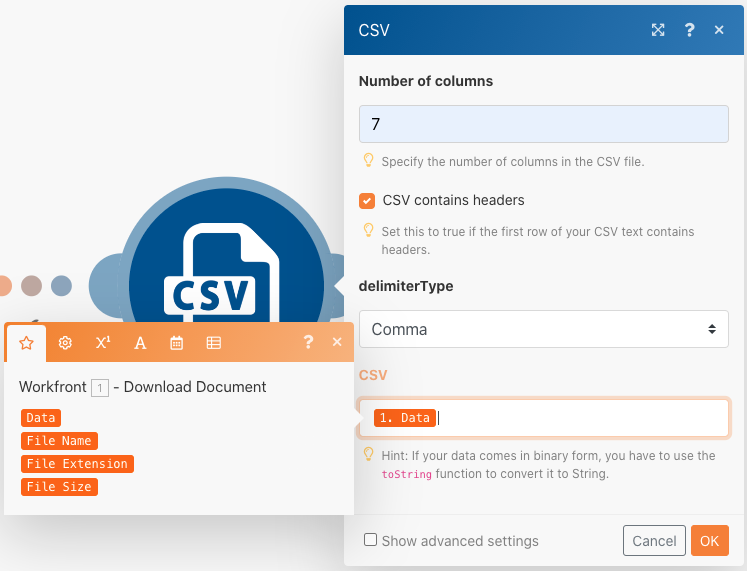

# Strutture di dati

Trasforma i dati da un file di origine in un file di destinazione.

## Panoramica dell’esercizio

Apri un file CSV contenente un elenco di voci temporali. Queste voci temporali si riferiscono a minuti registrati in determinati giorni da più utenti. L’obiettivo è quello di raccogliere queste informazioni e produrre un nuovo file CSV che mostra il tempo totale, in ore, registrato da ogni utente ogni giorno.

In questo scenario, verrà aperto un file contenente un elenco di voci relative all&#39;ora per i minuti lavorati, incluse la data e l&#39;ora, il numero di minuti immessi e l&#39;indirizzo di posta elettronica di chi ha effettuato la voce. Ci sono 100 voci temporali, alcune fatte dagli stessi individui e alcune di quelle sono state fatte lo stesso giorno di altre.

Per generare un file che mostra il tempo totale, in ore, lavorato ogni giorno da ogni individuo, segui questi passaggi:

1. Nel modulo trigger, ottieni un file dalla cartella Workfront. Scarica il file.
1. Nel primo modulo CSV, analizza i dati di immissione ora per generare un bundle per ogni immissione ora. Questo è un iteratore.
1. Il primo modulo Strumenti è un aggregatore numerico. Somma tutti i minuti e raggruppa le righe per indirizzo e-mail e data. Il risultato è il totale dei minuti lavorati ogni giorno per indirizzo e-mail.
1. Il secondo modulo Strumenti è un modulo Imposta variabile. Utilizzare questa opzione per formattare i minuti in modo da dividere per 60 e arrotondare a 2 decimali.
1. Nel secondo modulo CSV, imposta il file di output.
1. Nel modulo finale, carica il file CSV in Workfront.

## Passaggi da seguire

**Scarica il file da Workfront.**

1. Nella cartella &quot;Fusion Exercise Files&quot; di Workfront, selezionate &quot;_Fusion1.0JanTime.csv&quot; e fate clic su Dettagli documento.
1. Copia il primo numero ID dall’indirizzo URL.
1. Crea un nuovo scenario. Denominalo &quot;Creazione e utilizzo di strutture di dati&quot;.
1. Inizia con il modulo Scarica documento dall’app Workfront.
1. Configura la connessione Workfront e includi l’ID documento copiato dall’URL di Workfront.

   

   **Analizzare i dati di immissione ora.**

1. Aggiungi un altro modulo, selezionando Analizza CSV.
1. Imposta l&#39;analisi CSV per 7 colonne. Seleziona la casella CSV contains headers. Scegli il tipo di delimitatore virgola e inserisci dati nel campo CSV.

   

1. Fai clic su Esegui una volta per visualizzare l’output.
1. Apri la finestra di ispezione dell’esecuzione per visualizzare gli input e gli output del modulo CSV di analisi. Esiste un bundle (un file CSV) come input e diversi bundle come output (un bundle per ogni riga nel file CSV). Dovrebbe essere simile al seguente:

   

   **Quindi, trasforma i dati nel modulo di output desiderato, con i totali aggregati del tempo espressi in ore anziché in minuti.**

1. Aggiungere un modulo dello strumento Aggregatore numerico.
1. Seleziona il modulo sorgente, che è il modulo CSV di analisi.
1. Selezionare SOMMA per la funzione di aggregazione.
1. Il campo Valore è la colonna 7 del file CSV. Questo è il numero di minuti registrati da ciascun utente.
1. Per sommare i campi per gruppo, fare clic su Impostazioni avanzate e impostare Raggruppa per su e-mail (colonna 4), data (colonna 5).

   + Questo somma per ogni combinazione dell’e-mail e della data. Assicurati di inserire una virgola tra la colonna 4 e la colonna 5. Verrà utilizzato come delimitatore in un secondo momento.

   **Il pannello di mappatura deve essere simile al seguente:**

   

1. Fai clic su Esegui una volta per controllare l’output dell’aggregazione.

   **I bundle di output avranno un aspetto simile a questo:**

   

   **Ora converti i minuti aggregati in ore.**

1. Aggiungi un altro modulo strumenti, selezionando Imposta variabile.
1. Denomina la variabile &quot;Hours&quot;.
1. Imposta il valore della variabile su formatNumber(result/60;2;.;,)

   **Il pannello di mappatura deve essere simile al seguente:**

   

   **Quindi, imposta i valori per il file di output. Desideri l’ID utente e il valore data utilizzati per i raggruppamenti. Desideri anche le ore calcolate.**

1. Aggiungi un altro modulo CSV utilizzando l’aggregatore Crea CSV (avanzato).
1. Il modulo di origine è l’aggregatore numerico Strumenti.
1. Fai clic su Aggiungi in base al campo Data structure (Struttura dati) e denomina la nostra struttura dati &quot;Time Logged Daily Sum&quot; (Somma giornaliera registrata nel tempo).
1. Fare clic su Aggiungi elemento per creare il primo elemento.
1. Denomina l’elemento &quot;UserID&quot; e imposta il tipo su Text. Fai clic su Aggiungi.
1. Fare di nuovo clic su Aggiungi elemento per creare il secondo elemento.
1. Denomina l’elemento &quot;Date&quot;, imposta il tipo su Date e fai clic su Add (Aggiungi).
1. Fai clic su Aggiungi elemento un&#39;altra volta.
1. Denomina l&#39;elemento &quot;Hours&quot;, imposta il tipo su Number e fai clic su Add (Aggiungi).

   **La struttura dati deve essere simile alla seguente:**

   

1. Fare clic su Salva per completare la struttura dati Time Logged Daily Sum.

   **Ora fornisci i valori per i tre campi appena creati. Dovresti visualizzare questi tre campi nel pannello di mappatura CSV.**

1. Fare clic nel campo UserID e scegliere GET dalla scheda Funzioni generali. Nel primo parametro, inserisci SPLIT dalla scheda delle funzioni di testo e binarie. Il primo parametro per la funzione SPLIT è il campo Chiave. Aggiungi una virgola come delimitatore e 1 come indice. Questo indica che desideri che il GET recuperi il primo campo nell’array Key.
1. Copia questa espressione nel campo Data. Cambia l’indice da 1 a 2 per GET il secondo valore nell’array.
1. Per il campo Ore, aggiungere il campo Ore dallo strumento Imposta variabile.

   **Il pannello di mappatura CSV avrà un aspetto simile al seguente:**

   

   **Se esegui ora lo scenario, dovresti visualizzare questo output:**

   

   **Ora aggiungi un modulo per acquisire questo output e caricarlo come documento in un progetto esistente in Workfront.**

1. Apri il progetto in Workfront e copia l’ID progetto dall’URL.
1. Torna allo scenario in Fusion e aggiungi un altro modulo, il modulo Carica documento dall’app Workfront.
1. Incolla l’ID del progetto nel campo ID record correlato.
1. Scegliere Progetto per il tipo di record correlato.
1. Scegliere l&#39;opzione Mappa per il file di origine.
1. Per Nome documento, utilizza il nome file scaricato, precedendo il file viene aggiunto &quot;Aggiornato&quot;.
1. Per il contenuto del file, utilizza l’output di testo del modulo Crea CSV.

   **Il pannello di mappatura deve essere simile al seguente:**

   

1. Fare clic su OK e salvare lo scenario.
1. Fare clic su Esegui una volta per eseguire lo scenario.

   **Controlla la finestra di ispezione dell’esecuzione nel modulo Carica documento per confermare che il documento è stato caricato.**

   
