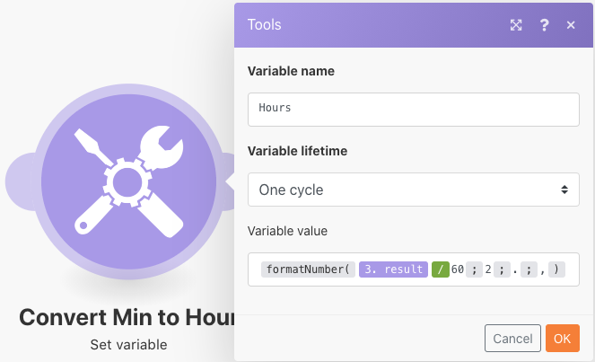

# Strutture dati

Trasforma i dati da un file di origine in un file di destinazione.

## Panoramica sull&#39;esercizio

Apri un file CSV contenente un elenco di voci di ora. Queste voci temporali sono per minuti registrati in alcuni giorni da più utenti. L’obiettivo è quello di prendere queste informazioni e produrre un nuovo CSV che mostra ogni giorno il tempo totale, in ore, registrato da ogni utente.

In questo scenario, aprirai un file contenente un elenco di voci per minuti lavorati, tra cui la data e l’ora, il numero di minuti immessi e l’indirizzo e-mail dell’utente che ha effettuato la voce. Ci sono 100 contributi, alcuni fatti dagli stessi individui e alcuni di questi sono stati fatti lo stesso giorno di altri.

Per produrre un file che mostri il tempo totale, in ore, lavorato ogni giorno da ogni individuo, segui questi passaggi:

1. Nel modulo trigger, ottieni un file dalla cartella Workfront. Scarica il file .
1. Nel primo modulo CSV, analizza i dati di immissione del tempo per generare un bundle per ogni entrata dell’ora. Questo è un iteratore.
1. Il primo modulo Strumenti è un aggregatore numerico. SOMMA tutti i minuti e raggruppa le righe per indirizzo e-mail, quindi per data. Il risultato è il totale dei minuti lavorati ogni giorno per indirizzo e-mail.
1. Il secondo modulo Strumenti è un modulo Imposta variabile. Utilizzare questo formato per formattare i minuti per dividere per 60 e arrotondare per 2 decimali.
1. Nel secondo modulo CSV, imposta il file di output.
1. Nel modulo finale, carica il file CSV in Workfront.

## Passaggi da seguire

**Scarica il file da Workfront.**

1. Nella cartella &quot;File di esercizio di fusione&quot; di Workfront, selezionare &quot;_Fusion1.0JanTime.csv&quot; e fare clic su Dettagli documento.
1. Copia il primo numero ID dall&#39;indirizzo URL.
1. Crea un nuovo scenario. Denomina &quot;Creazione e utilizzo di strutture di dati&quot;.
1. Inizia con il modulo Scarica documento dall’app Workfront.
1. Imposta la connessione Workfront e includi l&#39;ID documento copiato dall&#39;URL Workfront.

   

   **Analizzare i dati di immissione ora.**

1. Aggiungi un altro modulo, selezionando Analizza CSV.
1. Imposta Analizza CSV per 7 colonne. Seleziona la casella CSV contiene intestazioni . Scegli il tipo di delimitatore virgola e inserisci i dati nel campo CSV.

   

1. Fai clic su Esegui una volta per visualizzare l’output.
1. Apri la finestra di ispezione di esecuzione per visualizzare gli input e gli output del modulo CSV Parse. C&#39;è un bundle (un file CSV) come input e diversi bundle come output (un bundle per ogni riga nel file CSV). Dovrebbe assomigliare a questo:

   

   **Quindi, trasforma i dati nel modulo di output desiderato, con totali di tempo aggregati espressi in ore invece che in minuti.**

1. Aggiungi un modulo di strumenti Aggregator numerico.
1. Seleziona il modulo di origine, ovvero il modulo Parse CSV.
1. Selezionare SUM per la funzione di aggregazione.
1. Il campo Valore è la colonna 7 del file CSV. Si tratta dei minuti registrati da ogni utente.
1. Per sommare i campi per gruppo, fai clic su Impostazioni avanzate e imposta Raggruppa per inviare a e-mail (colonna 4), data (colonna 5).

   + Questo importo verrà sommato per ogni combinazione dell’e-mail e della data. Assicurati di inserire una virgola tra la colonna 4 e la colonna 5. Sarà utilizzato come delimitatore in un secondo momento.

   **Il pannello di mappatura deve essere simile al seguente:**

   

1. Fai clic su Esegui una volta per controllare l’output di aggregazione.

   **I bundle di output dovrebbero essere così:**

   

   **Ora converti i minuti aggregati in ore.**

1. Aggiungi un altro modulo di strumenti, selezionando Imposta variabile.
1. Denomina la variabile &quot;Hours&quot;.
1. Imposta il valore della variabile su formatNumber(result/60;2;.;

   **Il pannello di mappatura deve essere simile al seguente:**

   

   **Quindi, ottieni i valori impostati per il file di output. Individua l’ID utente e il valore della data utilizzati per i raggruppamenti. Vuoi anche le ore calcolate.**

1. Aggiungi un altro modulo-CSV utilizzando l’aggregatore Crea CSV (avanzato).
1. Il modulo di origine è l&#39;aggregatore numerico Strumenti .
1. Fai clic su Aggiungi dal campo della struttura dati e denomina la struttura dati &quot;Time Logged Daily Sum&quot;.
1. Fai clic su Aggiungi elemento per creare il primo elemento.
1. Denomina l&#39;elemento &quot;UserID&quot; e imposta il tipo su Text. Fai clic su Aggiungi.
1. Fare nuovamente clic su Aggiungi elemento per creare il secondo elemento.
1. Assegnare un nome all&#39;elemento &quot;Data&quot;, impostare il tipo su Data e fare clic su Aggiungi.
1. Fai clic su Aggiungi elemento una volta di più.
1. Assegnare un nome all&#39;elemento &quot;Ore&quot;, impostare il tipo su Numero e fare clic su Aggiungi.

   **La struttura dati deve essere simile alla seguente:**

   

1. Fai clic su Salva per completare la struttura dati della somma giornaliera registrata nel tempo.

   **Ora è possibile specificare i valori per i tre campi appena creati. Dovresti vedere questi tre campi nel pannello di mappatura CSV.**

1. Fare clic nel campo UserID e scegliere GET dalla scheda funzioni generali. Nel primo parametro, inserire SPLIT dalla scheda testo e funzioni binarie. Il primo parametro per la funzione SPLIT è il campo Key (Chiave). Aggiungi una virgola come delimitatore e 1 come indice. Indica che si desidera recuperare il primo campo nell&#39;array Key.
1. Copia questa espressione nel campo Data. Modificare l&#39;indice da 1 a 2 per GET il secondo valore nell&#39;array.
1. Per il campo Ore, aggiungere il campo Ore dallo strumento Imposta variabile .

   **Il pannello di mappatura CSV deve essere simile al seguente:**

   

   **Se esegui lo scenario ora, dovresti visualizzare questo output:**

   

   **Ora, aggiungi un modulo per prendere questo output e caricarlo come documento in un progetto esistente in Workfront.**

1. Apri il progetto in Workfront e copia l’ID del progetto dall’URL.
1. Torna allo scenario in Fusion e aggiungi un altro modulo, il modulo Carica documento, dall’app Workfront.
1. Incolla l&#39;ID del progetto nel campo ID record correlato.
1. Scegliere Progetto per il tipo di record correlato.
1. Scegliere l&#39;opzione Mappa per il file di origine.
1. Per Nome documento, utilizzare il nome file scaricato, aggiungendo &quot;Aggiornato&quot; davanti ad esso.
1. Per il contenuto del file, utilizza l’output Testo del modulo Crea CSV .

   **Il pannello di mappatura deve essere simile al seguente:**

   

1. Fare clic su OK e salvare lo scenario.
1. Fai clic su Esegui una volta per eseguire lo scenario.

   **Per confermare il caricamento del documento, controlla l’ispettore di esecuzione nel modulo Carica documento.**

   
