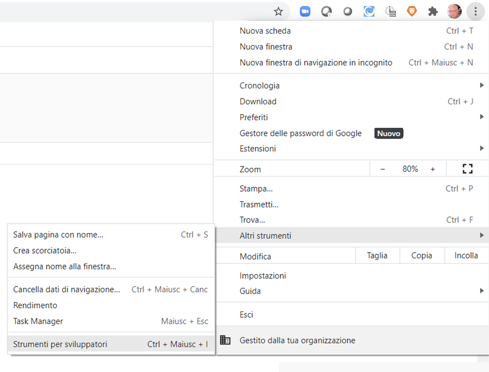
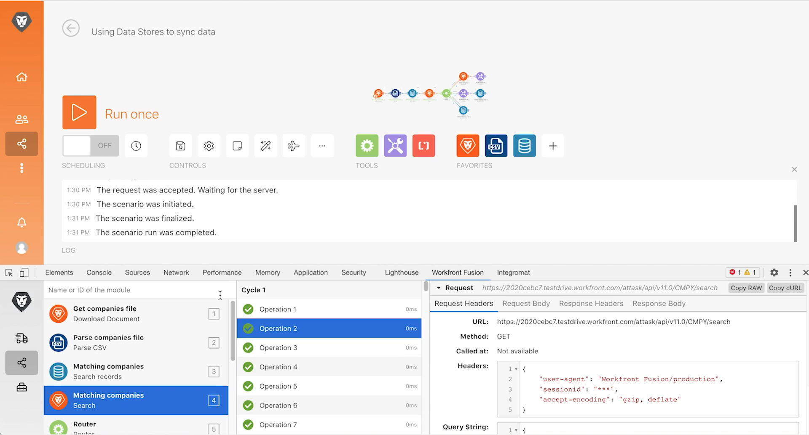
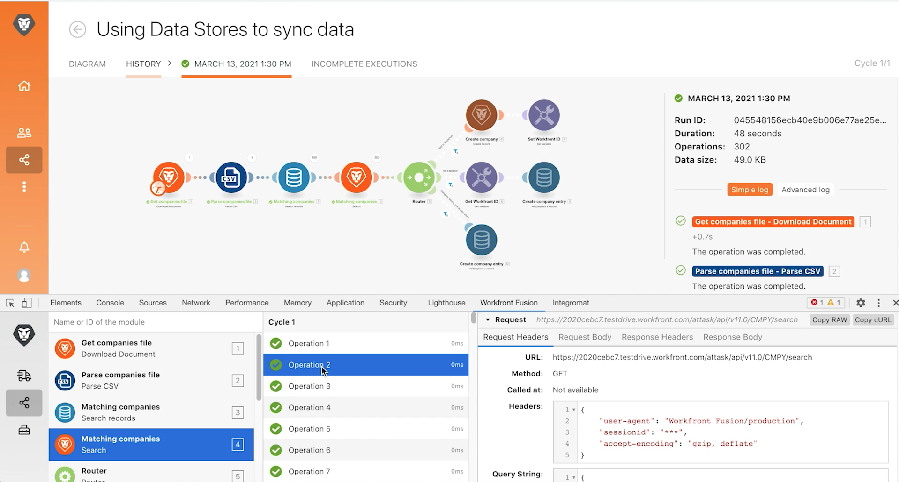

# Esercizio su DevTool

Migliora le tue capacità di risolvere i problemi di uno scenario e facilitare configurazioni complesse utilizzando DevTool.

## Panoramica dell’esercizio

Installa e utilizza le diverse aree del DevTool di Workfront per approfondire richieste/risposte e i suggerimenti per la progettazione avanzata degli scenari.

>[!NOTE]
>
>Il DevTool di Workfront Fusion è disponibile solo nel browser Chrome quando si utilizza lo [strumento per sviluppatori Chrome](https://developer.chrome.com/docs/devtools?hl=it).

## Passaggi da seguire

**Installa DevTool.**

1. Scarica il documento “workfront-fusion-devtool.zip” che si trova nella cartella dei file di esercizio di Fusion nell’unità di prova.
1. Estrai i file compressi in una cartella.
1. Apri una scheda in Chrome e digita **chrome://estensioni**.
1. Attiva la Modalità sviluppatore utilizzando l’interruttore in alto a destra, quindi fai clic sul pulsante “Carica estensione non pacchettizzata” visualizzato in alto a sinistra. Seleziona la cartella contenente DevTool (la cartella in cui è stato decompresso).

   

1. Una volta decompresso, DevTool appare tra le altre estensioni.

   

   **Utilizzare Live Stream.**

1. Per iniziare, apri lo scenario “Utilizzo degli archivi dati per sincronizzare i dati”.
1. Apri DevTool digitando F12 o la funzione F12. Oppure puoi fare clic sul menu con tre punti nella barra degli indirizzi di Chrome e passare a Strumenti per sviluppatori.

   

1. Fai clic sulla scheda Workfront Fusion, quindi seleziona Live Stream dall’elenco a sinistra.
1. Fai clic su Esegui una sola volta per visualizzare gli eventi nel momento in cui si verificano.
1. Fai clic su un evento per visualizzare le schede a destra per Intestazioni di richiesta, Corpo della richiesta, Intestazioni di risposta e Corpo della risposta.

   

   **Utilizzare il debugger dello scenario**

1. Seleziona il Debugger dello scenario e fai clic su un modulo per visualizzare le informazioni sulle operazioni di tale modulo.

   

1. Passa alla scheda Cronologia. Fai clic su Dettagli su un’esecuzione per esaminare i dettagli delle operazioni del modulo per un’esecuzione specifica.

   

   **Utilizzare gli strumenti**

1. Torna al designer dello scenario e seleziona Strumenti in DevTool. Vengono visualizzati gli strumenti disponibili.

   

+ Focus a module (Concentrati su un modulo): trova e apri rapidamente un modulo utilizzando il relativo ID.
+ Find Module(s) by Mapping (Trova moduli tramite mappatura): cerca uno scenario utilizzando una parola chiave per trovare valori e/o chiavi mappati nei moduli.
+ Get App Metadata (Ottieni metadati app): consulta i metadati per l’app selezionata in uno scenario.
+ Copy Mapping (Copia mappatura): copia la mappatura da un modulo all’altro. Puoi anche clonare il modulo nel designer.
+ Copy Filter (Copia filtro): copia un filtro. Il filtro è sempre assegnato al modulo alla sua destra.
+ Swap Connection (Scambia connessione): lo strumento acquisisce la connessione dal modulo selezionato e imposta la stessa connessione per tutti i moduli della stessa app nello scenario. Questa funzione è utile se devi modificare la connessione in tutto uno scenario completato. Usando questo strumento, puoi evitare di perdere tutte le mappature e risparmi tempo.
+ Swap Variable (Scambia variabile): trova tutte le occorrenze della variabile specificata in tutto lo scenario o in un modulo e le sostituisce con quella nuova. I caratteri jolly non sono supportati. Se hai mappato accidentalmente un valore nell’intero scenario, questo può aiutarti a scambiarlo facilmente con il valore corretto.
+ Swap App (Scambia app): scambia l’app specificata con un’altra.
+ Base 64: codifica i dati immessi in Base 64 o decodifica Base 64. È utile per cercare dati particolari nella richiesta codificata.
+ Copy Module Name (Copia nome modulo):copia negli Appunti il nome del modulo selezionato.
+ Remap Source (Rimappa origine): cambia l’origine della mappatura da un modulo all’altro. Devi innanzitutto aggiungere al percorso di indirizzamento in uno scenario il modulo da utilizzare come modulo di origine.
+ Migrate OS (Migra sistema operativo): realizzato appositamente per aggiornare i moduli Fogli Google (legacy) alla versione più recente di Fogli Google. Aggiunge una nuova versione del modulo subito dopo la sua versione legacy nel percorso di indirizzamento dello scenario.
